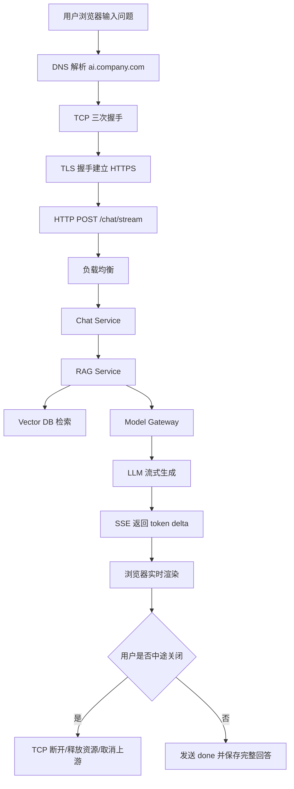

# ！重要！一个例子串起来 A01 网络


## 场景：用户问企业知识库“出差报销流程是什么？”

你现在做了一个企业知识库问答系统。

用户在浏览器里输入问题：

```text
出差报销流程是什么？
```

前端调用：

```text
POST https://ai.company.com/api/v1/chat/stream
```

后端会做 RAG 检索，再调用大模型，最后把答案一个字一个字流式返回。

这一个请求，可以把网络八股几乎全部串起来。

<!-- BEGIN_EXAMPLE_TERMS -->
## 读之前先把这篇的名词说清楚

这一篇你可以把网络想成一次外卖配送：浏览器先找地址，再敲门建立连接，再用加密袋子送请求，最后后端一边生成一边把答案送回来。

后面如果你看到这些词，先不要急着背定义。你可以按下面这个顺序理解：

```text
它是什么 -> 在这个例子里负责什么 -> 面试时怎么说
```

### 1. DNS

**新手理解**：DNS 就像通讯录。人记得住 `ai.company.com`，机器真正要连的是 IP 地址，所以要先查通讯录。

**在这个例子里**：用户输入域名后，浏览器靠 DNS 找到企业 AI 服务的入口 IP。

**面试说法**：用户访问域名前，浏览器会先做 DNS 解析，把域名转换成 IP。

### 2. IP

**新手理解**：IP 是网络里的门牌号。没有门牌号，请求不知道往哪台机器送。

**在这个例子里**：DNS 查到 IP 后，浏览器才知道要把请求发到哪一个服务入口。

**面试说法**：IP 负责定位网络中的主机，域名只是更适合人记忆的名字。

### 3. TCP

**新手理解**：TCP 像打电话前先确认双方电话通不通。它保证数据按顺序、可靠地到达。

**在这个例子里**：浏览器和后端之间要先建立 TCP 连接，后面的 HTTP 数据才能稳定传输。

**面试说法**：TCP 是可靠传输协议，通过连接、确认、重传、排序来保证数据可靠。

### 4. 三次握手

**新手理解**：三次握手就是双方互相确认：我能发、我能收、你也能发、你也能收。

**在这个例子里**：浏览器请求 `/chat/stream` 前，要先和服务器完成连接建立。

**面试说法**：三次握手用于建立 TCP 连接，并确认双方收发能力。

### 5. TLS / HTTPS

**新手理解**：HTTPS 可以理解成给 HTTP 套了一层加密信封，还能验证对方是不是假服务器。

**在这个例子里**：问题、企业资料、Token 都可能敏感，所以请求必须走 HTTPS。

**面试说法**：HTTPS = HTTP + TLS，提供加密、身份认证和完整性校验。

### 6. HTTP

**新手理解**：HTTP 是浏览器和服务器约定的说话格式。比如用 POST 表示提交问题，用 Header 放身份信息，用 Body 放问题内容。

**在这个例子里**：前端用 HTTP 请求把问题、会话 ID、知识库 ID 交给后端。

**面试说法**：HTTP 定义了方法、URL、Header、Body、状态码等应用层语义。

### 7. 负载均衡

**新手理解**：负载均衡像前台分诊台，把很多用户请求分给不同后端实例。

**在这个例子里**：线上会有多个 Chat Service，负载均衡负责挑一个实例处理当前请求。

**面试说法**：负载均衡用于分摊流量、提高可用性，常见策略有轮询、最少连接、一致性哈希。

### 8. SSE

**新手理解**：SSE 像服务员不停把厨房刚做好的菜端出来，不用等整桌菜全做好。

**在这个例子里**：大模型生成一个 token，后端就通过 SSE 推给浏览器，用户能看到答案逐字出现。

**面试说法**：SSE 是基于 HTTP 的服务端单向推送，适合大模型流式返回。

### 9. 长连接 / Keep-Alive

**新手理解**：长连接就是一次连接用久一点，别每说一句话都重新握手。

**在这个例子里**：浏览器到后端、后端到模型服务都可以复用连接，减少握手成本。

**面试说法**：Keep-Alive 通过连接复用降低 TCP/TLS 建连开销。

### 10. 超时

**新手理解**：超时就是给每一步设闹钟，不能让一个请求永远卡住。

**在这个例子里**：如果模型迟迟不返回，后端要及时停止等待并释放连接。

**面试说法**：网络调用要设置连接超时、读超时和整体请求超时，避免资源被占死。

<!-- END_EXAMPLE_TERMS -->

## 0. 总流程图



---

## 1. 用户先访问域名：DNS 出场

用户访问的是：

```text
ai.company.com
```

但机器真正通信靠 IP。

所以第一步是：

```text
ai.company.com -> DNS -> 203.0.113.10
```

这就对应：

```text
DNS / 域名解析 / 本地缓存 / 权威 DNS
```

面试里你可以这么讲：

```text
用户访问服务时，浏览器先通过 DNS 把域名解析成 IP，后续 TCP 连接才知道要连哪台机器。
```

---

## 2. 建立连接：TCP 三次握手

浏览器知道 IP 后，要和服务器建立 TCP 连接。

过程是：

```text
浏览器：我想连你，SYN
服务器：可以，我也准备好了，SYN + ACK
浏览器：收到，ACK
```

这就是：

```text
TCP 三次握手
```

它解决的问题是：

```text
双方都确认彼此能发送、能接收。
```

如果你的模型网关每次调用模型 API 都重新建 TCP 连接，就会浪费握手成本，所以后端常用：

```text
HTTP 连接池 / keep-alive
```

---

## 3. 如果是 HTTPS，还要 TLS 握手

因为请求里可能有：

- 用户身份。
- 企业文档。
- 模型回答。
- API Token。

所以必须用 HTTPS。

HTTPS 做三件事：

```text
加密
身份认证
完整性校验
```

直观理解：

```text
HTTP 像明信片，路上谁都能看。
HTTPS 像上锁的信封，还能确认收件人是真的。
```

---

## 4. 浏览器发 HTTP 请求

现在连接建立好了，浏览器发送 HTTP 请求：

```http
POST /api/v1/chat/stream HTTP/1.1
Host: ai.company.com
Authorization: Bearer xxx
Content-Type: application/json

{
  "conversation_id": "c1",
  "knowledge_base_id": "kb_finance",
  "question": "出差报销流程是什么？"
}
```

这里对应：

```text
HTTP Method
URL
Header
Body
Authorization
Content-Type
```

为什么用 POST？

因为这是提交一个问题，有请求体，还会产生一次模型调用记录。

---

## 5. 请求先到负载均衡

线上不可能只有一台后端机器。

请求会先到：

```text
Load Balancer
```

负载均衡会把请求分发给某个 Chat Service 实例：

```text
用户请求
  -> Nginx / SLB
  -> Chat Service 01
```

这对应：

```text
负载均衡 / 轮询 / 最少连接 / 一致性哈希
```

如果是 SSE 长连接，还要注意：

```text
连接会持续一段时间，负载均衡不能随便中断。
```

---

## 6. 后端开始处理：HTTP 状态码和 REST

后端收到请求后会先做：

```text
鉴权
参数校验
限流
```

如果 token 失效：

```text
401 Unauthorized
```

如果用户没有知识库权限：

```text
403 Forbidden
```

如果请求太频繁：

```text
429 Too Many Requests
```

如果模型超时：

```text
504 Gateway Timeout
```

这里状态码就不再是死记硬背，而是和真实业务对应起来。

---

## 7. 后端调用 RAG 服务：RPC / HTTP

Chat Service 不一定自己做检索，它可能调用 RAG Service：

```text
Chat Service
  -> RAG Service
```

服务间调用可以用：

```text
HTTP
gRPC
```

如果是 gRPC，它通常基于 HTTP/2，支持：

```text
强类型接口
高性能
流式通信
```

---

## 8. RAG 服务调用向量数据库：连接池和超时

RAG Service 要去向量库查相关 chunk：

```text
RAG Service -> Vector DB
```

这里必须设置：

```text
连接池
连接超时
读取超时
最大连接数
```

否则向量库一慢，RAG Service 的线程或协程就会被拖住。

面试可以这么说：

```text
AI 请求链路比较长，每个下游调用都要设置超时，否则一个向量库或模型服务慢，就可能拖垮整个请求。
```

---

## 9. 后端调用大模型：HTTP 长连接很重要

模型网关调用模型 API：

```text
Model Gateway -> LLM Provider
```

如果每次都重新：

```text
DNS -> TCP -> TLS -> HTTP
```

成本很高。

所以会复用：

```text
HTTP keep-alive
连接池
```

这就是 HTTP 长连接的意义。

---

## 10. 模型开始生成：SSE 流式返回

模型不是一次性生成完整答案，而是边生成边返回：

```text
根据公司制度，出差报销需要...
```

后端用 SSE 推给浏览器：

```text
event: message
data: {"delta":"根据"}

event: message
data: {"delta":"公司制度"}

event: done
data: {}
```

SSE 的特点：

```text
服务端 -> 客户端
单向推送
基于 HTTP
适合大模型文本流式输出
```

如果是语音对话或实时协作，才更适合 WebSocket。

---

## 11. 如果客户端中途关闭页面：TCP 断开和资源释放

用户等不及，关掉页面。

此时连接断开，后端要：

```text
感知客户端断开
停止继续转发
最好取消上游模型调用
释放连接
记录中断日志
```

否则模型还在后台继续生成，就会白白烧 token。

这里对应：

```text
TCP 断开
四次挥手
连接生命周期
资源释放
```

---

## 12. 如果网络慢：滑动窗口和拥塞控制在背后工作

用户网络不好时，TCP 会通过：

```text
滑动窗口
拥塞控制
重传
```

尽量保证数据可靠传输。

你不需要在业务代码里手写这些，但要知道：

```text
网络变慢会影响流式输出体验。
```

业务层要做：

```text
心跳
超时
断线处理
重试策略
```

---

## 13. 整条网络链路串起来

```text
浏览器输入问题
  -> DNS 解析 ai.company.com
  -> TCP 三次握手
  -> TLS 握手建立 HTTPS
  -> HTTP POST /chat/stream
  -> 负载均衡转发到 Chat Service
  -> Chat Service 调 RAG Service
  -> RAG Service 调 Vector DB
  -> Model Gateway 调 LLM
  -> LLM 流式生成
  -> 后端用 SSE 返回 delta
  -> 用户关闭页面时 TCP 断开并释放资源
```

---

## 14. 这条故事对应的网络八股

```text
DNS：域名变 IP
TCP 三次握手：建立可靠连接
HTTPS：加密和身份认证
HTTP：请求响应协议
状态码：表达请求结果
RESTful：资源化 API 设计
负载均衡：请求分发
RPC / gRPC：服务间调用
连接池：复用连接
超时重试：保护链路
SSE：模型流式输出
WebSocket：双向实时通信
TCP 四次挥手：关闭连接
滑动窗口：提高传输效率
拥塞控制：避免网络过载
```

---

## 15. 面试总结版

如果面试官问：

```text
讲一下一个 AI 问答请求的网络链路。
```

你可以答：

```text
用户在浏览器发起 HTTPS 请求，先经过 DNS 解析和 TCP/TLS 握手，然后请求到负载均衡，再转发到 Chat Service。后端鉴权限流后调用 RAG 服务和向量数据库，再通过模型网关调用大模型。模型生成时，后端用 SSE 把 token delta 流式返回给前端。整个链路中要注意 HTTP 连接池、超时重试、客户端断开处理和下游服务熔断，否则模型慢或网络抖动都可能拖垮请求。
```

