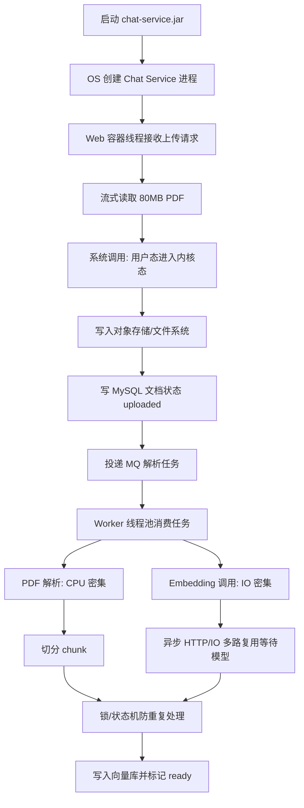

# ！重要！一个例子串起来 A02 操作系统


## 场景：用户上传一本 80MB 的 PDF，公司制度问答系统要解析并入库

用户上传：

```text
《差旅报销制度.pdf》
```

你的后端要做：

```text
接收文件
保存文件
异步解析
切分 chunk
调用 Embedding
写入向量库
```

这一条链路能把操作系统知识串起来。

<!-- BEGIN_EXAMPLE_TERMS -->
## 读之前先把这篇的名词说清楚

这一篇把后端处理 PDF 想成一家加工厂：进程是工厂，线程是工人，文件和网络都是工人手里的工具，操作系统负责分配资源和调度。

后面如果你看到这些词，先不要急着背定义。你可以按下面这个顺序理解：

```text
它是什么 -> 在这个例子里负责什么 -> 面试时怎么说
```

### 1. 进程

**新手理解**：进程就是正在运行的程序，是操作系统给程序发的一整套资源包。

**在这个例子里**：文档解析服务启动后，就是一个或多个进程在跑。

**面试说法**：进程是资源分配的基本单位，拥有独立地址空间、文件描述符等资源。

### 2. 线程

**新手理解**：线程是进程里的执行流，像工厂里的工人，真正被 CPU 轮流安排干活。

**在这个例子里**：一个解析进程里可以开多个线程处理不同 PDF 或不同页面。

**面试说法**：线程是 CPU 调度的基本单位，同一进程内线程共享进程资源。

### 3. 文件描述符 FD

**新手理解**：FD 像操作系统发给程序的文件小票，程序拿小票读文件、写 socket。

**在这个例子里**：上传的 PDF、日志文件、网络连接在进程里都会表现成 FD。

**面试说法**：Linux 中打开文件、socket、pipe 都会占用文件描述符。

### 4. 用户态 / 内核态

**新手理解**：用户态是普通程序能活动的区域，内核态是操作系统核心区域。

**在这个例子里**：程序读 PDF 时要通过系统调用进入内核态，让 OS 帮忙从磁盘读数据。

**面试说法**：用户程序不能直接操作硬件，需要通过系统调用切换到内核态。

### 5. 系统调用

**新手理解**：系统调用就是程序向操作系统求助的正式入口。

**在这个例子里**：读文件、写网络、创建线程都不是业务代码凭空完成的，要调用 OS 能力。

**面试说法**：read、write、open、send 等都是典型系统调用。

### 6. I/O

**新手理解**：I/O 就是输入输出，读磁盘、访问网络、写日志都算。

**在这个例子里**：解析 PDF 前要读文件，解析后要写结果、发消息，这些都是 I/O。

**面试说法**：后端性能瓶颈常出现在磁盘 I/O、网络 I/O 和数据库 I/O。

### 7. 缓冲区

**新手理解**：缓冲区像临时中转筐，数据先放进去，再批量处理或发送。

**在这个例子里**：PDF 内容会从磁盘读到内核缓冲区，再交给用户态程序解析。

**面试说法**：缓冲区能减少频繁 I/O 的成本，但也要注意内存占用和刷新时机。

### 8. 上下文切换

**新手理解**：CPU 从一个线程切到另一个线程，要保存现场再恢复现场，这个成本叫上下文切换。

**在这个例子里**：如果给每个任务都乱开线程，线程太多会让 CPU 忙着切换而不是干活。

**面试说法**：高并发系统要控制线程数，避免过多上下文切换拖慢吞吐。

### 9. IO 多路复用

**新手理解**：IO 多路复用像一个前台同时盯很多窗口，哪个窗口有动静就处理哪个。

**在这个例子里**：聊天流式连接很多时，后端不能一个连接一个阻塞线程地等。

**面试说法**：epoll/select/poll 可让少量线程管理大量 I/O 连接。

### 10. 零拷贝

**新手理解**：零拷贝不是完全不拷贝，而是尽量少在用户态和内核态之间搬数据。

**在这个例子里**：如果服务要直接把文件发给用户，可以减少不必要的数据复制。

**面试说法**：sendfile、mmap 等机制能减少拷贝和上下文切换，提高文件传输效率。

<!-- END_EXAMPLE_TERMS -->

## 0. 总流程图



---

## 1. 程序启动：进程出现

你写了一个后端服务：

```text
chat-service.jar
```

运行后：

```bash
java -jar chat-service.jar
```

操作系统创建一个进程：

```text
Chat Service 进程
```

进程是什么？

```text
正在运行的程序，是操作系统分配资源的基本单位。
```

它有：

```text
代码
堆
栈
文件描述符
socket
虚拟地址空间
```

---

## 2. 请求来了：线程处理上传接口

用户上传 PDF，请求进入后端。

Web 容器会安排一个线程处理：

```text
HTTP 请求线程
```

线程是什么？

```text
进程里的执行流，是 CPU 调度的基本单位。
```

进程像公司，线程像员工。

```text
公司有办公室、电脑、文件柜 -> 进程资源
员工在里面干活 -> 线程执行
```

---

## 3. 不能一次性把 80MB 文件读进内存

如果你这样写：

```text
byte[] bytes = readAll(file)
```

问题是：

```text
大量并发上传时，堆内存会暴涨，可能 OOM。
```

正确思路：

```text
流式读取
分块写入
限制文件大小
原文件放对象存储
```

这里对应：

```text
内存管理
堆
文件系统
缓冲区
```

---

## 4. 文件写入磁盘 / 对象存储：用户态和内核态切换

应用代码运行在用户态。

真正读写磁盘、网络发送，要通过操作系统：

```text
用户态 -> 系统调用 -> 内核态 -> 磁盘 / 网络
```

比如：

```text
write()
read()
send()
recv()
```

这就是用户态和内核态。

面试人话：

```text
应用程序不能直接操作硬件，要请求操作系统帮忙，这个过程会发生用户态和内核态切换。
```

---

## 5. 上传接口不能一直等解析完成：阻塞 IO 的问题

PDF 解析、OCR、Embedding 可能要几十秒。

如果 HTTP 线程一直等：

```text
请求线程被占住
连接不释放
并发上来后线程池被打满
```

这就是阻塞 IO 和长任务带来的问题。

所以接口应该：

```text
保存文件
写 document 状态 uploaded
投递 MQ
立即返回 task_id
```

---

## 6. 后台 Worker 处理：线程池

文档解析交给 Worker：

```text
Parse Worker
Embedding Worker
```

Worker 内部用线程池。

线程池解决：

```text
避免频繁创建销毁线程
控制并发数
隔离任务
```

注意：

```text
PDF 解析可能偏 CPU 密集
模型 API 调用偏 IO 密集
不要混用同一个线程池
```

---

## 7. 线程太多会怎样：上下文切换

假设你让每个 chunk 都开一个线程：

```text
10000 个 chunk -> 10000 个线程
```

CPU 会不停切换：

```text
线程 A
线程 B
线程 C
...
```

这叫上下文切换。

上下文切换要保存和恢复：

```text
寄存器
程序计数器
栈指针
线程状态
```

线程太多，CPU 时间反而浪费在切换上。

---

## 8. 调模型和向量库：IO 多路复用 / 异步 IO

Embedding Worker 要调用外部模型：

```text
chunk -> Embedding API
```

这是网络 IO。

如果每个请求都阻塞线程，吞吐会低。

可以用：

```text
异步 HTTP 客户端
协程
事件循环
IO 多路复用
```

直观理解：

```text
一个服务员盯很多桌，哪桌菜好了就处理哪桌。
```

对应：

```text
select / poll / epoll
```

---

## 9. 多个 Worker 抢同一个任务：锁

如果两个 Worker 同时拿到同一个文档任务：

```text
Worker A 正在解析 doc_1
Worker B 也开始解析 doc_1
```

会重复写 chunk、重复向量化。

解决：

```text
数据库行锁
Redis 分布式锁
任务状态机
```

本地锁只对一个进程有效，多个服务实例要用分布式锁。

---

## 10. 锁用不好：死锁

假设：

```text
线程 A 锁 document，再锁 knowledge_base
线程 B 锁 knowledge_base，再锁 document
```

两边互相等，就死锁。

死锁四条件：

```text
互斥
占有且等待
不可抢占
循环等待
```

解决：

```text
固定加锁顺序
减少锁粒度
设置超时
避免长事务
```

---

## 11. 解析大文件：虚拟内存和 Page Cache

程序看到的是虚拟地址空间，不是直接操作物理内存。

操作系统会管理：

```text
虚拟内存
物理内存
页表
缺页中断
Page Cache
```

读取文件时，OS 可能先把文件页缓存到 Page Cache，后续读取更快。

但如果内存压力大，频繁换页，性能会明显下降。

---

## 12. 整条 OS 链路串起来

```text
启动 chat-service.jar
  -> OS 创建进程
  -> Web 容器线程处理上传请求
  -> 文件流式写入对象存储
  -> 用户态通过系统调用进入内核态
  -> document 状态写入数据库
  -> MQ 投递解析任务
  -> Worker 线程池消费任务
  -> PDF 解析占 CPU
  -> Embedding 调用占 IO
  -> 异步 IO / 连接池提高并发
  -> 锁和状态机防止重复处理
  -> 大文件处理注意内存和 Page Cache
```

---

## 13. 对应知识点

```text
进程：Chat Service / Worker 是运行中的程序
线程：HTTP 请求线程、Worker 线程
协程：适合大量模型 API IO 等待
上下文切换：线程太多会浪费 CPU
用户态/内核态：文件和网络 IO 要系统调用
锁：防止重复处理同一文档
死锁：锁顺序不一致会互相等待
内存管理：大文件不能全读进内存
虚拟内存：进程看到独立地址空间
文件系统：上传、临时文件、对象存储前置处理
阻塞 IO：长任务会占线程
IO 多路复用：一个线程管理多个 IO
线程池：控制并发和资源
```

---

## 14. 面试总结版

```text
以文档上传解析为例，后端服务启动后是一个进程，请求由线程处理。大文件上传不能一次性读入内存，而是流式写入对象存储，文件和网络 IO 会通过系统调用从用户态进入内核态。解析和 Embedding 是耗时任务，所以我会通过 MQ 交给 Worker 线程池异步处理。解析偏 CPU 密集，模型调用偏 IO 密集，要隔离线程池。多个 Worker 处理同一文档时要用锁和状态机保证幂等，同时注意线程过多带来的上下文切换和大文件导致的内存压力。
```

