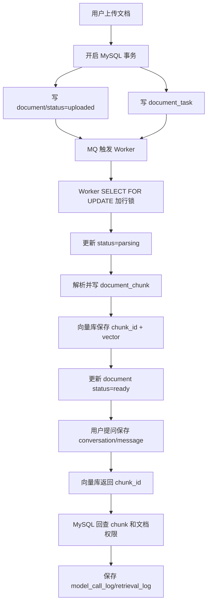

# ！重要！一个例子串起来 A03 数据库 MySQL


## 场景：企业知识库问答系统要保存文档、会话、消息和调用日志

用户上传文档、发起问答，系统必须知道：

```text
谁上传了哪份文档
文档处理到哪一步
切出了哪些 chunk
用户问了什么
模型答了什么
一次调用花了多少 token
```

这些结构化数据主要放 MySQL。

<!-- BEGIN_EXAMPLE_TERMS -->
## 读之前先把这篇的名词说清楚

这一篇把 MySQL 想成系统的账本：谁上传了文档、任务做到哪一步、一次问答花了多少钱，都要有可追溯的记录。

后面如果你看到这些词，先不要急着背定义。你可以按下面这个顺序理解：

```text
它是什么 -> 在这个例子里负责什么 -> 面试时怎么说
```

### 1. 表

**新手理解**：表就是一类数据的格子本，比如用户表、文档表、会话表。

**在这个例子里**：知识库系统会用表记录文档、chunk、会话、消息、调用日志。

**面试说法**：关系型数据库用表组织结构化数据。

### 2. 主键

**新手理解**：主键是一行数据的身份证号，不能重复。

**在这个例子里**：每个文档、每条消息、每次模型调用都要有自己的 ID。

**面试说法**：主键用于唯一标识记录，常配合索引加速查询。

### 3. 索引

**新手理解**：索引像书的目录，不用从第一页翻到最后一页。

**在这个例子里**：按 `kb_id` 查文档、按 `conversation_id` 查消息时，都需要索引。

**面试说法**：索引能提升查询速度，但会增加写入和存储成本。

### 4. 事务

**新手理解**：事务像银行转账，要么整套动作都成功，要么都别生效。

**在这个例子里**：创建文档记录和创建解析任务时，如果只成功一半，系统状态就会乱。

**面试说法**：事务保证一组数据库操作具备原子性和一致性。

### 5. ACID

**新手理解**：ACID 是事务的四个承诺：要么全做、结果正确、互不捣乱、落盘可靠。

**在这个例子里**：文档状态从 uploaded 到 indexing 到 ready，必须避免中间状态被错误提交。

**面试说法**：ACID 指原子性、一致性、隔离性、持久性。

### 6. MVCC

**新手理解**：MVCC 像给数据拍快照，读的人看自己的版本，写的人继续写。

**在这个例子里**：用户查询文档列表时，不应该被另一个更新状态的事务长时间挡住。

**面试说法**：MVCC 通过多版本控制提升并发读写能力。

### 7. 行锁

**新手理解**：行锁就是只锁住一行，不把整张表都拦住。

**在这个例子里**：多个 worker 抢解析任务时，可以锁住某一条任务记录防止重复处理。

**面试说法**：行级锁能提高并发，但要注意死锁和锁等待。

### 8. redo log / undo log / binlog

**新手理解**：redo 负责崩溃后重做，undo 负责回滚，binlog 负责复制和恢复。

**在这个例子里**：文档状态更新失败或数据库主从同步时，这些日志保证数据可恢复、可追踪。

**面试说法**：MySQL 依赖 redo log、undo log、binlog 实现事务、恢复和复制。

### 9. 慢查询

**新手理解**：慢查询就是数据库里跑得太久的 SQL。

**在这个例子里**：如果按知识库查会话很慢，可能是索引没建好或 SQL 写得不好。

**面试说法**：线上要通过慢查询日志定位 SQL 性能问题。

### 10. 连接池

**新手理解**：连接池像提前准备好的数据库通道，不用每次查询都重新建连接。

**在这个例子里**：Chat Service 每次请求都要查库，用连接池能减少建连成本。

**面试说法**：连接池通过复用连接提升性能，但要设置最大连接数和超时。

<!-- END_EXAMPLE_TERMS -->

## 0. 总流程图



---

## 1. 为什么不是全放向量库？

向量库擅长：

```text
语义相似度检索
```

MySQL 擅长：

```text
事务
结构化查询
权限关系
状态流转
日志索引
```

所以分工是：

```text
MySQL：业务事实
向量库：语义检索
对象存储：原始文件
Redis：缓存和限流
```

---

## 2. 文档上传：事务 ACID 出场

用户上传 `差旅制度.pdf`。

系统要做：

```text
写 document
写 knowledge_base_document 关系
写 document_task
```

这些要么都成功，要么都失败。

这就是事务的原子性。

事务 ACID：

```text
A：原子性，要么全成要么全败
C：一致性，数据满足约束
I：隔离性，并发事务互不乱影响
D：持久性，提交后不丢
```

---

## 3. document 表怎么设计

```text
document
  id
  tenant_id
  kb_id
  name
  file_url
  file_hash
  status
  chunk_version
  created_by
  created_at
```

`status` 很关键：

```text
uploaded
parsing
embedding
ready
failed
deleted
```

它让前端能看到：

```text
文档正在解析，暂时不能问。
```

---

## 4. 为什么需要索引：B+ 树出场

用户打开知识库文档列表：

```sql
select id, name, status
from document
where tenant_id = ?
  and kb_id = ?
order by created_at desc
limit 20;
```

如果没有索引，MySQL 要扫全表。

所以建联合索引：

```text
(tenant_id, kb_id, created_at)
```

InnoDB 用 B+ 树索引。

为什么 B+ 树适合？

```text
层高低，减少磁盘 IO
叶子节点有序，适合范围查询和排序
非叶子节点只存 key，能放更多索引项
```

---

## 5. 最左前缀：为什么 tenant_id 要放前面

联合索引：

```text
(tenant_id, kb_id, created_at)
```

能支持：

```text
where tenant_id = ?
where tenant_id = ? and kb_id = ?
```

但不适合：

```text
where kb_id = ?
```

这就是最左前缀。

多租户系统几乎所有查询都先带：

```text
tenant_id
```

所以它通常放最前。

---

## 6. 聚簇索引和二级索引：查文档发生了什么

InnoDB 主键索引是聚簇索引。

```text
主键索引叶子节点存整行数据
```

二级索引叶子节点存：

```text
索引列 + 主键 id
```

如果通过二级索引查：

```text
先找到 id
再回主键索引查整行
```

这叫回表。

---

## 7. 覆盖索引：列表页可以不回表

如果列表页只展示：

```text
id, name, status, created_at
```

可以设计索引让这些字段都在索引里。

这样查询不需要回表。

这就是覆盖索引。

但不要乱建大索引，因为索引会增加写入成本。

---

## 8. chunk 表和向量库如何对应

文档解析后切 chunk：

```text
document_chunk
  id
  document_id
  chunk_index
  content
  page
  section_title
  token_count
```

向量库里保存：

```text
vector
metadata: chunk_id, document_id, tenant_id, kb_id
```

在线检索时：

```text
向量库查到 chunk_id
  -> 回 MySQL 查 chunk 内容和文档信息
```

---

## 9. 多个 Worker 更新同一文档：锁和隔离级别

Worker A 和 Worker B 同时处理同一个 document。

需要防止：

```text
重复解析
重复写 chunk
状态乱跳
```

可以：

```sql
select *
from document
where id = ?
for update;
```

这会加行锁。

并发控制就不是抽象词了，它是在保护文档状态机。

---

## 10. MVCC：为什么读列表不一定阻塞写入

用户在看文档列表，Worker 正在更新状态。

MySQL 通过 MVCC 让普通读不阻塞写。

MVCC 靠：

```text
undo log
Read View
事务 id
```

让事务看到自己应该看到的版本。

---

## 11. redo、undo、binlog：文档状态为什么不容易丢

当 Worker 把文档状态从：

```text
embedding -> ready
```

MySQL 会用日志保证可靠。

```text
redo log：崩溃恢复，保证提交后的数据能恢复
undo log：回滚和 MVCC
binlog：主从复制和数据恢复
```

---

## 12. 主从复制：为什么刚上传后可能读不到

如果系统读写分离：

```text
写 document 到主库
读 document 从从库
```

主从有延迟。

用户刚上传完，马上查状态，可能从库还没同步。

解决：

```text
关键读走主库
读己之写
延迟监控
```

---

## 13. 日志表变大：分库分表和冷热分离

模型调用日志会非常大：

```text
model_call_log
retrieval_log
tool_call_log
```

每天几十万甚至更多。

优化：

```text
按时间分区
冷热分离
归档历史数据
只保留必要字段
避免 select *
```

---

## 14. 慢查询：一次问答卡在哪里

如果会话消息越来越多：

```sql
select *
from message
where conversation_id = ?
order by created_at desc
limit 20;
```

需要索引：

```text
(conversation_id, created_at)
```

用 explain 看：

```text
key 是否命中
rows 是否太大
Extra 是否 filesort
```

---

## 15. 整条 MySQL 链路串起来

```text
用户上传文档
  -> MySQL 事务写 document 和 task
  -> document.status = uploaded
  -> Worker 加锁更新状态 parsing
  -> 解析后写 document_chunk
  -> 向量库保存 chunk_id
  -> 状态更新 ready
  -> 用户提问时保存 conversation/message
  -> 检索查到 chunk_id 后回 MySQL 查原文
  -> 模型回答后写 model_call_log
  -> 日志表定期归档
```

---

## 16. 对应知识点

```text
InnoDB：支持事务和行锁
B+ 树：索引底层结构
聚簇索引：主键叶子节点存整行
二级索引：查到主键后可能回表
最左前缀：联合索引从左到右匹配
覆盖索引：减少回表
explain：分析慢查询
ACID：保证文档状态一致
隔离级别：并发事务可见性
MVCC：读写并发
锁：防止多个 Worker 重复处理
redo log：崩溃恢复
undo log：回滚和版本链
binlog：主从复制和恢复
主从复制：读写分离但有延迟
分库分表：处理大日志表
```

