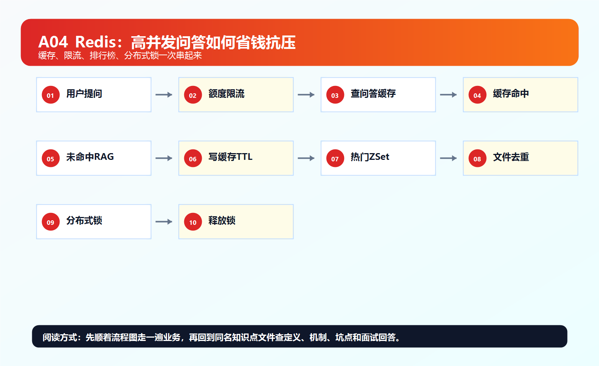
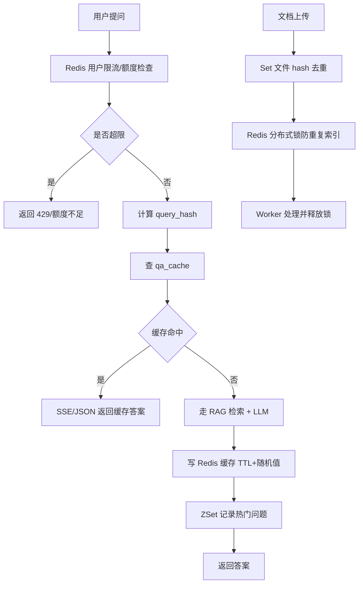

# ！重要！一个例子串起来 A04 Redis 缓存



## 场景：知识库问答系统突然被全公司同时使用

公司新制度发布后，几千个员工同时问：

```text
差旅报销流程是什么？
```

如果每次都：

```text
向量检索 -> Rerank -> 调大模型
```

系统会慢，模型成本也会炸。

Redis 这时候就登场了。

<!-- BEGIN_EXAMPLE_TERMS -->
## 读之前先把这篇的名词说清楚

这一篇把 Redis 想成前台的速查小本：高频、临时、访问很快的数据先放这里，别每次都去翻 MySQL 或重新调模型。

后面如果你看到这些词，先不要急着背定义。你可以按下面这个顺序理解：

```text
它是什么 -> 在这个例子里负责什么 -> 面试时怎么说
```

### 1. 缓存

**新手理解**：缓存就是把常用答案放在离用户更近、更快的地方。

**在这个例子里**：热点知识库配置、用户权限、部分问答结果可以放 Redis。

**面试说法**：缓存用于降低数据库和模型压力，提高响应速度。

### 2. Key-Value

**新手理解**：Key-Value 像字典，用一个 key 直接找到 value。

**在这个例子里**：`user:123:permission` 可以直接查到用户权限集合。

**面试说法**：Redis 核心是内存型 Key-Value 存储，并支持多种数据结构。

### 3. TTL

**新手理解**：TTL 是缓存的保质期，到点自动过期。

**在这个例子里**：权限或问答缓存不能永远有效，制度更新后旧缓存要过期。

**面试说法**：TTL 用于控制缓存生命周期，避免脏数据长期存在。

### 4. 缓存穿透

**新手理解**：穿透是一直查不存在的数据，请求每次都打到数据库。

**在这个例子里**：恶意用户查不存在的知识库 ID，Redis 没有，MySQL 也没有。

**面试说法**：可用空值缓存、布隆过滤器、参数校验缓解缓存穿透。

### 5. 缓存击穿

**新手理解**：击穿是一个超级热点 key 过期，瞬间大量请求打到后端。

**在这个例子里**：全公司都在问同一个报销制度答案，缓存刚好失效就会冲垮服务。

**面试说法**：可用互斥锁、逻辑过期、热点预热缓解缓存击穿。

### 6. 缓存雪崩

**新手理解**：雪崩是很多 key 同时过期，像一排支柱一起倒。

**在这个例子里**：大量知识库缓存设置了同一个过期时间，到点后请求集体打到数据库。

**面试说法**：可通过过期时间加随机值、多级缓存、限流降级缓解。

### 7. 热点 Key

**新手理解**：热点 key 是被访问特别频繁的一条缓存。

**在这个例子里**：某个公司制度或爆款问题可能成为热点 key。

**面试说法**：热点 key 要关注分片压力、预热、本地缓存和限流。

### 8. 分布式锁

**新手理解**：分布式锁像跨机器的排队牌，保证同一时刻只有一个实例做某件事。

**在这个例子里**：缓存失效后只允许一个实例去重建缓存，其他实例等待。

**面试说法**：Redis 可用 SET NX EX 实现简单分布式锁，但要处理过期和误删问题。

### 9. Lua 原子操作

**新手理解**：Lua 脚本像把几步 Redis 操作打包成一步执行，中途不会被插队。

**在这个例子里**：释放锁时要先判断锁是不是自己的，再删除，适合用 Lua 保证原子性。

**面试说法**：Redis 执行 Lua 脚本具备原子性，可避免多命令并发问题。

### 10. 淘汰策略

**新手理解**：淘汰策略就是内存满了先扔谁。

**在这个例子里**：缓存太多时，Redis 可能按 LRU/LFU 等规则淘汰旧数据。

**面试说法**：Redis 要配置 maxmemory 和淘汰策略，避免内存失控。

<!-- END_EXAMPLE_TERMS -->

## 0. 总流程图



---

## 1. 高频答案缓存：String

第一次用户问：

```text
差旅报销流程是什么？
```

系统正常走 RAG，得到答案。

然后把结果放 Redis：

```text
SET qa_cache:{tenant}:{kb}:{query_hash}:{prompt_version} answer EX 600
```

下次相同问题直接返回缓存。

对应：

```text
String
TTL
缓存 key 设计
```

---

## 2. 为什么缓存 key 不能只用 query

错误：

```text
qa_cache:差旅报销流程是什么
```

问题：

```text
不同租户
不同知识库
不同权限
不同 Prompt 版本
不同模型版本
```

答案都可能不同。

更合理：

```text
qa_cache:{tenant_id}:{user_scope}:{kb_id}:{query_hash}:{prompt_version}:{model_version}
```

---

## 3. 用户额度计数：String + INCR

公司给每个用户每天 100000 token 额度。

Redis 计数：

```text
INCRBY user:{user_id}:daily_tokens 1200
EXPIRE user:{user_id}:daily_tokens 86400
```

对应：

```text
String
incr
过期时间
限额
```

---

## 4. 用户会话短状态：Hash

一次流式回答过程中，后端可以暂存状态：

```text
HSET stream:{request_id} status running generated_tokens 300
```

对应：

```text
Hash
对象字段
短期状态
```

---

## 5. 热门问题排行：ZSet

每次用户提问后：

```text
ZINCRBY hot_queries:{kb_id} 1 {query_hash}
```

后台可以找 Top10 热门问题：

```text
ZREVRANGE hot_queries:{kb_id} 0 9 WITHSCORES
```

对应：

```text
ZSet
排行榜
TopK
```

---

## 6. 文档去重：Set

上传文档时计算 hash：

```text
file_hash = sha256(file)
```

Redis 记录已经上传过的文件：

```text
SADD uploaded_hash:{kb_id} {file_hash}
```

对应：

```text
Set
去重
```

---

## 7. 轻量任务流：Stream

如果任务规模不大，可以用 Redis Stream 做轻量队列：

```text
XADD document_events * type uploaded document_id doc_1
```

消费者组处理：

```text
XREADGROUP
XACK
```

对应：

```text
Stream
消费者组
ACK
```

大规模还是更推荐 Kafka / RocketMQ / RabbitMQ。

---

## 8. 缓存穿透：用户查不存在的文档

有人不断请求：

```text
GET /documents/not_exists
```

缓存没有，数据库也没有。

每次都打数据库，这叫缓存穿透。

解决：

```text
缓存空值
布隆过滤器
参数校验
```

---

## 9. 缓存击穿：热门问答缓存突然过期

热门问题缓存过期瞬间，1000 人同时问。

如果都去重建缓存，就会：

```text
1000 次向量检索
1000 次模型调用
```

解决：

```text
互斥锁重建缓存
逻辑过期
后台刷新
热点 key 不过期
```

---

## 10. 缓存雪崩：大量 key 同时过期

如果你给所有缓存都设置：

```text
EX 600
```

10 分钟后一起过期，数据库和模型服务压力暴增。

解决：

```text
TTL 加随机值
多级缓存
限流降级
Redis 高可用
```

---

## 11. 分布式锁：防止同一文档重复索引

多个 Worker 都想处理 doc_1。

Redis 加锁：

```text
SET lock:document:doc_1 worker_1 NX EX 300
```

释放时必须校验 value：

```text
只有 worker_1 能删 worker_1 的锁
```

对应：

```text
set nx ex
分布式锁
Lua 原子释放
```

---

## 12. Lua：额度扣减原子化

用户调用模型前要检查额度：

```text
剩余额度 >= 本次预计 token
```

不能拆成：

```text
GET
判断
DECR
```

因为并发下会超扣。

用 Lua 把检查和扣减做成原子操作。

---

## 13. Redis 持久化：RDB / AOF

Redis 是内存数据库，但也可以持久化。

```text
RDB：快照
AOF：记录写命令
```

缓存丢了可以重建，但额度、任务状态这类数据要谨慎设计持久化和恢复策略。

---

## 14. Redis 集群：热 key 问题

所有人都问同一个问题，访问同一个缓存 key。

即使用 Redis 集群，热 key 也可能压到单节点。

解决：

```text
本地缓存
热点 key 复制
请求合并
限流
```

---

## 15. 整条 Redis 链路串起来

```text
用户提问
  -> Redis 检查用户额度
  -> Redis 做限流
  -> 查问答缓存
  -> 命中直接返回
  -> 未命中走 RAG + LLM
  -> 结果写缓存，TTL 加随机值
  -> 记录热门问题 ZSet
  -> 流式过程用 Hash 暂存状态

文档上传
  -> Set 做文件 hash 去重
  -> Redis 分布式锁防止重复索引
  -> Worker 处理状态可短期缓存
```

---

## 16. 对应知识点

```text
String：答案缓存、计数器
Hash：任务和流式状态
Set：去重
ZSet：热门问题排行
Stream：轻量消息流
TTL：缓存过期
淘汰策略：内存满时处理
RDB/AOF：持久化
缓存穿透：查不存在数据
缓存击穿：热点 key 失效
缓存雪崩：大量 key 同时过期
分布式锁：防重复处理
Lua：原子操作
限流：保护模型成本
集群：扩展容量和吞吐
```

