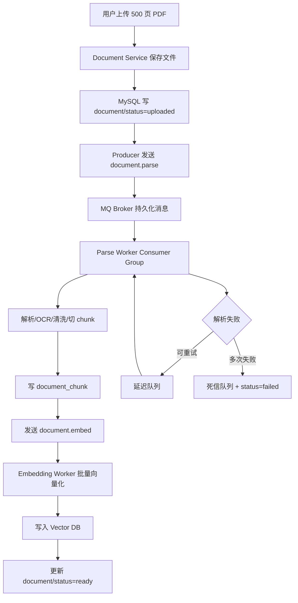

# ！重要！一个例子串起来 A05 消息队列


## 场景：用户上传 500 页 PDF，系统要后台解析并向量化

用户上传：

```text
公司财务制度合集.pdf
```

这个任务可能需要：

```text
PDF 解析
OCR
表格识别
chunk 切分
Embedding
写向量库
```

如果同步做，接口肯定很慢。

所以用 MQ。

<!-- BEGIN_EXAMPLE_TERMS -->
## 读之前先把这篇的名词说清楚

这一篇把 MQ 想成后厨传菜口：前台先接单，不等后厨把 800 页 PDF 全处理完，任务排队慢慢做。

后面如果你看到这些词，先不要急着背定义。你可以按下面这个顺序理解：

```text
它是什么 -> 在这个例子里负责什么 -> 面试时怎么说
```

### 1. 同步

**新手理解**：同步就是你让我做事，你在旁边等我做完。

**在这个例子里**：如果上传 PDF 后同步解析，用户可能等几十秒甚至几分钟。

**面试说法**：同步调用简单直观，但耗时任务会拖慢请求。

### 2. 异步

**新手理解**：异步就是先把任务记下来，马上告诉用户已受理，后面慢慢处理。

**在这个例子里**：上传文档后先返回，解析、切分、向量化交给后台 worker。

**面试说法**：异步化能削峰、解耦、提升接口响应速度。

### 3. 生产者

**新手理解**：生产者是发任务的人。

**在这个例子里**：文档服务把 `parse_document` 消息发到 MQ。

**面试说法**：生产者负责把消息投递到队列或 Topic。

### 4. 消费者

**新手理解**：消费者是领任务干活的人。

**在这个例子里**：解析 worker 从 MQ 拉取消息，执行解析、切分、Embedding。

**面试说法**：消费者负责消费消息并执行业务逻辑。

### 5. Topic / Queue

**新手理解**：Topic 像任务频道，Queue 像排队队列。

**在这个例子里**：文档解析、Embedding、索引构建可以放到不同 Topic 或队列。

**面试说法**：消息系统通过 Topic/Queue 组织消息和消费关系。

### 6. ACK

**新手理解**：ACK 就是消费者告诉队列：这活我干完了，可以删了。

**在这个例子里**：worker 成功写入向量库后再 ACK，避免任务丢失。

**面试说法**：ACK 机制用于确认消息成功消费。

### 7. 重试

**新手理解**：重试就是这次失败了，稍后再试一次。

**在这个例子里**：PDF 解析服务偶发失败时，可以让消息重新消费。

**面试说法**：重试能提高成功率，但必须配合幂等和最大次数。

### 8. 死信队列

**新手理解**：死信队列像疑难杂症收纳箱，反复失败的任务放进去人工排查。

**在这个例子里**：某个损坏 PDF 多次解析失败后进入死信队列。

**面试说法**：死信队列用于隔离无法正常消费的消息。

### 9. 幂等

**新手理解**：幂等就是同一件事做多次，最终结果和做一次一样。

**在这个例子里**：同一个文档解析消息被重复消费，也不能重复插入 chunk。

**面试说法**：MQ 至少一次投递很常见，消费者必须设计幂等。

### 10. 消息堆积

**新手理解**：堆积就是队列里任务进得比出得快。

**在这个例子里**：秋招季很多人上传文档，解析 worker 不够就会堆积。

**面试说法**：要通过扩容消费者、限流、拆分队列等方式处理消息堆积。

<!-- END_EXAMPLE_TERMS -->

## 0. 总流程图



---

## 1. 上传接口只做轻活

用户请求：

```text
POST /api/v1/documents/upload
```

后端做：

```text
保存原文件
写 document(status=uploaded)
发送 document.parse 消息
返回 task_id
```

用户看到：

```text
文档处理中
```

---

## 2. MQ 解决什么问题

这里 MQ 解决：

```text
异步：不用让用户等完整解析
解耦：上传服务不直接依赖解析服务
削峰：上传高峰时任务排队
重试：解析失败可以重新消费
```

---

## 3. Topic：任务分类

可以设计 Topic：

```text
document.parse
document.embed
document.delete_index
evaluation.run
```

每类任务独立消费、独立扩容。

---

## 4. Producer：上传服务发消息

Document Service 是生产者：

```text
Producer -> document.parse
```

消息内容：

```json
{
  "document_id": "doc_1",
  "tenant_id": "t1",
  "file_url": "oss://bucket/doc_1.pdf",
  "version": 1
}
```

---

## 5. Consumer：Parse Worker 消费

Parse Worker 是消费者。

它收到消息后：

```text
下载文件
解析文本
清洗
切分 chunk
写 document_chunk
发送 document.embed
```

---

## 6. Consumer Group：多个 Worker 并行

如果文件很多，一个 Worker 不够。

可以启动多个：

```text
Parse Worker 1
Parse Worker 2
Parse Worker 3
```

它们属于同一个消费者组。

同一条消息只由其中一个处理。

---

## 7. Partition：按 document_id 保证局部顺序

同一个文档最好按顺序：

```text
parse -> embed -> ready
```

可以用：

```text
document_id 作为分区 key
```

让同一文档相关消息进入同一分区。

---

## 8. 消息可靠性：消息不能丢

如果 parse 消息丢了：

```text
document 永远 uploaded
用户永远不能问
```

所以要：

```text
生产者确认
Broker 持久化
消费者手动 ACK
失败重试
补偿扫描
```

---

## 9. 重复消费：一定会发生，要靠幂等

消费者处理完，ACK 还没发成功，服务重启。

Broker 可能重新投递。

所以同一消息可能被消费多次。

解决不是幻想“绝不重复”，而是：

```text
业务幂等
```

Embedding 幂等 key：

```text
document_id + chunk_id + embedding_model_version
```

---

## 10. 状态机：防止乱跳

document 状态：

```text
uploaded
parsing
parsed
embedding
ready
failed
```

Worker 处理前先检查状态。

如果已经 ready，重复消息直接跳过。

---

## 11. 延迟队列：失败后不要立刻狂重试

PDF 解析失败，可能是临时网络问题。

可以：

```text
5 分钟后重试
30 分钟后重试
```

这对应延迟队列。

---

## 12. 死信队列：一直失败要收口

如果重试 5 次还失败：

```text
进入 dead_letter_document_parse
document.status = failed
```

后台管理员可以查看失败原因。

---

## 13. 事务消息 / 本地消息表：数据库和 MQ 一致

上传时有一个经典问题：

```text
MySQL 写 document 成功
MQ 消息发送失败
```

这样文档记录存在，但没人解析。

解决：

```text
事务消息
本地消息表
定时补偿扫描 uploaded 状态
```

---

## 14. Kafka / RabbitMQ / RocketMQ 怎么选

在这个项目里：

```text
Kafka：适合大规模日志、事件流、评测任务
RabbitMQ：适合中小规模业务异步任务
RocketMQ：适合事务消息、延迟消息、顺序消息
```

面试不必争绝对优劣，要说清场景。

---

## 15. 整条 MQ 链路串起来

```text
用户上传 PDF
  -> Document Service 写 MySQL
  -> 发送 document.parse
  -> Parse Worker 消费
  -> 解析、清洗、切 chunk
  -> 写 chunk 表
  -> 发送 document.embed
  -> Embedding Worker 消费
  -> 批量调用 Embedding 模型
  -> 写向量库
  -> 更新 document.status = ready

失败
  -> 延迟重试
  -> 多次失败进死信队列
  -> 状态 failed
```

---

## 16. 对应知识点

```text
Producer：上传服务
Consumer：解析/向量化 Worker
Topic：任务分类
Partition：并行和局部顺序
Consumer Group：多个 Worker 分摊任务
可靠性：消息不能丢
重复消费：靠幂等
顺序消息：同一文档任务按序
延迟队列：失败后稍后重试
死信队列：失败收口
事务消息：数据库和消息一致
Kafka/RabbitMQ/RocketMQ：不同场景选型
```

