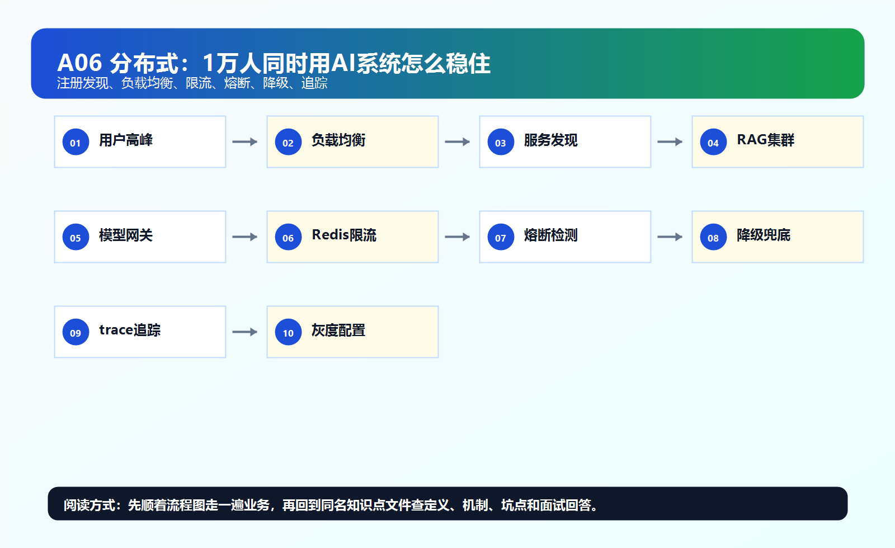
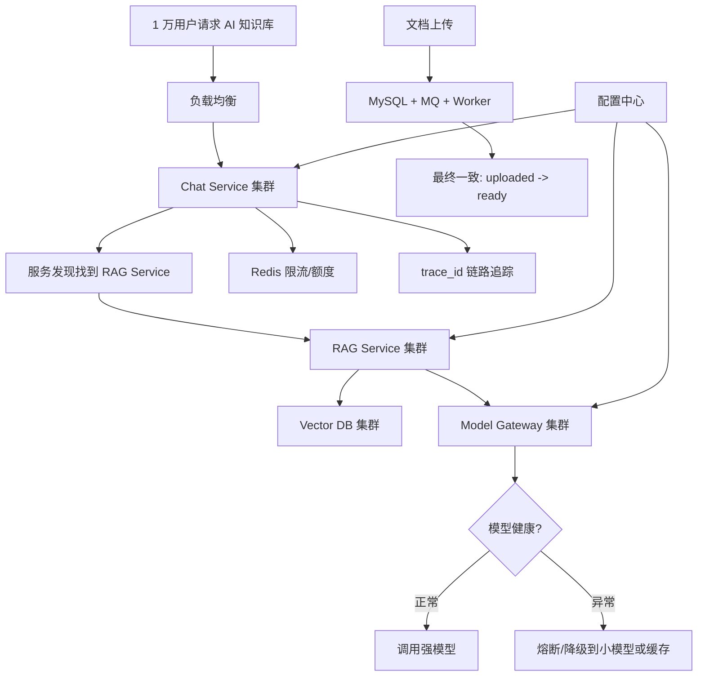

# ！重要！一个例子串起来 A06 分布式系统



## 场景：公司 1 万人同时使用 AI 知识库

系统不是单机：

```text
Chat Service 多实例
RAG Service 多实例
Model Gateway 多实例
Worker 多实例
MySQL 主从
Redis 集群
MQ 集群
Vector DB 集群
```

这就是分布式系统。

<!-- BEGIN_EXAMPLE_TERMS -->
## 读之前先把这篇的名词说清楚

这一篇把分布式系统想成很多小组一起办一场活动：每个小组只做一部分，但要互相找得到、配合得上、出错时不拖垮全场。

后面如果你看到这些词，先不要急着背定义。你可以按下面这个顺序理解：

```text
它是什么 -> 在这个例子里负责什么 -> 面试时怎么说
```

### 1. 服务拆分

**新手理解**：服务拆分就是把一个大系统拆成多个职责更清楚的小服务。

**在这个例子里**：Chat、RAG、文档解析、模型网关可以拆成不同服务。

**面试说法**：服务拆分能降低耦合，但会带来网络调用和一致性问题。

### 2. RPC

**新手理解**：RPC 像调用本地函数一样调用远程服务。

**在这个例子里**：Chat Service 可以通过 RPC 调 RAG Service 或 Model Gateway。

**面试说法**：RPC 屏蔽部分网络细节，但本质仍是远程调用。

### 3. 注册中心

**新手理解**：注册中心像服务通讯录，记录每个服务实例在哪里。

**在这个例子里**：Chat Service 要找到可用的 RAG Service，就可以查注册中心。

**面试说法**：注册中心用于服务发现和实例上下线管理。

### 4. 配置中心

**新手理解**：配置中心像远程开关面板，不用重新发版就能改参数。

**在这个例子里**：模型超时时间、限流阈值、开关新检索策略都可以放配置中心。

**面试说法**：配置中心支持动态配置和统一管理。

### 5. CAP

**新手理解**：CAP 是分布式系统的三难选择：一致性、可用性、分区容错性不能同时完美。

**在这个例子里**：网络抖动时，系统要选择继续服务还是强等数据一致。

**面试说法**：CAP 用于理解分布式系统在网络分区下的取舍。

### 6. 一致性

**新手理解**：一致性就是不同节点看到的数据是不是一样。

**在这个例子里**：文档更新后，不能一部分用户搜到旧制度，一部分搜到新制度。

**面试说法**：分布式系统要明确强一致、最终一致等策略。

### 7. 分布式事务

**新手理解**：分布式事务是跨多个服务或数据库的一组操作要一起成功。

**在这个例子里**：文档状态写 MySQL、索引写向量库，如果一边成功一边失败就要补偿。

**面试说法**：常见方案有本地消息表、Saga、TCC、最终一致。

### 8. 限流

**新手理解**：限流像景区限人数，保护系统别被瞬时流量挤爆。

**在这个例子里**：很多人同时问大模型时，要限制每个用户或租户的请求速率。

**面试说法**：限流用于保护下游资源，常见算法有令牌桶、漏桶。

### 9. 熔断

**新手理解**：熔断像电路保险丝，下游一直失败时先断开，别拖垮自己。

**在这个例子里**：模型服务连续超时，模型网关可以短暂拒绝或切换备用模型。

**面试说法**：熔断用于阻止故障扩散。

### 10. 链路追踪

**新手理解**：链路追踪像快递轨迹，能看到一个请求经过哪些服务、哪里慢。

**在这个例子里**：一次问答可能经过 Chat、RAG、向量库、模型网关，需要 trace 定位问题。

**面试说法**：链路追踪用于分布式系统的性能分析和故障定位。

<!-- END_EXAMPLE_TERMS -->

## 0. 总流程图



---

## 1. 为什么要分布式

单机撑不住：

```text
请求多
文件多
模型调用慢
日志量大
需要容灾
```

所以拆成多个服务。

---

## 2. 服务注册发现

Chat Service 要调用 RAG Service。

但 RAG Service 有多个实例：

```text
rag-1
rag-2
rag-3
```

服务注册中心记录它们。

Chat Service 通过服务发现找到可用实例。

---

## 3. 负载均衡

请求进来后分发：

```text
用户请求
  -> Load Balancer
  -> Chat Service 2
```

服务间也要负载均衡：

```text
Chat Service -> RAG Service 1/2/3
```

模型推理服务还要考虑：

```text
GPU 利用率
队列长度
显存
```

---

## 4. CAP：文档 ready 状态要怎么取舍

网络分区时，系统可能无法同时保证：

```text
一致性
可用性
分区容错
```

例如：

```text
文档已经写 MySQL
向量库暂时不可用
```

你可以让用户继续上传，但状态显示 processing。

这是偏可用和最终一致。

---

## 5. BASE：文档索引适合最终一致

文档上传后，不要求立刻能问。

流程是：

```text
uploaded -> parsing -> embedding -> ready
```

用户看到处理中。

最终 ready 后可检索。

这就是 BASE / 最终一致的业务体现。

---

## 6. 限流：保护模型成本

1 万人同时问，不能无限调用强模型。

限流维度：

```text
用户 QPS
租户 QPS
模型 QPS
每日 token
每月费用
```

超过后：

```text
429
排队
降级模型
提示稍后再试
```

---

## 7. 熔断：模型服务挂了不能拖垮主系统

如果某模型接口：

```text
超时率 80%
错误率 60%
```

模型网关应该熔断：

```text
暂时不再调用它
```

否则所有请求都会卡在模型调用上。

---

## 8. 降级：保证核心体验

模型或 Rerank 服务不可用时，可以：

```text
强模型 -> 小模型
关闭 Rerank
返回缓存答案
返回检索片段
转人工
```

分布式系统里，稳定比完美更重要。

---

## 9. 分布式事务：上传文档跨多个资源

上传文档涉及：

```text
对象存储
MySQL
MQ
向量库
```

不适合强行一个大事务。

常用：

```text
本地事务 + MQ + 状态机 + 补偿任务
```

保证最终一致。

---

## 10. 分布式 ID：所有链路都要能串起来

一次问答需要：

```text
trace_id
request_id
conversation_id
message_id
document_id
chunk_id
task_id
```

这些 ID 要全局唯一。

常见方案：

```text
UUID
雪花算法
号段模式
```

---

## 11. 配置中心：不用发版就能改策略

AI 系统经常调：

```text
TopK
Rerank 开关
模型路由
Prompt 版本
超时时间
限流阈值
```

这些适合放配置中心。

---

## 12. 链路追踪：一次问答慢在哪里

用户说：

```text
AI 回答太慢了。
```

你要看 trace：

```text
auth 10ms
redis 2ms
vector search 300ms
rerank 900ms
model first token 4500ms
stream total 12000ms
```

这样才知道瓶颈在模型，不是数据库。

---

## 13. 灰度发布：Prompt 也要灰度

AI 应用灰度的不只是代码：

```text
Prompt
模型
Embedding
Rerank
检索策略
chunk 策略
```

比如新 Prompt 先给 5% 用户，用评测和线上反馈观察。

---

## 14. 整条分布式链路串起来

```text
用户请求
  -> 负载均衡
  -> Chat Service
  -> 服务发现找到 RAG Service
  -> RAG 调 Vector DB
  -> Model Gateway 调模型
  -> Redis 做限流
  -> MQ 做异步任务
  -> trace_id 串起全链路

如果模型异常
  -> 熔断
  -> 降级备用模型或缓存

如果文档入库
  -> MySQL + MQ + 向量库最终一致
```

---

## 15. 对应知识点

```text
CAP：网络分区时一致性和可用性取舍
BASE：文档索引最终一致
服务注册发现：找到服务实例
负载均衡：分发请求
限流：保护成本和系统
熔断：下游异常时快速失败
降级：保核心可用
分布式事务：跨资源一致性
分布式 ID：全局唯一
配置中心：动态调整策略
链路追踪：定位慢请求
灰度发布：小流量验证
```

