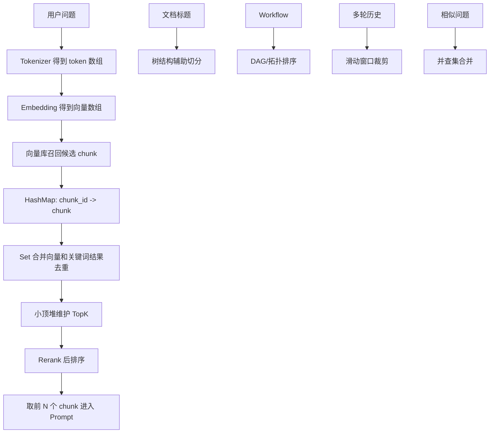

# ！重要！一个例子串起来 A07 数据结构与算法


## 场景：RAG 系统从 100 万个 chunk 里找最相关的 5 个

用户问：

```text
出差报销需要哪些材料？
```

系统要从 100 万个文档 chunk 中找到最相关的 5 个。

这件事能串起很多算法。

<!-- BEGIN_EXAMPLE_TERMS -->
## 读之前先把这篇的名词说清楚

这一篇把算法想成从 100 万份候选资料里快速挑前 5 个。数据结构不是为刷题而刷题，是为了让系统找得快、排得准、扛得住。

后面如果你看到这些词，先不要急着背定义。你可以按下面这个顺序理解：

```text
它是什么 -> 在这个例子里负责什么 -> 面试时怎么说
```

### 1. 时间复杂度

**新手理解**：时间复杂度是在估算数据变多以后，程序会慢得多快。

**在这个例子里**：100 万个 chunk 不能每次都傻傻全量排序。

**面试说法**：复杂度用于评估算法随输入规模增长的性能变化。

### 2. 空间复杂度

**新手理解**：空间复杂度是在估算程序为了跑得快要多占多少内存。

**在这个例子里**：缓存 topK、去重集合、倒排索引都会占内存。

**面试说法**：算法设计要在时间和空间之间做权衡。

### 3. TopK

**新手理解**：TopK 就是从一堆候选里选最好的 K 个。

**在这个例子里**：RAG 检索常要从大量 chunk 中选最相关的前 5 或前 10 个。

**面试说法**：TopK 可用堆、快速选择、排序等方式实现。

### 4. 堆

**新手理解**：堆像一个随时能拿到最大值或最小值的优先队列。

**在这个例子里**：维护一个大小为 K 的小顶堆，可以不用全量排序就找 topK。

**面试说法**：堆适合动态维护 topK，复杂度通常是 O(n log K)。

### 5. 哈希表

**新手理解**：哈希表像按身份证号直接找人，查找很快。

**在这个例子里**：合并向量检索和关键词检索结果时，可以用哈希表去重。

**面试说法**：哈希表平均 O(1) 查询，常用于去重和快速映射。

### 6. 排序

**新手理解**：排序就是把候选按分数从高到低排好。

**在这个例子里**：Rerank 后要按相关性分数排序，再取前几个放进 Prompt。

**面试说法**：排序常见复杂度 O(n log n)，数据量大时要避免不必要全排序。

### 7. 向量相似度

**新手理解**：向量相似度是在问：两个句子的方向像不像。

**在这个例子里**：用户问题和 chunk 的 embedding 越相似，说明语义越接近。

**面试说法**：常见相似度有 cosine、dot product、欧氏距离。

### 8. 倒排索引

**新手理解**：倒排索引像书后面的关键词索引，从词反查哪些文档出现过。

**在这个例子里**：关键词检索查“报销”“发票”时，会用类似倒排索引的结构。

**面试说法**：搜索引擎常用倒排索引支持关键词检索。

### 9. 去重

**新手理解**：去重就是同一个候选不要重复进入 Prompt。

**在这个例子里**：向量检索和关键词检索可能召回同一个 chunk，需要合并去重。

**面试说法**：去重常用哈希集合，避免重复内容浪费 token。

### 10. 剪枝

**新手理解**：剪枝就是提前丢掉明显没希望的候选，少做无用功。

**在这个例子里**：先按权限、知识库、文档版本过滤，再做相关性排序。

**面试说法**：剪枝能降低计算量，是大规模检索里的常见优化。

<!-- END_EXAMPLE_TERMS -->

## 0. 总流程图



---

## 1. 文本先变成数组：Embedding 向量

用户问题会变成向量：

```text
[0.12, -0.03, 0.88, ...]
```

本质就是数组。

对应：

```text
数组
随机访问
向量计算
```

---

## 2. chunk_id 映射：哈希表

向量库返回：

```text
chunk_101
chunk_208
chunk_333
```

后端要快速找到 chunk 内容。

可以用 Map：

```text
chunk_id -> chunk_content
```

对应：

```text
哈希表
O(1) 查询
去重
```

---

## 3. 检索结果去重：Set

混合检索会同时有：

```text
向量检索结果
关键词检索结果
```

同一个 chunk 可能出现两次。

用 Set 去重：

```text
seen_chunk_ids
```

---

## 4. TopK：堆

系统不需要排序 100 万个 chunk，只要前 5 个。

可以维护一个大小为 5 的小顶堆。

过程：

```text
新 chunk 分数比堆顶高 -> 替换
否则丢弃
```

复杂度：

```text
O(n log k)
```

这就是堆和 TopK。

---

## 5. 检索结果排序：排序算法

Rerank 后得到分数：

```text
chunk_1 0.92
chunk_2 0.85
chunk_3 0.78
```

要按分数降序。

这就是排序。

面试要知道：

```text
快排平均 O(n log n)
归并稳定 O(n log n)
堆排 O(n log n)
```

---

## 6. 文档标题层级：树

制度文档可能是：

```text
1 差旅制度
  1.1 交通
  1.2 住宿
2 报销流程
  2.1 材料
  2.2 审批
```

这是树结构。

切 chunk 时可以按标题树切。

对应：

```text
二叉树 / 多叉树
DFS
层级结构
```

---

## 7. Workflow 依赖：图和拓扑排序

文档入库流程：

```text
上传 -> 解析 -> 清洗 -> 切分 -> Embedding -> 入库
```

如果有更复杂依赖：

```text
OCR 和表格解析可以并行
都完成后才能合并
```

这就是 DAG。

执行顺序可以用拓扑排序理解。

---

## 8. Agent 搜索路径：BFS / DFS

Agent 要完成任务：

```text
查制度 -> 查订单 -> 生成答复
```

如果把每一步工具调用看成状态节点，Agent 在状态空间里搜索路径。

这可以类比：

```text
BFS
DFS
图搜索
```

生产里要限制：

```text
max_steps
```

避免搜索失控。

---

## 9. 相似问题合并：并查集

用户问题：

```text
报销流程是什么？
怎么申请报销？
费用报销步骤？
```

这些可以聚为一类。

如果不断发现两个问题相似，就把它们合并到同一集合。

这可以用并查集理解：

```text
find
union
```

---

## 10. token 窗口裁剪：滑动窗口

上下文窗口有限。

历史消息太多时，可以保留最近 N 轮。

这像滑动窗口：

```text
[最近 10 条消息]
窗口随着对话向后移动
```

chunk overlap 也像滑动窗口：

```text
chunk1: 0-500
chunk2: 400-900
chunk3: 800-1300
```

---

## 11. 阈值查找：二分

你在调一个相似度阈值：

```text
score >= x 才进入 Prompt
```

阈值太高召回少，太低噪声多。

可以通过二分在评测集上找合适阈值。

这就是答案二分的思想。

---

## 12. 编辑距离：动态规划

两个问题：

```text
报销流程
报销流成
```

有错别字。

编辑距离可以判断它们很接近。

编辑距离经典做法就是动态规划。

---

## 13. 整条算法链路串起来

```text
用户问题
  -> tokenizer 得到 token 数组
  -> embedding 得到向量数组
  -> 向量库召回候选
  -> HashMap 映射 chunk 信息
  -> Set 合并去重
  -> 堆维护 TopK
  -> Rerank 后排序
  -> 标题树帮助 chunk 切分
  -> Workflow DAG 用拓扑关系执行
  -> 多轮历史用滑动窗口裁剪
  -> 相似问题用并查集合并
  -> 阈值调参可用二分思想
```

---

## 14. 对应知识点

```text
数组：embedding 向量
链表：基础结构，面试常考
栈：解析嵌套结构
队列：BFS 和任务排队
哈希表：chunk_id 映射
树：文档标题结构
堆：TopK
图：Workflow / Agent 状态
并查集：相似问题合并
排序：Rerank 排序
二分：阈值搜索
滑动窗口：上下文裁剪和 chunk overlap
动态规划：编辑距离
```

---

## 15. 面试总结版

```text
算法在 RAG 系统里不是孤立刷题。Embedding 本质是数组，chunk_id 查找用哈希表，混合检索结果要用 Set 去重，TopK 可以用堆维护，Rerank 后要排序，文档标题可以看成树，Workflow 和 Agent 可以看成图，多轮上下文裁剪像滑动窗口。这样算法知识就能和 AI 应用项目自然结合起来。
```

