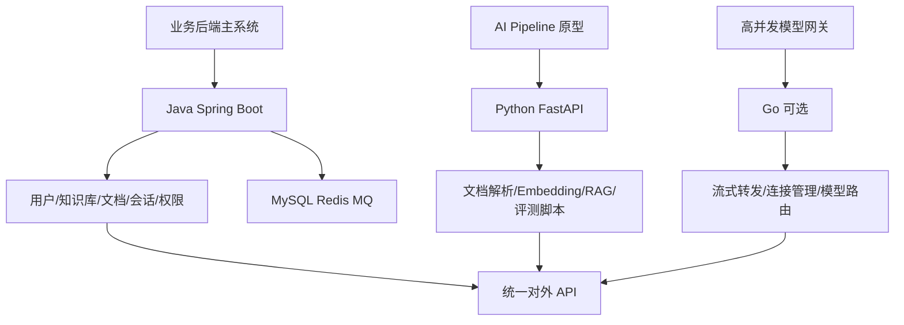

# ！重要！一个例子串起来 B01 编程语言


## 场景：你要从 0 写一个企业知识库问答后端

你准备实现：

```text
用户上传文档
文档异步向量化
用户发起问答
后端 RAG 检索
模型流式返回
```

这时语言选择不是抽象争论，而是不同语言负责不同部分。

<!-- BEGIN_EXAMPLE_TERMS -->
## 读之前先把这篇的名词说清楚

这一篇把语言选择想成给不同岗位选工具：Java 稳，Python 快，Go 轻。后端 AI 应用不是只会一种语言，而是知道每种语言适合放在哪条链路。

后面如果你看到这些词，先不要急着背定义。你可以按下面这个顺序理解：

```text
它是什么 -> 在这个例子里负责什么 -> 面试时怎么说
```

### 1. 静态类型

**新手理解**：静态类型是在运行前就尽量把类型检查清楚。

**在这个例子里**：Java/Go 写核心后端接口时，类型清晰更利于维护。

**面试说法**：静态类型语言通常编译期能发现更多类型错误。

### 2. 动态类型

**新手理解**：动态类型是运行时才更灵活地决定变量是什么。

**在这个例子里**：Python 写文档解析、模型实验、脚本工具很快。

**面试说法**：动态类型开发效率高，但大型工程要靠规范和测试兜底。

### 3. JVM

**新手理解**：JVM 是 Java 程序运行的虚拟机器。

**在这个例子里**：Java 后端服务通过 JVM 获得成熟的生态、线程模型和监控能力。

**面试说法**：JVM 提供跨平台运行、GC、类加载和运行时优化。

### 4. GIL

**新手理解**：GIL 是 Python 解释器里的一把全局锁，会限制多线程同时执行 Python 字节码。

**在这个例子里**：Python 适合 I/O 密集和脚本任务，但 CPU 密集解析要注意多进程或原生库。

**面试说法**：GIL 会影响 Python CPU 密集型多线程并行效果。

### 5. goroutine

**新手理解**：goroutine 是 Go 里的轻量级并发执行单元，比传统线程更轻。

**在这个例子里**：模型网关或高并发代理服务可以用 Go 管理大量请求。

**面试说法**：Go 通过 goroutine 和 channel 提供轻量并发模型。

### 6. GC

**新手理解**：GC 是垃圾回收，自动清理不用的内存。

**在这个例子里**：聊天服务频繁创建对象，GC 参数会影响延迟抖动。

**面试说法**：有 GC 的语言要关注停顿时间、内存占用和对象分配。

### 7. SDK 封装

**新手理解**：SDK 封装就是把复杂调用包成好用的工具包。

**在这个例子里**：把模型调用、重试、日志、错误处理封装成 ModelClient。

**面试说法**：工程中常通过 SDK/Client 封装外部服务调用，统一治理。

### 8. 异常处理

**新手理解**：异常处理是程序出错后的处理路线。

**在这个例子里**：模型超时、向量库失败、参数非法都要转换成可理解的错误。

**面试说法**：后端要区分业务异常、系统异常和外部依赖异常。

<!-- END_EXAMPLE_TERMS -->

## 0. 总流程图



---

## 1. Java：负责企业级后端主干

如果你投国内后端 AI 应用岗位，Java 很适合作为主语言。

它负责：

```text
用户登录
知识库管理
文档管理
会话消息
权限系统
模型调用日志
后台管理
```

原因：

```text
Spring 生态成熟
MySQL/Redis/MQ 集成强
企业后端面试认可度高
```

---

## 2. Java 集合：在项目里怎么用

检索结果回来：

```text
List<ChunkResult>
```

chunk 去重：

```text
Set<String> chunkIds
```

chunk_id 查内容：

```text
Map<String, Chunk>
```

TopK：

```text
PriorityQueue<ChunkResult>
```

这些集合不是刷题里的孤岛，而是 RAG 后端天天会用。

---

## 3. ConcurrentHashMap：本地缓存

你可能在模型网关里缓存模型配置：

```text
model_name -> model_config
```

多个请求线程同时读取。

用：

```text
ConcurrentHashMap
```

而不是普通 HashMap。

---

## 4. 线程池：文档处理和模型调用要隔离

Java 后端里会有：

```text
documentParseExecutor
embeddingExecutor
modelCallExecutor
```

解析 PDF 偏 CPU。

调用模型 API 偏 IO。

不要混用同一个线程池，否则：

```text
PDF 解析慢 -> 模型调用也排队
模型接口慢 -> 文档解析也卡住
```

---

## 5. JVM：大文件和长 Prompt 会制造内存压力

如果一次性把 500 页 PDF 读成字符串：

```text
String allText = ...
```

再切成几千个 chunk，堆内存会膨胀。

你要关注：

```text
堆
GC
OOM
大对象
```

---

## 6. Python：负责 AI 实验和数据处理

Python 适合：

```text
文档解析脚本
RAG 原型
Embedding 批处理
评测脚本
Prompt 实验
```

原因：

```text
AI SDK 多
数据处理方便
实验速度快
```

---

## 7. Python async：同时调多个外部服务

RAG 服务可能要并行：

```text
向量检索
关键词检索
Rerank
模型调用
```

这些都是 IO 等待。

Python 的 async / await 可以提高并发。

但 CPU 密集的 OCR 不适合只靠 async。

---

## 8. Go：可选做高并发网关

如果你要写模型网关：

```text
大量长连接
SSE 流式转发
模型路由
连接管理
```

Go 的 goroutine 和 channel 很适合。

秋招不一定主攻，但知道它适合高并发会加分。

---

## 9. 最终语言分工

```text
Java：业务后端主系统
Python：AI Pipeline 和评测
Go：高并发网关可选
```

---

## 10. 面试总结版

```text
我会用 Java/Spring Boot 承担企业级后端主系统，包括用户、知识库、文档、权限、会话和日志；用 Python/FastAPI 快速实现 RAG、文档解析、Embedding 和评测；如果需要高并发模型网关，可以考虑 Go。语言选择不是孤立的，而是根据业务模块、生态和性能需求分工。
```

