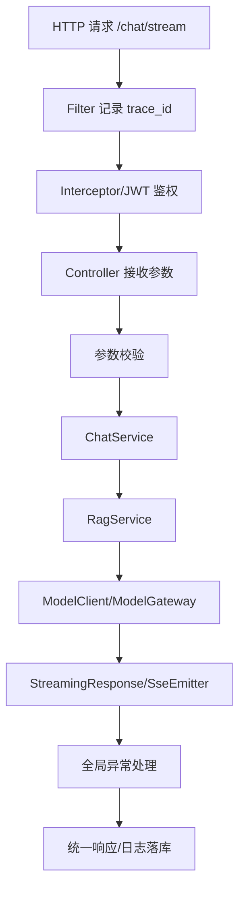

# ！重要！一个例子串起来 B02 Web 框架


## 场景：一次 `/chat/stream` 请求在 Spring Boot / FastAPI 里怎么走

用户在前端点击发送：

```text
出差报销流程是什么？
```

请求：

```text
POST /api/v1/chat/stream
```

这能串起 Web 框架知识。

<!-- BEGIN_EXAMPLE_TERMS -->
## 读之前先把这篇的名词说清楚

这一篇把 Web 框架想成餐厅前厅：路由负责把客人带到窗口，中间件先验票，Handler 真正处理订单，最后统一出餐和兜底异常。

后面如果你看到这些词，先不要急着背定义。你可以按下面这个顺序理解：

```text
它是什么 -> 在这个例子里负责什么 -> 面试时怎么说
```

### 1. 路由

**新手理解**：路由就是 URL 到处理函数的映射表。

**在这个例子里**：`POST /chat/stream` 会被路由到聊天处理函数。

**面试说法**：Web 框架通过路由把不同请求分发到不同 Handler。

### 2. Controller / Handler

**新手理解**：Handler 是真正处理请求的人。

**在这个例子里**：聊天 Handler 读取问题、调用 RAG 和模型网关，再返回流。

**面试说法**：Controller/Handler 承担应用层请求处理逻辑。

### 3. Middleware

**新手理解**：Middleware 像进门前的一排检查岗。

**在这个例子里**：鉴权、日志、限流、跨域、trace 都可以放在中间件里。

**面试说法**：中间件用于在业务处理前后统一增强请求链路。

### 4. DTO

**新手理解**：DTO 是接口传输用的数据盒子。

**在这个例子里**：前端提交的 question、kb_id、conversation_id 可以封装成请求 DTO。

**面试说法**：DTO 用于隔离接口输入输出和内部领域对象。

### 5. 依赖注入

**新手理解**：依赖注入就是不要在 Handler 里到处 new，而是把需要的服务提前装配进来。

**在这个例子里**：Chat Handler 依赖 RagService、ModelClient、MessageRepository。

**面试说法**：依赖注入能降低耦合，便于测试和替换实现。

### 6. ORM

**新手理解**：ORM 是把数据库表和代码对象对应起来的工具。

**在这个例子里**：保存会话消息时，可以通过 ORM 操作 Message 对象而不是手写 SQL。

**面试说法**：ORM 提升开发效率，但复杂查询仍要关注 SQL 性能。

### 7. 连接池

**新手理解**：连接池是复用数据库、Redis、HTTP 连接的池子。

**在这个例子里**：每次请求都访问数据库和模型服务，必须复用连接。

**面试说法**：连接池减少建连成本，但要配置大小、超时和泄漏监控。

### 8. 全局异常处理

**新手理解**：全局异常处理像统一客服，所有错误都按统一格式回复。

**在这个例子里**：参数错返回 400，没权限返回 403，模型超时返回可理解提示。

**面试说法**：Web 服务要统一错误码、日志和异常转换。

### 9. SSE

**新手理解**：SSE 是后端持续向浏览器推送文本流。

**在这个例子里**：模型边生成，Web 框架边 flush 给前端。

**面试说法**：SSE 适合聊天类单向流式输出。

<!-- END_EXAMPLE_TERMS -->

## 0. 总流程图



---

## 1. Controller：只接请求，不堆业务

Controller 做：

```text
接收请求
参数校验
调用 Service
返回响应
```

不应该在 Controller 里：

```text
查数据库
拼 Prompt
调模型
写日志
```

否则代码会很乱。

---

## 2. IOC：依赖由容器管理

ChatController 依赖 ChatService：

```text
ChatController -> ChatService -> RagService -> ModelClient
```

这些对象交给 Spring IOC 管理。

好处：

```text
解耦
可测试
可替换模型客户端
配置统一
```

---

## 3. AOP：记录模型调用日志

模型调用前后都要记录：

```text
耗时
token
成本
错误码
trace_id
```

这些是横切逻辑，可以用 AOP 或统一网关处理。

---

## 4. Spring MVC 请求流程

一次请求大致经过：

```text
DispatcherServlet
  -> HandlerMapping
  -> HandlerAdapter
  -> Controller
  -> MessageConverter
```

你不用死背类名，但要知道请求不是直接飞到业务方法里的，中间有框架调度。

---

## 5. Bean 生命周期：模型客户端初始化

模型客户端可能要初始化：

```text
HTTP 连接池
API Key
超时配置
```

这些可以在 Bean 初始化时完成。

服务关闭时释放连接。

---

## 6. Spring 事务：不要把模型调用放事务里

保存用户消息可以开事务：

```text
insert user_message
```

但不要在事务里调用大模型：

```text
开启事务
  -> 调模型等 20 秒
  -> 提交
```

这会长时间占数据库连接和锁。

正确：

```text
先保存必要状态
事务提交
再调用模型
最后更新结果
```

---

## 7. FastAPI：适合 AI 服务

如果 RAG 服务用 Python：

```text
FastAPI
```

它适合：

```text
Pydantic 参数校验
async 模型调用
StreamingResponse 流式返回
快速接 AI SDK
```

---

## 8. Pydantic：校验请求和模型输出

请求体：

```text
question: string
kb_id: string
top_k: int
```

Pydantic 可以校验类型。

模型结构化输出也可以用它校验。

---

## 9. StreamingResponse / SseEmitter：流式输出

模型生成 token：

```text
delta_1
delta_2
delta_3
```

后端用：

```text
Spring SseEmitter
FastAPI StreamingResponse
```

逐段返回。

---

## 10. 整条 Web 框架链路

```text
请求进入 Filter
  -> 生成 trace_id
  -> Interceptor 鉴权
  -> Controller 参数校验
  -> Service 编排 RAG
  -> Repository 查数据库
  -> Client 调模型
  -> StreamingResponse 返回
  -> 全局异常处理兜底
  -> 日志统一记录
```

---

## 11. 面试总结版

```text
Web 框架负责把 HTTP 请求转成后端业务调用。以 chat/stream 为例，请求先经过 Filter 和鉴权拦截器，再到 Controller 做参数校验，随后 Service 编排 RAG 和模型调用，最后通过 SSE 流式返回。IOC 负责依赖管理，AOP 可用于日志和监控，事务只包数据库操作，不应该包慢模型调用。
```

