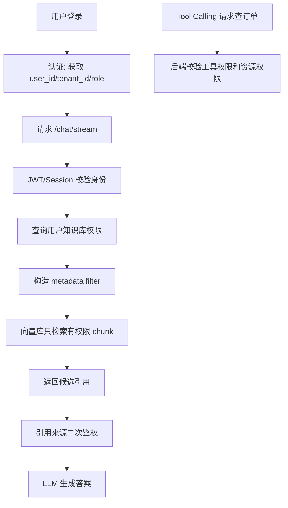

# ！重要！一个例子串起来 B04 认证鉴权


## 场景：财务知识库只有财务部能访问

公司有两个知识库：

```text
财务制度知识库
研发规范知识库
```

普通研发同学问：

```text
公司年度预算审批流程是什么？
```

如果系统把财务文档召回给他，就是严重越权。

<!-- BEGIN_EXAMPLE_TERMS -->
## 读之前先把这篇的名词说清楚

这一篇把认证鉴权想成进公司大楼：认证先确认你是谁，鉴权再确认你能进哪间办公室、能看哪份文件。

后面如果你看到这些词，先不要急着背定义。你可以按下面这个顺序理解：

```text
它是什么 -> 在这个例子里负责什么 -> 面试时怎么说
```

### 1. 认证 Authentication

**新手理解**：认证是确认你是谁。

**在这个例子里**：用户登录后，系统知道当前请求来自张三还是李四。

**面试说法**：认证解决身份识别问题。

### 2. 鉴权 Authorization

**新手理解**：鉴权是确认你能做什么。

**在这个例子里**：财务知识库只能财务部或有权限的人查询。

**面试说法**：鉴权解决权限判断问题。

### 3. Session

**新手理解**：Session 是服务端保存登录状态的一种方式。

**在这个例子里**：用户登录后，服务端保存会话，浏览器带 cookie 访问。

**面试说法**：Session 适合服务端可控的登录态管理。

### 4. JWT

**新手理解**：JWT 是把用户身份信息签名后放在 Token 里。

**在这个例子里**：前端请求 `/chat/stream` 时在 Header 里带 Bearer Token。

**面试说法**：JWT 适合无状态鉴权，但要注意过期、撤销和泄露风险。

### 5. RBAC

**新手理解**：RBAC 是按角色授权，比如管理员、财务、普通员工。

**在这个例子里**：财务角色能看报销制度，普通员工只能看公开制度。

**面试说法**：RBAC 通过用户-角色-权限关系降低权限管理复杂度。

### 6. ACL

**新手理解**：ACL 是给具体资源列访问名单。

**在这个例子里**：某个知识库只允许项目组 A 的成员访问。

**面试说法**：ACL 适合资源级、细粒度权限控制。

### 7. Token

**新手理解**：Token 像临时通行证，请求时带上它证明身份。

**在这个例子里**：后端从 Authorization Header 解析 Token。

**面试说法**：Token 要设置过期、刷新和吊销机制。

### 8. metadata filter

**新手理解**：metadata filter 是在检索资料时按元数据过滤。

**在这个例子里**：向量检索前先加 `department=finance`、`tenant_id=t1` 过滤，避免越权召回。

**面试说法**：RAG 权限不能只靠 Prompt，要在检索层做 metadata filter。

### 9. 最小权限原则

**新手理解**：最小权限就是只给完成任务所需的最少权限。

**在这个例子里**：模型工具只能查当前用户自己的报销单，不能查全公司。

**面试说法**：权限设计要默认拒绝，按需授权。

### 10. 审计日志

**新手理解**：审计日志是记录谁在什么时候做了什么。

**在这个例子里**：用户查询敏感文档、工具调用财务接口都要留痕。

**面试说法**：审计日志用于安全追踪、合规和事故排查。

<!-- END_EXAMPLE_TERMS -->

## 0. 总流程图



---

## 1. 认证：先确认你是谁

用户登录后得到：

```text
user_id
tenant_id
role
token
```

这叫认证。

方式：

```text
Cookie/Session
JWT
OAuth2
```

---

## 2. JWT：分布式服务传身份

请求 Header：

```text
Authorization: Bearer xxx
```

后端解析 JWT，得到：

```text
user_id = u123
tenant_id = t1
roles = ["rd"]
```

注意：

```text
JWT 不能放敏感明文
泄露后有风险
失效控制要设计
```

---

## 3. 鉴权：确认你能访问什么

用户是研发角色，不代表能访问财务知识库。

系统要查：

```text
knowledge_base_member
role_permission
document_acl
```

这叫鉴权。

---

## 4. RBAC：角色权限

角色：

```text
普通员工
财务专员
知识库管理员
系统管理员
```

权限：

```text
read_kb
upload_document
delete_document
view_logs
```

---

## 5. ABAC：按属性判断

财务文档可能有：

```text
department=finance
confidential_level=3
tenant_id=t1
```

用户属性：

```text
department=rd
level=1
```

规则不通过，不能访问。

---

## 6. RAG 权限过滤必须在检索阶段做

错误做法：

```text
先检索所有文档
再让模型不要回答无权限内容
```

正确：

```text
检索前构造 metadata filter
只召回有权限 chunk
```

因为模型不可信，也不应该看到无权限资料。

---

## 7. 引用返回前二次校验

即使检索时做了 filter，返回前也要检查：

```text
引用 document_id 是否仍有权限
```

防止权限刚变化、缓存旧数据等问题。

---

## 8. Tool Calling 鉴权

模型想调用：

```text
query_salary(user_id=someone_else)
```

后端必须拒绝。

Tool Calling 权限不是模型决定：

```text
后端检查当前用户
后端检查工具权限
后端检查资源权限
```

---

## 9. OAuth2：接入第三方资料源

如果 AI 助手要读取用户 Google Drive / GitHub：

```text
用户授权
系统拿 access_token
按授权范围读取
```

这就是 OAuth2 的场景。

---

## 10. 接口签名和防重放

第三方系统调用你的 AI 服务时，可以用：

```text
app_id
timestamp
nonce
signature
```

防止伪造和重放。

---

## 11. 面试总结版

```text
认证解决用户是谁，鉴权解决用户能访问什么。RAG 系统中最重要的是权限过滤要在检索阶段完成，根据 user_id、tenant_id、role、ACL 构造 metadata filter，只召回有权限的 chunk。Tool Calling 也必须由后端做工具权限和资源权限校验，不能让模型决定权限。
```

