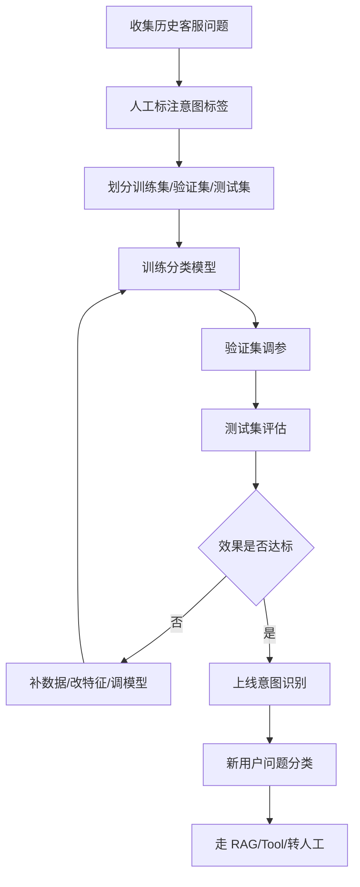

# ！重要！一个例子串起来 C01 机器学习基础


## 场景：训练一个“用户问题意图识别器”

智能客服系统里，用户可能问：

```text
怎么报销？
订单到哪了？
我要投诉。
账号登不上。
```

系统要先判断意图：

```text
报销咨询
订单查询
投诉
账号问题
```

这能串起机器学习基础。

<!-- BEGIN_EXAMPLE_TERMS -->
## 读之前先把这篇的名词说清楚

这一篇把机器学习想成教一个新人客服：给它很多历史问题和正确分类，让它从例子里学规律，再去判断新问题。

后面如果你看到这些词，先不要急着背定义。你可以按下面这个顺序理解：

```text
它是什么 -> 在这个例子里负责什么 -> 面试时怎么说
```

### 1. 样本 Sample

**新手理解**：样本就是一条训练数据。

**在这个例子里**：一条用户问题加它的意图标签，就是一个样本。

**面试说法**：机器学习从大量样本中学习规律。

### 2. 标签 Label

**新手理解**：标签是样本的正确答案。

**在这个例子里**：`我要报销机票` 的标签可能是 `差旅报销`。

**面试说法**：监督学习依赖人工或规则提供标签。

### 3. 特征 Feature

**新手理解**：特征是模型用来判断的信息。

**在这个例子里**：问题里的关键词、句向量、用户部门都可以作为特征。

**面试说法**：特征质量会直接影响模型效果。

### 4. 模型 Model

**新手理解**：模型是学到的判断规则或函数。

**在这个例子里**：意图识别模型输入一句话，输出它属于哪个业务意图。

**面试说法**：模型通过训练从数据中学习输入到输出的映射。

### 5. 训练 Training

**新手理解**：训练就是让模型反复看题和答案，调整内部参数。

**在这个例子里**：用历史客服问题训练意图分类器。

**面试说法**：训练过程通过优化损失函数更新模型参数。

### 6. 验证集 / 测试集

**新手理解**：验证集像模拟考试，测试集像期末考试。

**在这个例子里**：不能只看训练集准确率，要看没见过的问题答得怎样。

**面试说法**：数据集通常分训练、验证、测试来评估泛化能力。

### 7. Loss

**新手理解**：Loss 是模型错得有多离谱的分数。

**在这个例子里**：分类错了或信心不对，loss 会变大。

**面试说法**：训练目标通常是最小化 loss。

### 8. 梯度下降

**新手理解**：梯度下降像沿着山坡往低处走，逐步降低错误。

**在这个例子里**：模型根据 loss 的方向调整参数。

**面试说法**：梯度下降是神经网络常用优化方法。

### 9. 过拟合

**新手理解**：过拟合是把练习题背熟了，但新题不会做。

**在这个例子里**：模型在历史问题上很准，真实用户新问法却不准。

**面试说法**：要用正则化、更多数据、验证集监控等方式缓解过拟合。

### 10. Precision / Recall / F1

**新手理解**：Precision 看答出来的有多少是对的，Recall 看该找的找到了多少，F1 是两者折中。

**在这个例子里**：意图识别和检索评估都会用这些指标。

**面试说法**：分类任务常用 Precision、Recall、F1 综合评估。

<!-- END_EXAMPLE_TERMS -->

## 0. 总流程图



---

## 1. 监督学习：因为你有标签

你有历史数据：

```text
“怎么报销？” -> 报销咨询
“订单到哪了？” -> 订单查询
```

输入和答案都知道。

这就是监督学习。

---

## 2. 分类：预测离散类别

模型输出不是一个连续数值，而是类别：

```text
报销咨询 / 订单查询 / 投诉 / 账号问题
```

这就是分类。

---

## 3. 训练集、验证集、测试集

你把数据拆成三份：

```text
训练集：让模型学习
验证集：调参数和选模型
测试集：最后验收
```

不能用测试集调模型，否则成绩虚高。

---

## 4. 过拟合：模型背题了

如果训练集 99%，测试集 70%。

说明模型可能记住了训练样本，但没学到通用规律。

这就是过拟合。

解决：

```text
更多数据
正则化
降低模型复杂度
早停
```

---

## 5. 欠拟合：模型没学会

如果训练集和测试集都很差。

说明模型太弱，或数据特征不够。

这就是欠拟合。

---

## 6. Precision 和 Recall：投诉识别不能只看准确率

假设 1000 个问题里只有 20 个投诉。

模型全预测“非投诉”：

```text
Accuracy = 98%
```

但它一个投诉都没发现。

所以要看：

```text
Precision：判成投诉的有多少真投诉
Recall：真实投诉有多少被找出来
F1：二者平衡
```

---

## 7. AUC：看排序能力

如果模型输出投诉概率：

```text
问题 A: 0.9
问题 B: 0.2
```

AUC 衡量的是：

```text
模型能不能把真正投诉排在普通问题前面。
```

---

## 8. 特征工程：让模型看懂输入

传统机器学习需要你手动设计特征：

```text
是否包含“投诉”
是否包含“退款”
文本长度
历史投诉次数
```

大模型时代，Embedding 会自动学习语义特征。

但应用层仍然要做：

```text
数据清洗
标签质量控制
metadata 设计
```

---

## 9. 无监督学习：相似问题聚类

没有标签时，可以把问题聚类：

```text
报销流程
报销材料
费用审批
```

聚成一类，发现高频问题。

这就是无监督学习。

---

## 10. 强化学习：了解 RLHF

大模型通过人类反馈变得更会回答。

你不用深挖公式，只要知道：

```text
RLHF 用人类偏好训练模型，让输出更符合人类期望。
```

---

## 11. 整条机器学习链路

```text
收集客服问题
  -> 标注意图
  -> 训练分类模型
  -> 用验证集调参
  -> 用测试集评估
  -> 看 Precision/Recall/F1
  -> 上线后继续收集 bad case
  -> 补充数据重新优化
```

---

## 12. 面试总结版

```text
以智能客服意图识别为例，带标签的历史问题可以训练一个监督分类模型。数据要拆训练、验证、测试集，避免过拟合。评估不能只看 Accuracy，尤其投诉、违规这类少数类要看 Precision、Recall 和 F1。上线后还要持续收集 bad case，补充数据形成闭环。
```

