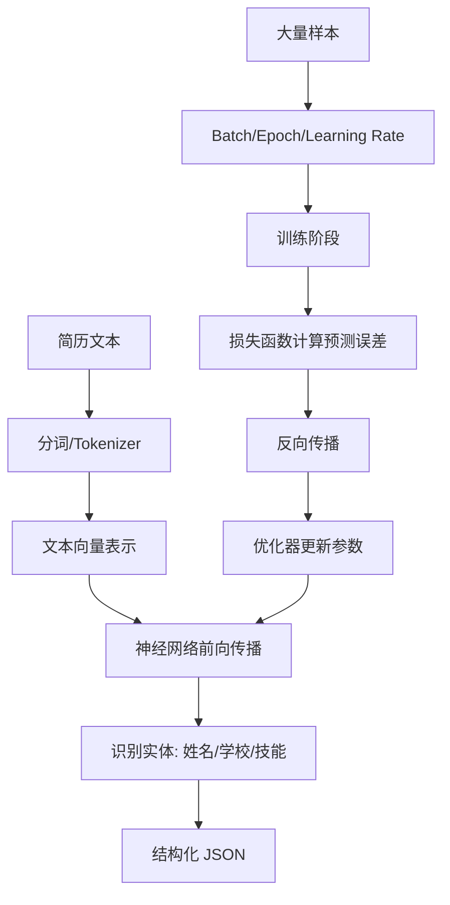

# ！重要！一个例子串起来 C02 深度学习与 NLP


## 场景：让系统自动抽取简历里的姓名、学校和技能

用户上传简历：

```text
张三，本科毕业于浙江大学，熟悉 Java、Spring Boot、Redis...
```

系统要抽取：

```json
{
  "name": "张三",
  "school": "浙江大学",
  "skills": ["Java", "Spring Boot", "Redis"]
}
```

这能串起深度学习和 NLP。

<!-- BEGIN_EXAMPLE_TERMS -->
## 读之前先把这篇的名词说清楚

这一篇把 NLP 想成让机器读懂文字：先把字词变成数字，再用神经网络理解上下文，最后做分类、抽取或生成。

后面如果你看到这些词，先不要急着背定义。你可以按下面这个顺序理解：

```text
它是什么 -> 在这个例子里负责什么 -> 面试时怎么说
```

### 1. NLP

**新手理解**：NLP 是自然语言处理，让机器处理人说的话和写的文字。

**在这个例子里**：简历解析、制度问答、客服意图识别都属于 NLP 场景。

**面试说法**：NLP 关注文本分类、信息抽取、检索、生成等任务。

### 2. 神经网络

**新手理解**：神经网络像很多层小判断器叠在一起，从简单特征学到复杂模式。

**在这个例子里**：它可以从一句话里学出意图、实体和语义关系。

**面试说法**：深度学习通过多层神经网络自动学习表示。

### 3. Embedding

**新手理解**：Embedding 是把词、句子或文档变成一串数字向量。

**在这个例子里**：简历和岗位要求变成向量后，才能比较匹配度。

**面试说法**：Embedding 用连续向量表示离散文本的语义。

### 4. Tokenizer

**新手理解**：Tokenizer 是把文本切成模型认识的 token。

**在这个例子里**：一句简历描述会先被切成 token，再进入模型。

**面试说法**：Tokenizer 决定文本如何被模型编码。

### 5. 序列

**新手理解**：序列就是有顺序的数据。

**在这个例子里**：一句话里的词前后顺序会影响含义，比如“不报销”和“报销”。

**面试说法**：NLP 中文本通常被建模为 token 序列。

### 6. Attention

**新手理解**：Attention 是让模型在读一句话时知道该重点看哪里。

**在这个例子里**：抽取毕业院校时，模型要重点关注学校名附近的词。

**面试说法**：注意力机制能建模 token 之间的关联。

### 7. 微调 Fine-tune

**新手理解**：微调是在预训练模型基础上，用自己的数据再训练一小段。

**在这个例子里**：用企业简历样本微调模型，让它更懂你的字段格式。

**面试说法**：Fine-tune 可让通用模型适配具体任务。

### 8. 信息抽取

**新手理解**：信息抽取是从文本里抓结构化字段。

**在这个例子里**：从简历里抽姓名、学校、技能、项目经历。

**面试说法**：信息抽取常用于把非结构化文本转为结构化数据。

### 9. 分类

**新手理解**：分类是给文本打类别。

**在这个例子里**：判断用户问题属于报销、请假、采购还是 IT 支持。

**面试说法**：文本分类是 NLP 的基础任务之一。

### 10. OCR

**新手理解**：OCR 是从图片里识别文字。

**在这个例子里**：扫描版简历或发票照片要先 OCR，再做 NLP 处理。

**面试说法**：OCR 负责图像到文本的转换。

<!-- END_EXAMPLE_TERMS -->

## 0. 总流程图



---

## 1. NLP：让机器处理自然语言

简历是自然语言。

系统要做：

```text
理解文本
识别实体
抽取结构
生成建议
```

这就是 NLP 的典型任务。

---

## 2. 分词 / Tokenizer：先切成模型能处理的单位

文本：

```text
熟悉 Java、Spring Boot、Redis
```

会被切成 token。

传统 NLP 叫分词，大模型里叫 tokenizer。

---

## 3. 文本向量：从文字到数字

模型不能直接吃文字。

它需要数字向量：

```text
Java -> [0.1, 0.3, ...]
```

这就是表示学习。

---

## 4. 神经网络：一层层提取特征

输入 token 向量后，神经网络会一层层处理。

浅层可能识别：

```text
词形
位置
短语
```

深层可能识别：

```text
这是学校
这是技能
这是人名
```

---

## 5. 前向传播：模型给出预测

输入简历文本，模型输出：

```text
张三 -> 人名
浙江大学 -> 学校
Java -> 技能
```

这就是前向传播。

推理阶段只做前向传播。

---

## 6. 损失函数：判断预测错得多不多

训练时，真实标签是：

```text
浙江大学 = 学校
```

如果模型预测成公司，损失就大。

损失函数衡量预测和真实答案差距。

---

## 7. 反向传播：告诉模型错在哪里

模型错了，就通过反向传播计算每个参数该怎么改。

再用优化器更新参数。

---

## 8. 优化器：一步步调参数

常见：

```text
SGD
Adam
AdamW
```

直观理解：

```text
沿着错误减少的方向调整模型。
```

---

## 9. Batch / Epoch / Learning Rate

训练时不会一条一条随便学。

```text
Batch：一批样本
Epoch：完整看一遍训练集
Learning Rate：每次改参数的步子
```

---

## 10. CNN / RNN / LSTM / Transformer 的位置

早期：

```text
CNN 处理局部特征
RNN/LSTM 处理序列
```

现在大规模 NLP 主流是 Transformer。

你知道演进关系即可。

---

## 11. 命名实体识别：简历抽取的核心

识别：

```text
人名
学校
公司
时间
技能
```

这就是 NER。

简历解析、合同解析、工单抽取都会用到。

---

## 12. 摘要：把长简历压缩

系统还可以生成：

```text
该候选人有 3 年 Java 后端经验，熟悉 Spring Boot、Redis、MySQL...
```

这是摘要任务。

---

## 13. GPU：为什么训练和推理需要它

神经网络大量计算是矩阵乘法。

GPU 适合并行矩阵计算。

所以大模型推理会关注：

```text
GPU 利用率
显存
tokens/s
```

---

## 14. 面试总结版

```text
以简历解析为例，NLP 先把文本分词或 token 化，再转成向量输入神经网络。模型前向传播识别人名、学校、技能等实体，训练时通过损失函数衡量错误，再用反向传播和优化器更新参数。后端 AI 应用不一定训练模型，但要理解这些概念，才能解释模型为什么能抽取信息、为什么推理需要 GPU、为什么输出还要校验。
```

