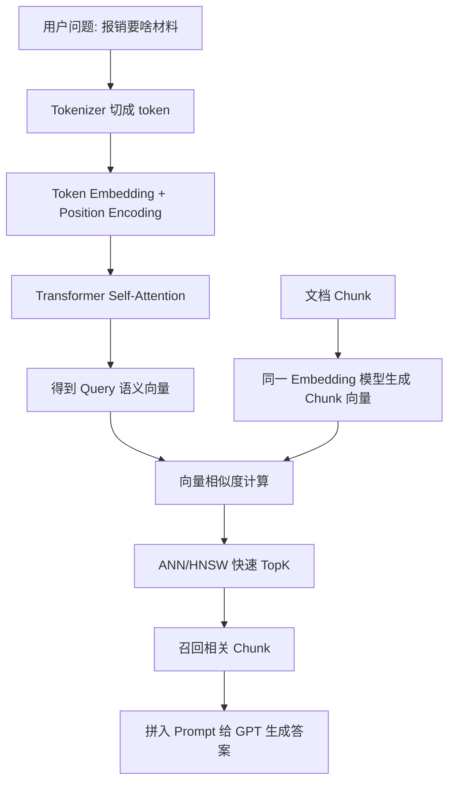

# ！重要！一个例子串起来 C03 Transformer 与 Embedding


## 场景：用户问“报销要啥材料”，系统找到了“差旅费用报销材料清单”

用户问题：

```text
报销要啥材料？
```

文档里写的是：

```text
差旅费用报销需提交发票、审批单、行程单。
```

字面不一样，但语义相关。

这能串起 Transformer 和 Embedding。

<!-- BEGIN_EXAMPLE_TERMS -->
## 读之前先把这篇的名词说清楚

这一篇把 Transformer 想成一个会抓重点的读书小组：每个 token 都会看其他 token，判断谁和自己关系最大，最后形成能表示语义的向量。

后面如果你看到这些词，先不要急着背定义。你可以按下面这个顺序理解：

```text
它是什么 -> 在这个例子里负责什么 -> 面试时怎么说
```

### 1. Token

**新手理解**：Token 是模型眼里的最小文本单位，不一定等于一个汉字或一个词。

**在这个例子里**：用户问题会先被切成 token，模型才能处理。

**面试说法**：大模型按 token 读取上下文并计费。

### 2. Embedding

**新手理解**：Embedding 是 token 或句子的数字坐标。

**在这个例子里**：意思相近的问题，在向量空间里距离更近。

**面试说法**：Embedding 把文本语义映射到连续向量空间。

### 3. 位置编码

**新手理解**：位置编码告诉模型每个 token 在句子里的位置。

**在这个例子里**：“我报销了发票”和“发票报销了我”词差不多，但顺序不一样。

**面试说法**：Transformer 本身不天然知道顺序，需要位置编码注入位置信息。

### 4. Self-Attention

**新手理解**：Self-Attention 是一句话内部的词互相看对方。

**在这个例子里**：模型判断“它”指代哪份发票，要看前文。

**面试说法**：自注意力用于建模序列内部 token 之间的依赖。

### 5. Q / K / V

**新手理解**：Q 像我想找什么，K 像别人有什么标签，V 像别人真正提供的信息。

**在这个例子里**：一个 token 通过 QK 匹配决定关注谁，再从 V 取信息。

**面试说法**：注意力机制通过 Query、Key、Value 计算加权表示。

### 6. 语义相似度

**新手理解**：语义相似度不是看字面一样，而是看意思像不像。

**在这个例子里**：“差旅报销需要什么”和“出差回来交哪些材料”语义很接近。

**面试说法**：Embedding 检索常用向量相似度衡量语义接近程度。

### 7. Cosine Similarity

**新手理解**：余弦相似度看两个向量方向像不像。

**在这个例子里**：两个句向量方向越接近，说明表达的意思越接近。

**面试说法**：余弦相似度常用于文本向量检索。

### 8. ANN

**新手理解**：ANN 是近似最近邻搜索，不保证绝对精确，但速度快很多。

**在这个例子里**：向量库从百万 chunk 中快速找相近内容，一般不会暴力全比。

**面试说法**：ANN 用近似算法在大规模向量中高效检索。

### 9. 维度

**新手理解**：维度就是向量里数字的个数。

**在这个例子里**：Embedding 可能是 768 维、1024 维或更高。

**面试说法**：维度影响表达能力、存储成本和检索性能。

<!-- END_EXAMPLE_TERMS -->

## 0. 总流程图



---

## 1. Tokenizer：先把句子切成 token

```text
报销要啥材料？
```

会变成 token id：

```text
[101, 345, 998, ...]
```

模型处理的是 token，不是原始汉字字符串。

---

## 2. Token 和上下文窗口

每个 token 都占上下文。

RAG 里：

```text
用户问题
系统 Prompt
历史消息
检索 chunk
```

全部都占 token。

所以 TopK 不能无限大。

---

## 3. Position Encoding：模型要知道顺序

```text
我打你
你打我
```

词一样，顺序不同。

位置编码告诉模型 token 在哪里。

---

## 4. Self-Attention：找上下文关联

在句子：

```text
报销要啥材料
```

模型会让“材料”关注“报销”，理解这是报销所需材料。

Self-Attention 的核心是：

```text
Query
Key
Value
```

计算 token 之间的相关性。

---

## 5. Multi-Head Attention：从多个角度看句子

不同 head 可以关注：

```text
动作
对象
语气
领域词
```

让模型理解更丰富。

---

## 6. Encoder 和 Decoder

Embedding 模型常偏理解，类似 Encoder 思路。

GPT 生成答案，属于 Decoder-only 自回归生成。

```text
Embedding：理解并表示语义
GPT：根据上下文生成下一个 token
```

---

## 7. Embedding：把语义变成向量

用户问题变成：

```text
[0.12, -0.08, 0.45, ...]
```

文档 chunk 也变成向量。

语义接近，向量距离近。

---

## 8. 相似度：判断哪个 chunk 更接近

常见：

```text
余弦相似度
点积
欧氏距离
```

RAG 会用相似度找 TopK。

---

## 9. ANN：为什么能在百万 chunk 中快速找

暴力算 100 万个相似度太慢。

向量库用 ANN：

```text
HNSW
IVF
PQ
```

用近似搜索换速度。

---

## 10. Temperature / Top-p：生成时控制风格

GPT 生成答案时：

```text
temperature 低 -> 稳定
temperature 高 -> 发散
```

知识库问答一般低 temperature。

---

## 11. 面试总结版

```text
以 RAG 检索为例，用户问题先经过 tokenizer 变成 token，再通过 Transformer 的 Attention 得到语义表示。Embedding 模型把用户问题和文档 chunk 都映射到同一向量空间，语义相近的内容距离更近。向量库用 ANN 快速找 TopK chunk，再交给 GPT 类 Decoder 模型生成答案。
```

