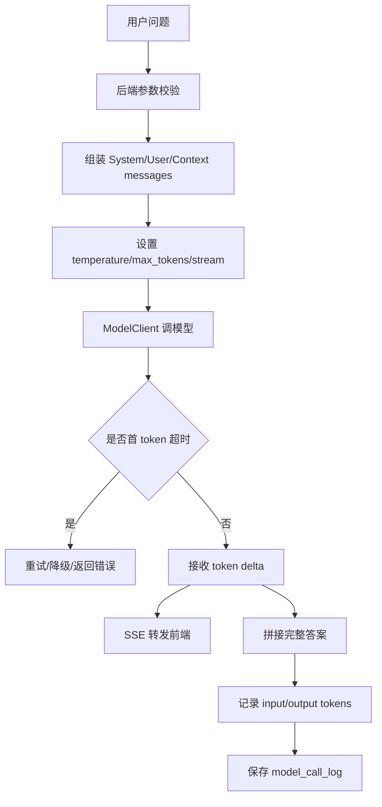

# ！重要！一个例子串起来 D01 模型调用基础


## 场景：后端调用大模型生成一段知识库答案

用户问：

```text
差旅报销多久能到账？
```

后端要组装消息、调用模型、流式返回、记录成本。

<!-- BEGIN_EXAMPLE_TERMS -->
## 读之前先把这篇的名词说清楚

这一篇把模型调用想成后端去请一位外部专家答题：你要把问题、资料、规则打包给它，还要管超时、费用、日志和返回方式。

后面如果你看到这些词，先不要急着背定义。你可以按下面这个顺序理解：

```text
它是什么 -> 在这个例子里负责什么 -> 面试时怎么说
```

### 1. LLM

**新手理解**：LLM 是大语言模型，像一个能根据上下文续写和回答的语言引擎。

**在这个例子里**：后端把用户问题和资料发给 LLM，让它生成知识库答案。

**面试说法**：LLM 负责生成自然语言结果，但不天然知道你的私有资料。

### 2. messages

**新手理解**：messages 是一组对话消息，告诉模型系统规则、用户问题和历史上下文。

**在这个例子里**：后端把 system、user、assistant 历史组装成 messages。

**面试说法**：Chat 模型通常以 messages 数组作为输入。

### 3. system / user / assistant

**新手理解**：system 是规则，user 是用户说的话，assistant 是模型之前说的话。

**在这个例子里**：system 里写“只能基于资料回答”，user 里放当前问题。

**面试说法**：不同 role 帮模型区分指令、问题和回答历史。

### 4. Token

**新手理解**：Token 是模型处理文本的单位，也是上下文长度和费用的基本单位。

**在这个例子里**：资料塞太多会占 token，导致成本高或超出窗口。

**面试说法**：模型输入输出通常按 token 计量。

### 5. 上下文窗口

**新手理解**：上下文窗口是模型一次能看的最大 token 数。

**在这个例子里**：历史对话、检索资料、当前问题都要塞进这个窗口。

**面试说法**：上下文窗口限制决定了必须做裁剪、摘要和检索。

### 6. temperature

**新手理解**：temperature 控制回答随机程度。

**在这个例子里**：知识库问答通常要低 temperature，让答案稳定。

**面试说法**：temperature 越高输出越发散，越低越确定。

### 7. max_tokens

**新手理解**：max_tokens 限制模型最多生成多少 token。

**在这个例子里**：后端要防止模型回答过长导致费用和延迟失控。

**面试说法**：max_tokens 用于控制输出长度和成本。

### 8. 流式调用

**新手理解**：流式调用是模型边生成边返回。

**在这个例子里**：用户能马上看到答案逐字出现，不必等完整答案。

**面试说法**：streaming 能降低首屏等待，适合聊天体验。

### 9. ModelClient

**新手理解**：ModelClient 是后端封装模型调用的小工具。

**在这个例子里**：它统一处理请求参数、重试、超时、日志和错误。

**面试说法**：工程上通常封装模型客户端，避免业务代码直接散落调用细节。

### 10. 调用日志

**新手理解**：调用日志记录模型请求用了什么模型、多少 token、是否成功。

**在这个例子里**：排查慢请求、统计成本、复盘坏答案都要靠它。

**面试说法**：模型调用要记录 trace、latency、token、错误码等信息。

<!-- END_EXAMPLE_TERMS -->

## 0. 总流程图



## 1. messages 怎么组装

```text
System：你是企业知识库问答助手
User：差旅报销多久能到账？
Context：检索到的制度片段
```

System 管规则，User 放问题，Context 放资料。

## 2. 参数怎么设

知识库问答：

```text
temperature 低
max_tokens 受控
stream = true
```

原因：

```text
要稳定、低幻觉、低成本、体验好。
```

## 3. 为什么要 ModelClient

不要在业务代码里到处写：

```text
http.post(model_api)
```

统一封装：

```text
ModelClient.chat()
ModelClient.streamChat()
ModelClient.embed()
```

统一处理超时、重试、日志、成本。

## 4. 流式返回怎么做

模型返回：

```text
delta: 差旅
delta: 报销
delta: 通常
```

后端一边转发给前端，一边拼接完整答案。

最终保存：

```text
assistant message
model_call_log
```

## 5. 面试总结版

```text
一次模型调用不是简单发 HTTP 请求。后端要组装 messages，设置模型参数，处理流式输出、超时重试、错误码、token 成本和日志。通常我会封装 ModelClient 或模型网关，避免业务代码直接依赖具体模型 API。
```

