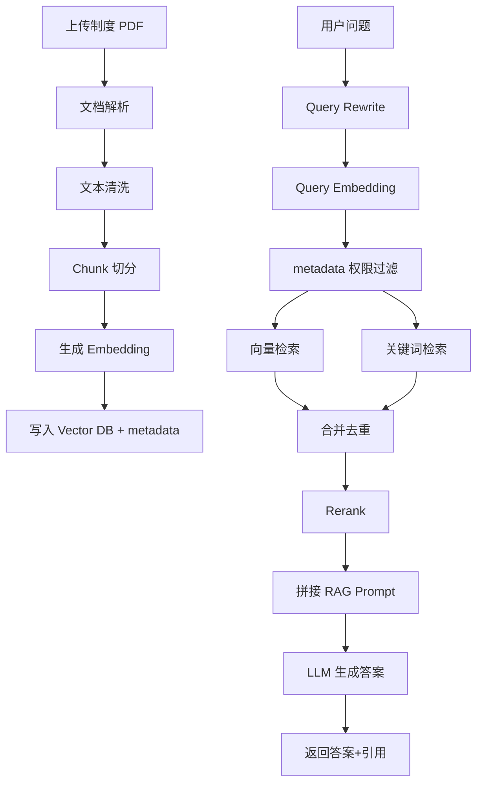

# ！重要！一个例子串起来 D03 RAG


## 场景：用户问“报销材料有哪些”，系统从制度 PDF 中找答案

RAG 的核心就是：

```text
先找资料，再让模型基于资料回答。
```

<!-- BEGIN_EXAMPLE_TERMS -->
## 读之前先把这篇的名词说清楚

这一篇把 RAG 想成开卷考试：模型不是闭着眼背答案，而是先把相关制度资料找出来，再拿着资料答题。

后面如果你看到这些词，先不要急着背定义。你可以按下面这个顺序理解：

```text
它是什么 -> 在这个例子里负责什么 -> 面试时怎么说
```

### 1. RAG

**新手理解**：RAG 是 Retrieval-Augmented Generation，意思是检索增强生成。

**在这个例子里**：先从制度 PDF 里找相关 chunk，再让模型基于 chunk 回答。

**面试说法**：RAG 用外部知识补充大模型，降低私有知识缺失和幻觉。

### 2. 离线链路

**新手理解**：离线链路是用户提问前提前做好的准备工作。

**在这个例子里**：PDF 先解析、清洗、切分、向量化、写入向量库。

**面试说法**：RAG 离线链路负责把资料变成可检索形态。

### 3. 在线链路

**新手理解**：在线链路是用户提问时实时发生的流程。

**在这个例子里**：问题改写、检索、重排、拼 Prompt、调用模型都在在线链路。

**面试说法**：在线链路决定响应速度和回答质量。

### 4. 文档解析

**新手理解**：文档解析是把 PDF、Word 里的内容读成程序能处理的文本。

**在这个例子里**：制度 PDF 先被解析成段落、标题、表格文本。

**面试说法**：文档解析质量会影响后续检索上限。

### 5. Chunk

**新手理解**：Chunk 是把长文档切出来的一小段资料。

**在这个例子里**：一份报销制度会被切成多个 chunk，每个 chunk 存一段语义完整内容。

**面试说法**：Chunk 是 RAG 检索和拼 Prompt 的基本单位。

### 6. Embedding

**新手理解**：Embedding 是把文本变成语义向量。

**在这个例子里**：chunk 和用户问题都要变成向量，才能比较语义相似度。

**面试说法**：Embedding 模型负责把文本映射到向量空间。

### 7. 向量库 Vector DB

**新手理解**：向量库是专门存向量并快速找相似向量的数据库。

**在这个例子里**：系统把所有 chunk 的 embedding 存进去，提问时找最相近的 chunk。

**面试说法**：向量数据库支持大规模语义检索。

### 8. metadata

**新手理解**：metadata 是 chunk 身上的标签。

**在这个例子里**：比如知识库 ID、部门、文档版本、页码、权限范围。

**面试说法**：metadata 用于过滤、权限控制、引用展示和版本管理。

### 9. Query Rewrite

**新手理解**：Query Rewrite 是把用户问题改写得更适合检索。

**在这个例子里**：用户追问“那发票呢？”可以改写成“差旅报销需要哪些发票材料？”

**面试说法**：问题改写能补全上下文，提高召回效果。

### 10. 混合检索

**新手理解**：混合检索是向量检索和关键词检索一起用。

**在这个例子里**：向量懂语义，关键词能抓金额、条款号、专有名词。

**面试说法**：Hybrid Search 常用于提升 RAG 召回稳定性。

### 11. Rerank

**新手理解**：Rerank 是把初步召回的候选再精排一次。

**在这个例子里**：先召回 50 个 chunk，再挑最相关的 5 个给模型。

**面试说法**：Rerank 能提高进入 Prompt 的资料相关性。

### 12. 引用和拒答

**新手理解**：引用是告诉用户答案来自哪里，拒答是资料不足时不硬编。

**在这个例子里**：回答报销材料时附上制度名称和页码；找不到就说无法确定。

**面试说法**：企业 RAG 要强调可追溯和不编造。

<!-- END_EXAMPLE_TERMS -->

## 0. 总流程图



## 1. 离线链路

文档先变成可检索的 chunk。

```text
PDF -> 文本 -> chunk -> embedding -> 向量库
```

## 2. 在线链路

用户问题也变成向量。

然后：

```text
召回 -> 重排 -> 生成
```

## 3. Chunk 为什么重要

chunk 太大：

```text
不精准、token 多
```

chunk 太小：

```text
语义断裂
```

## 4. 混合检索为什么重要

向量检索懂语义。

关键词检索懂精确词。

报销制度里有编号、条款、金额时，混合检索更稳。

## 5. Rerank 为什么重要

召回阶段先多拿点，避免漏。

Rerank 再把最相关的排前面。

## 6. 引用和拒答

资料有答案：

```text
回答 + 引用
```

资料没答案：

```text
根据当前资料无法确定
```

## 7. 面试总结版

```text
RAG 分离线和在线两条链路。离线把文档解析、清洗、切分、向量化并写入向量库；在线对用户问题做改写和向量化，在权限过滤下进行向量和关键词混合检索，合并去重后 Rerank，再把相关 chunk 拼入 Prompt 让模型生成答案，并返回引用来源。
```

