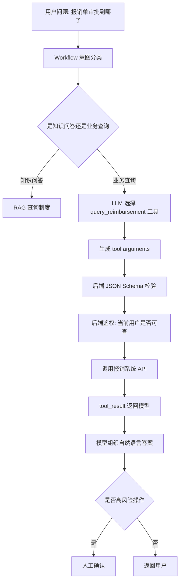

# ！重要！一个例子串起来 D04 Tool Calling、Agent、Workflow


## 场景：用户问“我的报销单现在审批到哪了？”

这个问题不能只靠知识库。

模型需要调用业务系统查询报销单状态。

<!-- BEGIN_EXAMPLE_TERMS -->
## 读之前先把这篇的名词说清楚

这一篇把 Tool Calling 想成模型会填申请单，但真正查系统、改数据必须由后端执行；Workflow 是固定流程，Agent 是更自由的任务规划者。

后面如果你看到这些词，先不要急着背定义。你可以按下面这个顺序理解：

```text
它是什么 -> 在这个例子里负责什么 -> 面试时怎么说
```

### 1. Tool Calling

**新手理解**：Tool Calling 是模型判断需要调用哪个工具，并生成工具参数。

**在这个例子里**：用户问报销单状态，模型决定调用 `get_reimbursement_status`。

**面试说法**：Tool Calling 让模型从只会说话，变成能触发后端能力。

### 2. 工具 Schema

**新手理解**：Schema 是工具说明书，告诉模型工具名、参数和含义。

**在这个例子里**：报销单查询工具要声明需要 `reimbursement_id`。

**面试说法**：Schema 决定模型能否正确构造工具调用。

### 3. 参数校验

**新手理解**：参数校验是后端检查模型给的参数能不能用。

**在这个例子里**：报销单 ID 格式不对、缺字段，都不能直接查。

**面试说法**：模型输出不可信，工具参数必须在后端校验。

### 4. 后端鉴权

**新手理解**：后端鉴权是由业务系统判断用户有没有权限。

**在这个例子里**：模型想查某张报销单，后端还要确认这张单属于当前用户。

**面试说法**：权限不能交给模型判断，必须由可信后端执行。

### 5. Workflow

**新手理解**：Workflow 是预先写死的流程图。

**在这个例子里**：查状态：识别意图 -> 校验参数 -> 查数据库 -> 生成回答。

**面试说法**：生产环境常优先用 Workflow 保证可控性。

### 6. Agent

**新手理解**：Agent 是能自己规划步骤、选择工具、观察结果再继续行动的模型应用。

**在这个例子里**：复杂任务里 Agent 可能先查制度，再查报销单，再生成建议。

**面试说法**：Agent 灵活但不稳定，需要边界、预算和人工兜底。

### 7. Planning

**新手理解**：Planning 是 Agent 拆解任务的过程。

**在这个例子里**：它可能把“帮我处理报销”拆成查政策、查单据、生成待办。

**面试说法**：规划能力让 Agent 能处理多步骤任务。

### 8. Human-in-the-loop

**新手理解**：Human-in-the-loop 是关键步骤让人确认。

**在这个例子里**：如果要提交报销或修改状态，必须让用户点击确认。

**面试说法**：高风险操作要加入人工确认，避免模型误操作。

### 9. SQL 安全

**新手理解**：SQL 安全是不能让模型直接拼数据库语句乱查。

**在这个例子里**：模型不能生成 `select * from finance` 直接执行。

**面试说法**：Tool Calling 应暴露受控接口，而不是开放任意 SQL。

<!-- END_EXAMPLE_TERMS -->

## 0. 总流程图



## 1. Tool Calling 做什么

模型不直接查数据库。

它只说：

```text
我需要调用 query_reimbursement(order_id=xxx)
```

真正执行由后端完成。

## 2. 参数必须校验

模型生成参数可能错：

```text
order_id 为空
order_id 格式错误
top_k 过大
```

后端用 Schema 校验。

## 3. 权限必须后端做

用户只能查自己的报销单。

不能让模型决定权限。

## 4. Workflow：生产里先固定流程

这个客服流程可以固定：

```text
意图分类 -> RAG 或工具 -> 校验 -> 输出
```

比完全自主 Agent 更可控。

## 5. Agent：适合开放复杂任务

如果用户说：

```text
帮我整理这个月所有报销异常，并生成邮件草稿。
```

可能需要多步计划、多工具调用。

这时可以局部用 Agent，但要限制：

```text
max_steps
allowed_tools
max_cost
human_confirm
```

## 6. 面试总结版

```text
Tool Calling 中模型只负责选择工具和生成参数，后端负责参数校验、鉴权和执行。生产系统更适合用 Workflow 固定关键流程，只有复杂开放任务才局部引入 Agent，并设置最大步数、工具白名单、预算和人工确认。
```

