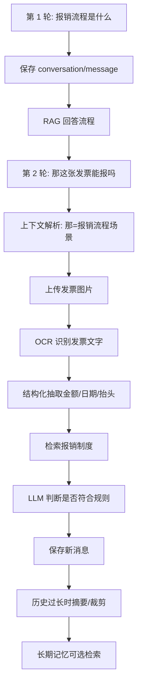

# ！重要！一个例子串起来 D05 多轮记忆与多模态


## 场景：用户连续追问，还上传了一张发票照片

用户先问：

```text
出差报销流程是什么？
```

接着问：

```text
那这张发票能报吗？
```

然后上传发票图片。

这能串起多轮记忆和多模态。

<!-- BEGIN_EXAMPLE_TERMS -->
## 读之前先把这篇的名词说清楚

这一篇把多轮对话想成客服记住上下文：用户第二句说“那这个呢”，系统要知道“这个”指上一张发票；多模态则是系统能看图片、听语音。

后面如果你看到这些词，先不要急着背定义。你可以按下面这个顺序理解：

```text
它是什么 -> 在这个例子里负责什么 -> 面试时怎么说
```

### 1. Conversation

**新手理解**：Conversation 是一整段对话的容器。

**在这个例子里**：用户和知识库助手围绕报销聊了十轮，这十轮属于一个 conversation。

**面试说法**：Conversation 用于组织多轮上下文。

### 2. Message

**新手理解**：Message 是对话里的一条消息。

**在这个例子里**：用户一句问题、助手一次回答都可以是一条 message。

**面试说法**：Message 通常包含 role、content、time、token 等字段。

### 3. 上下文窗口

**新手理解**：上下文窗口是模型一次能看的最大内容量。

**在这个例子里**：历史消息、图片 OCR 文本、检索资料都要争这个空间。

**面试说法**：上下文窗口有限，所以不能无限塞历史。

### 4. 短期记忆

**新手理解**：短期记忆是当前对话里最近几轮内容。

**在这个例子里**：用户刚上传发票后追问“能报吗”，系统要记住刚才那张发票。

**面试说法**：短期记忆通常来自最近消息或当前会话状态。

### 5. 历史裁剪

**新手理解**：历史裁剪是把太久或不重要的消息移出上下文。

**在这个例子里**：十几轮之后，只保留最近问题和必要摘要。

**面试说法**：裁剪用于控制 token 成本和上下文长度。

### 6. 对话摘要

**新手理解**：对话摘要是把长历史压缩成短说明。

**在这个例子里**：把前十轮总结为“用户在咨询上海出差发票报销”。

**面试说法**：摘要能保留关键信息，同时减少 token。

### 7. 长期记忆

**新手理解**：长期记忆是跨会话保存的稳定信息。

**在这个例子里**：用户常用部门、偏好语言、历史工单可以作为长期记忆。

**面试说法**：长期记忆要注意隐私、授权和可删除。

### 8. 多模态

**新手理解**：多模态是模型或系统能处理文本以外的信息，比如图片、语音、视频。

**在这个例子里**：用户上传发票照片，系统要识别图片内容再回答。

**面试说法**：多模态应用需要处理不同数据类型的输入和存储。

### 9. OCR

**新手理解**：OCR 是把图片里的文字识别出来。

**在这个例子里**：发票照片先 OCR 成金额、日期、抬头等文本。

**面试说法**：OCR 常作为图片文档进入 RAG 或结构化抽取的第一步。

### 10. ASR / TTS

**新手理解**：ASR 是语音转文字，TTS 是文字转语音。

**在这个例子里**：用户语音提问先 ASR，助手答案可以 TTS 播放。

**面试说法**：语音交互常由 ASR、LLM、TTS 串起来。

<!-- END_EXAMPLE_TERMS -->

## 0. 总流程图



## 1. Conversation 和 Message

会话保存：

```text
conversation_id
```

消息保存：

```text
role=user/assistant
content
created_at
```

## 2. 多轮上下文

“那这张发票”里的“那”依赖上一轮。

所以要带最近历史，或者先做问题改写。

## 3. 历史不能无限塞

对话越长：

```text
token 越多
成本越高
噪声越大
```

解决：

```text
最近 N 轮原文 + 早期摘要
```

## 4. 长期记忆

如果用户经常问财务制度，可以记录偏好。

但长期记忆涉及隐私，要支持删除。

## 5. 多模态：图片先 OCR

发票图片需要：

```text
OCR
版面分析
结构化抽取
```

再结合制度判断是否可报。

## 6. 多模态 RAG

图片内容转成文本后，也可以进入 RAG：

```text
发票信息 + 报销制度 -> 模型判断
```

## 7. 面试总结版

```text
多轮对话要保存 conversation 和 message，并做上下文管理。历史不能无限塞进 Prompt，常用最近 N 轮原文加早期摘要。多模态场景下，发票图片先经过 OCR 和结构化抽取，再结合 RAG 检索制度，让模型判断是否符合报销规则。
```

