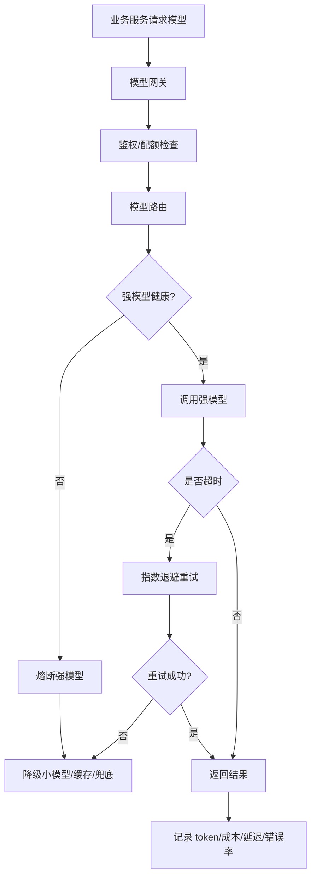

# ！重要！一个例子串起来 E01 模型网关与稳定性


## 场景：强模型突然超时，系统不能全挂

用户正在问知识库。

模型 A 突然超时率升高。

模型网关要保护主系统。

<!-- BEGIN_EXAMPLE_TERMS -->
## 读之前先把这篇的名词说清楚

这一篇把模型网关想成公司统一的外部专家接待处：业务方不用直接找每个模型厂商，统一由网关分配、限流、重试、统计费用。

后面如果你看到这些词，先不要急着背定义。你可以按下面这个顺序理解：

```text
它是什么 -> 在这个例子里负责什么 -> 面试时怎么说
```

### 1. 模型网关

**新手理解**：模型网关是所有模型调用的统一入口。

**在这个例子里**：Chat Service 不直接调各家模型，而是先调 Model Gateway。

**面试说法**：模型网关统一做路由、鉴权、限流、日志、成本和稳定性治理。

### 2. 模型路由

**新手理解**：模型路由是决定这次请求用哪个模型。

**在这个例子里**：简单问题用便宜模型，复杂总结用强模型。

**面试说法**：模型路由可按任务类型、成本、可用性和租户策略选择模型。

### 3. Provider

**新手理解**：Provider 是模型供应商或模型后端。

**在这个例子里**：可能是第三方 API，也可能是自部署模型服务。

**面试说法**：网关要屏蔽不同 provider 的接口差异。

### 4. 超时

**新手理解**：超时是给模型调用设等待上限。

**在这个例子里**：强模型超过 15 秒不返回，就触发备用策略。

**面试说法**：外部调用必须设置超时，避免线程和连接被占死。

### 5. 重试

**新手理解**：重试是短暂失败时再试一次。

**在这个例子里**：网络抖动或 5xx 可以重试，但流式输出和非幂等请求要谨慎。

**面试说法**：重试要控制次数、间隔和幂等性。

### 6. 熔断

**新手理解**：熔断是下游持续失败时先暂停调用。

**在这个例子里**：某模型 provider 大面积超时，网关短时间内不再打过去。

**面试说法**：熔断防止故障扩散，保护系统整体可用性。

### 7. 降级

**新手理解**：降级是强能力不可用时给用户一个弱一点但可用的结果。

**在这个例子里**：强模型挂了，就切到便宜模型或返回“稍后再试”。

**面试说法**：降级牺牲部分效果，换取系统可用。

### 8. 限流

**新手理解**：限流是控制请求速度。

**在这个例子里**：每个用户、租户或模型 provider 都要有调用额度。

**面试说法**：限流保护成本和下游容量。

### 9. 流式转发

**新手理解**：流式转发是网关收到模型 token 后立刻转给业务服务。

**在这个例子里**：用户看到答案逐字出现，Chat Service 不用等完整结果。

**面试说法**：模型网关要支持流式代理和异常中断处理。

### 10. 可观测性

**新手理解**：可观测性是让系统出问题时看得见。

**在这个例子里**：记录延迟、错误率、token、模型名、trace_id。

**面试说法**：可观测性包括日志、指标、链路追踪和告警。

<!-- END_EXAMPLE_TERMS -->

## 0. 总流程图



## 1. 模型网关统一入口

业务服务不直接调模型。

统一走：

```text
Model Gateway
```

这样才能统一做路由、限流、日志和降级。

## 2. 模型路由

简单问题：

```text
小模型
```

复杂问题：

```text
强模型
```

长文档：

```text
长上下文模型
```

## 3. 超时和重试

模型调用必须设置：

```text
连接超时
首 token 超时
总超时
```

重试要有上限，避免雪崩。

## 4. 熔断和降级

模型 A 不健康：

```text
暂时不调用
切备用模型
返回缓存答案
返回检索片段
```

## 5. 成本和可观测性

记录：

```text
input_tokens
output_tokens
latency_ms
first_token_latency_ms
cost
```

否则无法优化成本。

## 6. 面试总结版

```text
模型网关是模型调用统一入口，负责模型路由、限流、超时重试、熔断降级、流式转发、日志和成本统计。当强模型异常时，网关可以熔断并降级到备用模型、缓存答案或兜底响应，避免模型服务拖垮主系统。
```

