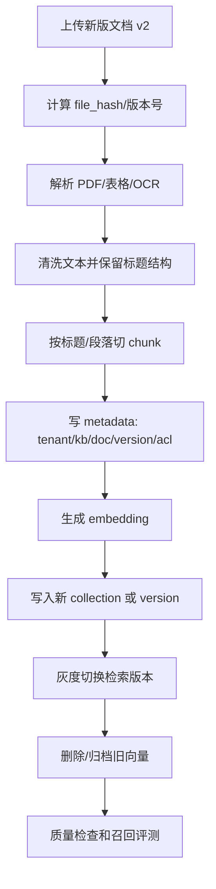

# ！重要！一个例子串起来 E02 数据工程与向量数据库


## 场景：同一份制度 PDF 更新了，旧答案不能再被检索出来

财务部上传了新版：

```text
差旅报销制度 v2.pdf
```

旧版内容不能继续影响回答。

<!-- BEGIN_EXAMPLE_TERMS -->
## 读之前先把这篇的名词说清楚

这一篇把数据工程想成整理图书馆：书要去重、编号、贴标签、上架；向量库就是按语义找书的特殊书架。

后面如果你看到这些词，先不要急着背定义。你可以按下面这个顺序理解：

```text
它是什么 -> 在这个例子里负责什么 -> 面试时怎么说
```

### 1. 数据清洗

**新手理解**：数据清洗是把脏文本整理干净。

**在这个例子里**：去掉 PDF 页眉页脚、乱码、重复目录，保留正文。

**面试说法**：数据质量决定 RAG 效果上限。

### 2. 去重

**新手理解**：去重是删掉重复内容。

**在这个例子里**：同一制度复制了两遍，会让检索结果重复、浪费 token。

**面试说法**：去重能减少噪声和存储成本。

### 3. metadata

**新手理解**：metadata 是数据标签。

**在这个例子里**：给每个 chunk 标上租户、知识库、文档版本、页码、权限。

**面试说法**：metadata 支撑权限过滤、版本管理和引用。

### 4. Collection

**新手理解**：Collection 是向量库里的一组向量集合。

**在这个例子里**：可以按租户、业务线或 embedding 模型版本建 collection。

**面试说法**：Collection 类似向量数据的逻辑命名空间。

### 5. Upsert

**新手理解**：Upsert 是有就更新，没有就插入。

**在这个例子里**：制度更新后，同一个 chunk_id 可以 upsert 新向量。

**面试说法**：Upsert 常用于幂等写入向量数据。

### 6. 向量数据库

**新手理解**：向量数据库是专门存 embedding 并做相似度检索的数据库。

**在这个例子里**：用户问题向量进来后，向量库返回相似 chunk。

**面试说法**：向量库解决大规模语义检索问题。

### 7. HNSW

**新手理解**：HNSW 像给向量建一张多层导航图，先走高速层再精找。

**在这个例子里**：百万 chunk 检索时，HNSW 能比暴力比对快很多。

**面试说法**：HNSW 是常见 ANN 索引，查询快但占内存。

### 8. IVF / PQ

**新手理解**：IVF 像先分区再查，PQ 像把向量压缩存。

**在这个例子里**：数据特别大时，可以用它们降低检索和存储成本。

**面试说法**：IVF/PQ 是向量检索中常见的索引和压缩方法。

### 9. 版本管理

**新手理解**：版本管理是知道哪份数据是新版本，哪份已经过期。

**在这个例子里**：制度 PDF 更新后，旧 chunk 不能继续被检索出来。

**面试说法**：向量数据要和文档版本、embedding 模型版本绑定。

### 10. 软删除

**新手理解**：软删除是不立刻物理删除，而是标记不可用。

**在这个例子里**：旧制度 chunk 标记为 inactive，检索时过滤掉。

**面试说法**：软删除便于回滚和审计，但查询时要过滤状态。

<!-- END_EXAMPLE_TERMS -->

## 0. 总流程图



## 1. 数据清洗决定上限

PDF 解析乱了，后面全会受影响。

要保留：

```text
标题
表格
页码
章节
来源
```

## 2. Metadata 是权限和版本的钥匙

每个 chunk 要有：

```text
tenant_id
kb_id
document_id
version
acl
page
section
```

没有 metadata，就没法权限过滤和引用。

## 3. 向量库负责语义检索

向量库保存：

```text
vector
chunk_id
metadata
```

它不替代 MySQL。

## 4. Embedding 模型升级要重建

不同 embedding 模型向量空间不同。

不能新旧混用。

通常：

```text
新建 collection
双写/灰度
切流量
删除旧索引
```

## 5. 面试总结版

```text
数据工程包括解析、清洗、切分、metadata 标注、向量化和索引。向量库负责语义检索，MySQL 负责业务元数据。文档更新或 embedding 模型升级时，要处理版本和索引重建，避免旧向量继续被召回。
```

