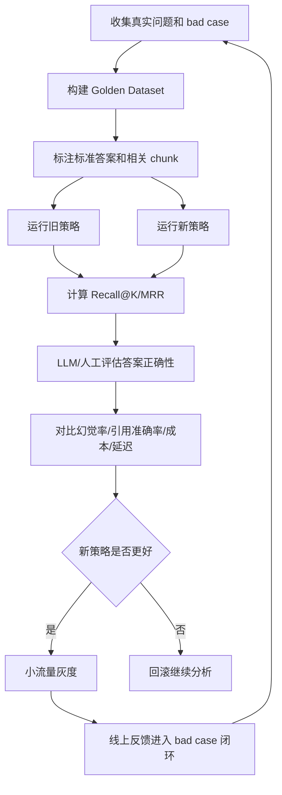

# ！重要！一个例子串起来 E03 评测与 LLMOps


## 场景：你优化了 RAG，但怎么证明真的变好了？

你把检索策略从：

```text
纯向量检索
```

改成：

```text
向量 + 关键词 + Rerank
```

不能只说“感觉更准了”。

<!-- BEGIN_EXAMPLE_TERMS -->
## 读之前先把这篇的名词说清楚

这一篇把评测想成给 RAG 做考试：不能说“我感觉更准了”，要拿固定试卷、固定评分标准、旧策略新策略一起比。

后面如果你看到这些词，先不要急着背定义。你可以按下面这个顺序理解：

```text
它是什么 -> 在这个例子里负责什么 -> 面试时怎么说
```

### 1. Golden Dataset

**新手理解**：Golden Dataset 是一套固定的高质量考题。

**在这个例子里**：里面放真实问题、标准答案、相关 chunk、必须包含点和禁止点。

**面试说法**：Golden Dataset 是 AI 应用回归评测的基础。

### 2. Bad Case

**新手理解**：Bad Case 是线上答错、答慢、答偏的失败样本。

**在这个例子里**：用户反馈“报销材料答漏了发票”，这就是 bad case。

**面试说法**：Bad Case 要沉淀进评测集，形成优化闭环。

### 3. Recall@K

**新手理解**：Recall@K 看正确资料有没有出现在前 K 个召回结果里。

**在这个例子里**：相关制度 chunk 如果没被召回，后面模型再强也答不准。

**面试说法**：Recall@K 衡量检索阶段有没有把答案资料找回来。

### 4. MRR

**新手理解**：MRR 看第一个正确结果排得有多靠前。

**在这个例子里**：正确 chunk 排第 1 比排第 10 更好。

**面试说法**：MRR 用于评估检索结果排名质量。

### 5. NDCG

**新手理解**：NDCG 看多个结果的相关性和排序位置。

**在这个例子里**：高度相关 chunk 排前面，得分更高。

**面试说法**：NDCG 适合评估有多级相关性的排序结果。

### 6. Answer Correctness

**新手理解**：答案正确性就是回答事实对不对。

**在这个例子里**：模型是否正确列出报销材料。

**面试说法**：生成评测要判断答案是否满足标准答案要点。

### 7. Faithfulness

**新手理解**：忠实性是答案有没有忠于给定资料。

**在这个例子里**：资料没说的内容，模型不能自己补。

**面试说法**：Faithfulness 用于衡量回答是否基于上下文而不是编造。

### 8. Citation Accuracy

**新手理解**：引用准确率是答案引用的来源是否真的支撑答案。

**在这个例子里**：引用第 3 页，但第 3 页没有这条规定，就是引用错误。

**面试说法**：企业 RAG 要关注引用可追溯性。

### 9. Hallucination Rate

**新手理解**：幻觉率是模型编造或无依据回答的比例。

**在这个例子里**：资料没有餐补标准，模型却说每天 100 元，就是幻觉。

**面试说法**：幻觉率越低，系统可信度越高。

### 10. LLM-as-a-Judge

**新手理解**：LLM-as-a-Judge 是让另一个模型当裁判打分。

**在这个例子里**：用裁判模型判断答案是否覆盖要点，但关键样本要人工复核。

**面试说法**：模型评测要固定裁判 Prompt 和版本，避免评分漂移。

### 11. 灰度

**新手理解**：灰度是先让一小部分流量试新策略。

**在这个例子里**：新 Rerank 策略先给 5% 用户用，观察指标再全量。

**面试说法**：灰度发布能降低上线风险。

### 12. LLMOps

**新手理解**：LLMOps 是围绕大模型应用的开发、评测、上线、监控、迭代流程。

**在这个例子里**：Prompt、检索策略、模型版本都要评测和回滚。

**面试说法**：LLMOps 让 AI 应用从 demo 变成可持续迭代的工程系统。

<!-- END_EXAMPLE_TERMS -->

## 0. 总流程图



## 1. Golden Dataset

固定问题集：

```text
问题
标准答案
相关 chunk
必须包含点
禁止出现点
```

它是评测地基。

## 2. 检索指标

看：

```text
Recall@K
MRR
NDCG
```

回答前先确认资料有没有找对。

## 3. 生成指标

看：

```text
答案正确性
忠实性
引用准确率
幻觉率
```

## 4. LLM-as-a-Judge

可以用模型帮评估，但关键样本要人工复核。

裁判模型和 Prompt 也要固定版本。

## 5. LLMOps 闭环

线上 bad case：

```text
收集 -> 标注 -> 加入评测集 -> 优化 -> 回归 -> 灰度
```

## 6. 面试总结版

```text
证明 RAG 优化有效，需要固定 Golden Dataset。检索层看 Recall@K、MRR，生成层看正确性、忠实性、引用准确率和幻觉率，工程层看延迟和成本。上线后通过灰度和 bad case 闭环继续迭代。
```

