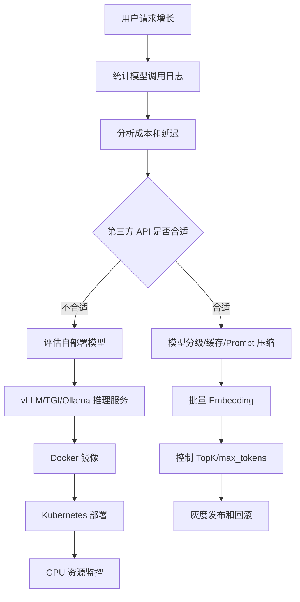

# ！重要！一个例子串起来 E05 部署推理与成本优化


## 场景：知识库问答每天调用 10 万次，成本太高、响应太慢

你要优化：

```text
延迟
吞吐
成本
部署稳定性
```

<!-- BEGIN_EXAMPLE_TERMS -->
## 读之前先把这篇的名词说清楚

这一篇把部署和成本想成开餐厅：用外卖平台省事但贵，自建厨房可控但复杂；还要关心第一口菜多久上、每分钟能出多少份、食材怎么省。

后面如果你看到这些词，先不要急着背定义。你可以按下面这个顺序理解：

```text
它是什么 -> 在这个例子里负责什么 -> 面试时怎么说
```

### 1. 第三方 API

**新手理解**：第三方 API 是直接调用外部模型服务。

**在这个例子里**：不用自己部署 GPU，按调用量付费。

**面试说法**：第三方 API 上手快，但成本、延迟和数据合规要评估。

### 2. 自部署模型

**新手理解**：自部署是把模型跑在自己的服务器或云 GPU 上。

**在这个例子里**：企业可以控制数据和推理服务，但要维护资源。

**面试说法**：自部署适合高调用量、强合规或定制化场景。

### 3. 推理服务

**新手理解**：推理服务是专门接收请求并运行模型生成结果的服务。

**在这个例子里**：模型网关把请求转给推理服务，推理服务返回 token。

**面试说法**：推理服务关注吞吐、延迟、显存和稳定性。

### 4. 首 token 延迟

**新手理解**：首 token 延迟是从发请求到看到第一个字的时间。

**在这个例子里**：聊天体验里用户最先感受到的是首 token 延迟。

**面试说法**：首 token 延迟影响体感响应速度。

### 5. tokens/s

**新手理解**：tokens/s 是每秒生成多少 token。

**在这个例子里**：它决定长答案生成得快不快。

**面试说法**：tokens/s 是衡量推理吞吐的重要指标。

### 6. Batch 推理

**新手理解**：Batch 是把多个请求合在一起推理。

**在这个例子里**：高并发时合批能提高 GPU 利用率。

**面试说法**：Batch 能提升吞吐，但可能增加单个请求等待时间。

### 7. KV Cache

**新手理解**：KV Cache 是 Transformer 推理时缓存历史注意力计算结果。

**在这个例子里**：生成长回答时，不必每个新 token 都重新算全部历史。

**面试说法**：KV Cache 能显著提升自回归生成效率，但占显存。

### 8. 量化

**新手理解**：量化是用更低精度存模型权重。

**在这个例子里**：把 FP16 降到 INT8/INT4，可以省显存、提速度。

**面试说法**：量化能降低成本，但可能损失部分效果。

### 9. Prompt Cache

**新手理解**：Prompt Cache 是复用相同前缀 Prompt 的计算结果。

**在这个例子里**：系统 Prompt 和固定知识库说明经常重复，可以缓存。

**面试说法**：Prompt Cache 能降低重复上下文的成本和延迟。

### 10. Docker / Kubernetes

**新手理解**：Docker 是打包运行环境的盒子，Kubernetes 是管理很多盒子的调度系统。

**在这个例子里**：模型网关、RAG 服务、推理服务都可以容器化部署。

**面试说法**：Docker 解决环境一致性，Kubernetes 负责编排、扩缩容和滚动发布。

### 11. 灰度 / 回滚

**新手理解**：灰度是先小范围上线，回滚是出问题快速退回旧版本。

**在这个例子里**：新模型或新检索策略不能直接全量放开。

**面试说法**：AI 应用上线要支持灰度、监控和快速回滚。

<!-- END_EXAMPLE_TERMS -->

## 0. 总流程图



## 1. 第三方 API vs 自部署

第三方 API：

```text
接入快
效果强
不用管 GPU
```

自部署：

```text
数据可控
私有化
高调用量可能更便宜
但运维复杂
```

## 2. 推理服务

自部署会用：

```text
vLLM
TGI
Triton
Ollama
```

它们处理模型加载、批处理、KV Cache、流式输出。

## 3. 性能指标

要看：

```text
首 token 延迟
tokens/s
P95
吞吐
GPU 利用率
显存
```

## 4. 成本优化

方法：

```text
模型分级
缓存高频答案
Prompt 压缩
控制 TopK
控制 max_tokens
批量 Embedding
减少无效重试
```

## 5. Docker / Kubernetes

服务容器化：

```text
Chat Service
RAG Worker
Model Gateway
推理服务
```

K8s 负责：

```text
扩容
服务发现
配置
健康检查
滚动发布
```

## 6. 灰度和回滚

AI 应用灰度对象：

```text
模型
Prompt
检索策略
Embedding 版本
```

Embedding 回滚最复杂，因为涉及向量索引。

## 7. 面试总结版

```text
当调用量上来后，我会先通过日志分析成本和延迟，再做模型分级、缓存、Prompt 压缩、TopK 和 max_tokens 控制、批量 Embedding 等优化。如果第三方 API 在成本或数据安全上不合适，再评估自部署推理服务，并关注首 token 延迟、tokens/s、GPU 利用率和灰度回滚。
```

