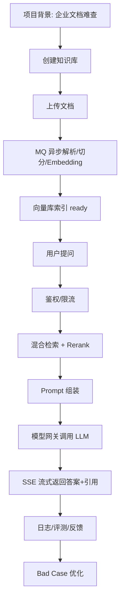

# ！重要！一个例子串起来 F01 企业知识库问答项目


## 场景：面试官让你完整介绍项目

你要讲的不是“我调了大模型”，而是一个完整系统。

<!-- BEGIN_EXAMPLE_TERMS -->
## 读之前先把这篇的名词说清楚

这一篇是你面试时的主项目故事。不要把它讲成“我调了模型”，要讲成两条链路：资料怎么进系统，问题怎么被准确回答。

后面如果你看到这些词，先不要急着背定义。你可以按下面这个顺序理解：

```text
它是什么 -> 在这个例子里负责什么 -> 面试时怎么说
```

### 1. 企业知识库

**新手理解**：企业知识库是把公司内部制度、手册、FAQ、流程文档集中管理的资料库。

**在这个例子里**：员工问报销、请假、采购时，系统从对应知识库找资料。

**面试说法**：知识库问答的价值是让私有资料可检索、可问答、可追溯。

### 2. RAG

**新手理解**：RAG 是先检索资料，再让模型基于资料回答。

**在这个例子里**：系统先找制度 chunk，再让 LLM 组织答案。

**面试说法**：RAG 解决大模型不知道企业私有知识的问题。

### 3. 文档入库

**新手理解**：文档入库是把 PDF/Word 从文件变成可检索数据。

**在这个例子里**：上传后要解析、清洗、切分、向量化、写入向量库。

**面试说法**：入库链路决定资料能不能被准确召回。

### 4. 对象存储

**新手理解**：对象存储像专门放文件的大仓库。

**在这个例子里**：原始 PDF 不适合直接塞 MySQL，通常放对象存储，MySQL 只存路径和状态。

**面试说法**：对象存储适合保存大文件，数据库保存元数据。

### 5. MQ

**新手理解**：MQ 是消息队列，用来把耗时任务异步排队。

**在这个例子里**：上传文档后发消息给 worker 后台解析，不让用户一直等。

**面试说法**：MQ 用于异步解耦、削峰和任务重试。

### 6. Chunk / Embedding / 向量库

**新手理解**：Chunk 是文档小段，Embedding 是小段的语义向量，向量库负责按语义找相似小段。

**在这个例子里**：制度被切成 chunk 后向量化，用户提问时从向量库召回相关 chunk。

**面试说法**：这是 RAG 检索层的核心三件套。

### 7. 鉴权 / metadata filter

**新手理解**：鉴权判断用户能不能看，metadata filter 在检索时把不能看的资料过滤掉。

**在这个例子里**：财务知识库不能被普通员工召回，即使模型想答也拿不到资料。

**面试说法**：权限要在后端和检索层做，不能只靠 Prompt。

### 8. 混合检索

**新手理解**：混合检索是语义检索和关键词检索一起用。

**在这个例子里**：“差旅补贴 200 元”这种金额和条款，关键词检索更稳；同义问法，向量检索更稳。

**面试说法**：混合检索能提升召回稳定性。

### 9. Rerank

**新手理解**：Rerank 是把召回结果再精排。

**在这个例子里**：先拿 50 个候选，再挑 5 个最相关的放进 Prompt。

**面试说法**：Rerank 用于提升最终上下文质量。

### 10. 模型网关

**新手理解**：模型网关是所有模型调用的统一入口。

**在这个例子里**：项目通过网关做模型选择、超时、重试、日志和成本统计。

**面试说法**：模型网关让模型调用从散乱 API 变成可治理能力。

### 11. SSE

**新手理解**：SSE 是服务端持续给浏览器推送答案片段。

**在这个例子里**：模型生成一个 token，前端就显示一点，用户感觉更快。

**面试说法**：SSE 适合大模型问答的流式输出。

### 12. Bad Case / 评测

**新手理解**：Bad Case 是失败样本，评测是用固定题集证明系统有没有变好。

**在这个例子里**：用户反馈答错的问题要进入 Golden Dataset，后续回归测试。

**面试说法**：AI 项目要靠评测闭环迭代，而不是凭感觉优化。

<!-- END_EXAMPLE_TERMS -->

## 0. 总流程图



## 1. 项目一句话

```text
我做的是企业知识库问答系统，用 RAG 把企业内部文档接入大模型问答。
```

## 2. 两条主线

```text
文档入库链路
在线问答链路
```

文档入库解决“资料怎么进来”。

在线问答解决“问题怎么答准”。

## 3. 五个难点

```text
文档处理耗时 -> MQ 异步
检索不准 -> 混合检索 + Rerank
权限风险 -> metadata filter
模型慢且贵 -> 流式 + 缓存 + 模型分级
效果不可控 -> Golden Dataset 评测
```

## 4. 面试三分钟版

```text
项目分文档入库和在线问答两条链路。文档上传后存对象存储，MySQL 记录状态，通过 MQ 异步解析、切分和 Embedding，最后写入向量库。用户提问时，系统做鉴权和限流，然后通过向量和关键词混合检索召回 chunk，Rerank 后拼入 Prompt，通过模型网关调用大模型，并用 SSE 流式返回答案和引用。工程上我重点处理了异步任务、权限过滤、模型稳定性、成本和评测。
```

