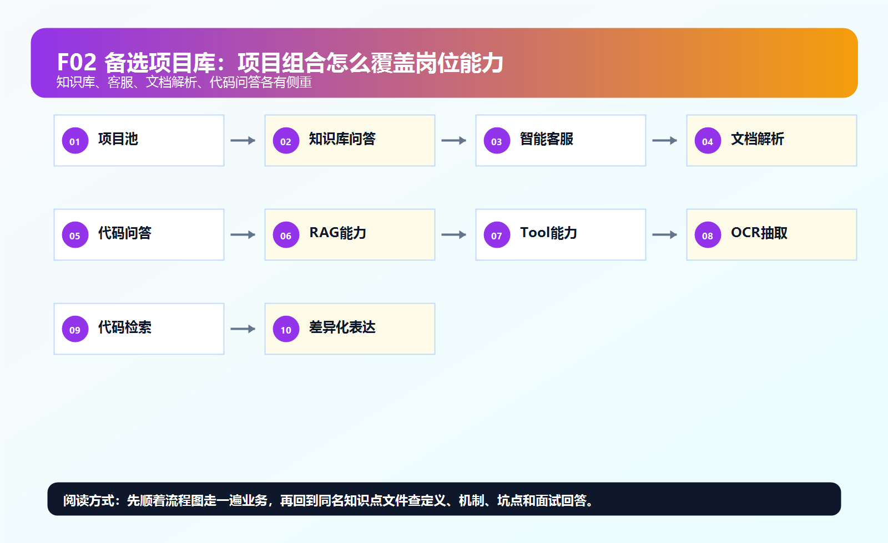
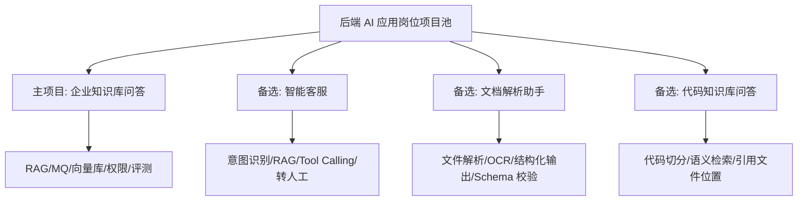

# ！重要！一个例子串起来 F02 备选项目库



## 场景：你需要准备 1 个主项目 + 2 个备选项目

主项目：

```text
企业知识库问答
```

备选项目：

```text
智能客服
文档解析助手
代码知识库问答
```

<!-- BEGIN_EXAMPLE_TERMS -->
## 读之前先把这篇的名词说清楚

这一篇不是让你硬背很多项目名，而是帮你准备一主两备：主项目讲深，备选项目用同一套 AI 后端能力迁移过去。

后面如果你看到这些词，先不要急着背定义。你可以按下面这个顺序理解：

```text
它是什么 -> 在这个例子里负责什么 -> 面试时怎么说
```

### 1. 主项目

**新手理解**：主项目是面试里你最深入讲的项目。

**在这个例子里**：企业知识库问答适合作为主项目，因为它覆盖后端、RAG、工程化、评测。

**面试说法**：主项目要能经得住架构、难点、优化、追问。

### 2. 备选项目

**新手理解**：备选项目是面试官换方向时你还能展开的项目。

**在这个例子里**：智能客服、文档解析、代码知识库都能作为备选。

**面试说法**：备选项目不一定比主项目大，但要有清晰业务和技术亮点。

### 3. 智能客服

**新手理解**：智能客服是把用户问题自动分流、检索 FAQ、生成回复的系统。

**在这个例子里**：它和知识库问答共享 RAG、意图识别、工单工具调用。

**面试说法**：智能客服适合体现业务闭环和 Tool Calling。

### 4. 文档解析助手

**新手理解**：文档解析助手是把简历、合同、发票等非结构化文件转成结构化字段。

**在这个例子里**：它会用 OCR、NLP 抽取、规则校验、人工复核。

**面试说法**：文档解析适合体现数据处理和结构化输出。

### 5. 代码知识库问答

**新手理解**：代码知识库问答是让模型基于仓库代码回答问题。

**在这个例子里**：它会解析代码、建立索引、按符号和语义检索。

**面试说法**：代码问答适合体现 RAG 在工程知识场景的迁移。

### 6. 会议纪要助手

**新手理解**：会议纪要助手是把语音或文字会议整理成摘要、待办、决策。

**在这个例子里**：它会用 ASR、摘要、信息抽取和任务生成。

**面试说法**：会议纪要适合体现多模态和工作流。

### 7. 复用技术底座

**新手理解**：复用技术底座是不同项目共用同一套能力。

**在这个例子里**：认证、文件上传、MQ、RAG、模型网关、评测都能复用。

**面试说法**：面试里可以说自己掌握的是可迁移的 AI 应用架构。

### 8. 差异化亮点

**新手理解**：差异化亮点是这个项目和普通 demo 的区别。

**在这个例子里**：权限过滤、评测闭环、稳定性、成本优化都比单纯调 API 更像真实项目。

**面试说法**：项目表达要突出工程难点和业务约束。

<!-- END_EXAMPLE_TERMS -->

## 0. 总流程图



## 1. 为什么主项目选知识库问答

它覆盖面最大：

```text
后端基础
RAG
文档处理
向量库
模型网关
安全
评测
```

## 2. 智能客服怎么讲

重点：

```text
意图识别
RAG 回答 FAQ
Tool Calling 查询订单
低置信度转人工
客服摘要
```

## 3. 文档解析助手怎么讲

重点：

```text
文件上传
OCR
LLM 信息抽取
JSON Schema 校验
隐私脱敏
```

## 4. 代码知识库问答怎么讲

重点：

```text
按函数/类切分
代码 embedding
跨文件引用
答案引用代码位置
```

## 5. 面试总结版

```text
我会把企业知识库问答作为主项目，因为它最完整地覆盖后端 AI 应用链路。备选项目可以准备智能客服突出 Tool Calling，文档解析助手突出结构化输出和 OCR，代码知识库突出代码语义检索。这样项目组合不会重复，能覆盖更多追问。
```

