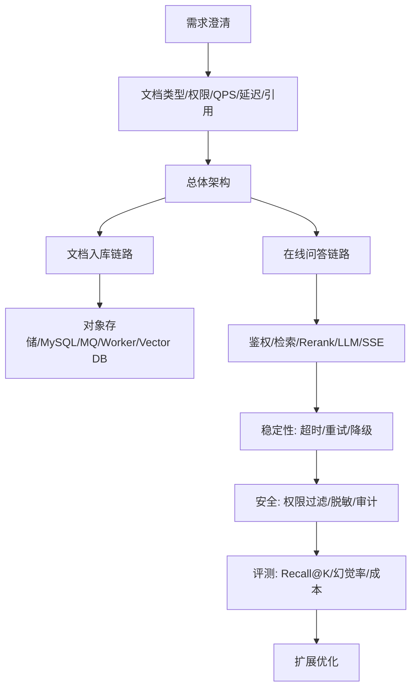

# ！重要！一个例子串起来 F03 系统设计题库


## 场景：面试官问“设计一个企业知识库问答系统”

不要一上来就说技术名词。

按系统设计顺序来。

<!-- BEGIN_EXAMPLE_TERMS -->
## 读之前先把这篇的名词说清楚

这一篇把系统设计题想成搭房子：先问清住几个人、要几层，再画结构图，最后说哪里抗压、哪里防火、哪里能扩建。

后面如果你看到这些词，先不要急着背定义。你可以按下面这个顺序理解：

```text
它是什么 -> 在这个例子里负责什么 -> 面试时怎么说
```

### 1. 需求澄清

**新手理解**：需求澄清是先问清楚系统到底要解决什么。

**在这个例子里**：是企业内部知识库，还是公网客服？文档规模多大？是否多租户？

**面试说法**：系统设计先澄清功能、规模、约束和目标。

### 2. QPS

**新手理解**：QPS 是每秒请求数。

**在这个例子里**：100 QPS 和 1 万 QPS 的架构完全不同。

**面试说法**：QPS 决定服务容量、缓存、限流和扩容设计。

### 3. 延迟

**新手理解**：延迟是用户等多久。

**在这个例子里**：知识库问答要关注首 token 延迟和完整回答耗时。

**面试说法**：延迟目标会影响流式输出、缓存和模型选择。

### 4. 总体架构

**新手理解**：总体架构是系统由哪些模块组成、怎么连接。

**在这个例子里**：前端、Chat Service、RAG Service、向量库、模型网关、MySQL、MQ。

**面试说法**：系统设计要先给出高层模块和数据流。

### 5. 数据流

**新手理解**：数据流是数据从哪里来、经过哪里、到哪里去。

**在这个例子里**：PDF 入库和用户提问是两条不同数据流。

**面试说法**：数据流能帮助面试官理解核心链路。

### 6. 存储选型

**新手理解**：存储选型是决定什么数据放哪里。

**在这个例子里**：原文件放对象存储，元数据放 MySQL，缓存放 Redis，向量放向量库。

**面试说法**：不同存储解决不同问题，不能混用概念。

### 7. 瓶颈

**新手理解**：瓶颈是系统最容易慢或挂的地方。

**在这个例子里**：模型调用、向量检索、文档解析都可能成为瓶颈。

**面试说法**：系统设计要主动识别瓶颈并给优化方案。

### 8. 扩展性

**新手理解**：扩展性是流量变大时能不能加机器解决。

**在这个例子里**：文档解析 worker 可以横向扩容，模型网关也可以多实例部署。

**面试说法**：扩展性通常依赖无状态服务、队列削峰和分层架构。

### 9. 安全

**新手理解**：安全是保证用户只能看该看的、工具只能做该做的。

**在这个例子里**：多租户知识库必须做鉴权和 metadata filter。

**面试说法**：AI 系统设计必须覆盖权限、敏感信息和审计。

### 10. 取舍 Trade-off

**新手理解**：取舍是说明为什么这么设计，而不是只堆技术名词。

**在这个例子里**：强模型效果好但贵，便宜模型快但质量可能差。

**面试说法**：面试官喜欢听到成本、效果、复杂度之间的权衡。

<!-- END_EXAMPLE_TERMS -->

## 0. 总流程图



## 1. 第一步：需求澄清

问：

```text
文档类型有哪些？
用户规模多大？
是否多租户？
是否需要权限？
是否需要引用？
延迟要求？
```

## 2. 第二步：总体架构

说模块：

```text
API Gateway
Document Service
RAG Service
Model Gateway
Worker
MySQL/Redis/MQ/Vector DB/Object Storage
```

## 3. 第三步：核心链路

必须分：

```text
离线文档入库
在线问答
```

## 4. 第四步：稳定性

说：

```text
异步任务
超时重试
限流
熔断降级
模型备用
```

## 5. 第五步：安全和评测

说：

```text
metadata 权限过滤
Prompt 注入防护
审计日志
Golden Dataset
Recall@K
幻觉率
```

## 6. 面试总结版

```text
系统设计题要先澄清需求，再讲架构和链路。企业知识库问答要分离线文档入库和在线问答两条链路，再补存储设计、稳定性、安全权限、评测和扩展优化。这样回答会比直接堆 RAG、Redis、MQ 更有逻辑。
```

