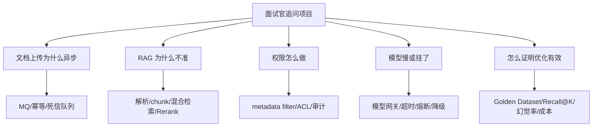

# ！重要！一个例子串起来 F04 高频追问答案


## 场景：面试官连续追问你的知识库项目

你已经讲完项目，面试官开始追问：

```text
为什么用 MQ？
RAG 不准怎么办？
权限怎么做？
模型挂了怎么办？
怎么证明效果变好？
```

这些追问其实围绕同一条链路展开。

<!-- BEGIN_EXAMPLE_TERMS -->
## 读之前先把这篇的名词说清楚

这一篇把追问想成面试官沿着项目链路往下挖。你不要把答案背成散点，要把每个追问拉回文档入库、在线问答、稳定性、安全、评测这几条主线。

后面如果你看到这些词，先不要急着背定义。你可以按下面这个顺序理解：

```text
它是什么 -> 在这个例子里负责什么 -> 面试时怎么说
```

### 1. Demo

**新手理解**：Demo 是能演示核心效果的小样。

**在这个例子里**：只调模型回答一个问题，就是 demo。

**面试说法**：面试要强调自己做的是工程系统，不只是 demo。

### 2. 生产化

**新手理解**：生产化是让系统能稳定给真实用户用。

**在这个例子里**：要有鉴权、限流、日志、评测、回滚、成本控制。

**面试说法**：生产化能力是后端 AI 应用岗位非常看重的点。

### 3. 异步

**新手理解**：异步是耗时任务后台处理，前台先返回。

**在这个例子里**：文档解析、Embedding、索引构建都适合异步。

**面试说法**：异步能提升接口响应速度并削峰。

### 4. 幂等

**新手理解**：幂等是重复执行不会产生重复或错误结果。

**在这个例子里**：MQ 消息重复消费时，不能重复写 chunk 或重复扣费。

**面试说法**：涉及重试和消息队列时必须谈幂等。

### 5. 缓存

**新手理解**：缓存是把热点数据放在快速存储里。

**在这个例子里**：权限、配置、热点问题、模型结果都可能缓存。

**面试说法**：缓存要同时考虑一致性、过期和击穿雪崩。

### 6. 向量库 vs MySQL

**新手理解**：MySQL 管结构化状态和事务，向量库管语义相似检索。

**在这个例子里**：文档状态放 MySQL，chunk embedding 放向量库。

**面试说法**：二者不是替代关系，而是分工关系。

### 7. 幻觉

**新手理解**：幻觉是模型无依据地编造答案。

**在这个例子里**：资料没说报销金额，模型却编出一个金额。

**面试说法**：RAG 能降低幻觉，但不能完全消除，要配合引用、拒答、评测。

### 8. 权限过滤

**新手理解**：权限过滤是先决定能看哪些资料，再做回答。

**在这个例子里**：用户没权限的 chunk 根本不能进入 Prompt。

**面试说法**：权限要在检索层和工具层做，不能只靠模型。

### 9. SSE vs WebSocket

**新手理解**：SSE 是服务端单向推送，WebSocket 是双向长连接。

**在这个例子里**：普通模型流式回答用 SSE 足够；实时协作或双向频繁通信才考虑 WebSocket。

**面试说法**：选型要根据通信方向、复杂度和基础设施支持。

### 10. Prompt 回归

**新手理解**：Prompt 回归是 Prompt 改完后重跑固定题集。

**在这个例子里**：优化拒答规则后要看老问题有没有被误伤。

**面试说法**：Prompt 和代码一样需要测试、版本和回滚。

### 11. Agent 风险

**新手理解**：Agent 风险是模型自主规划可能失控、慢、贵、不可预测。

**在这个例子里**：让 Agent 自己查库、调用工具、循环推理，必须限制步数和权限。

**面试说法**：生产里优先 Workflow，可控后再引入 Agent。

<!-- END_EXAMPLE_TERMS -->

## 0. 总流程图



## 1. 追问不是散的

面试官问 MQ，其实在问：

```text
你有没有工程化处理长任务？
```

问权限，其实在问：

```text
你有没有真实企业系统意识？
```

问评测，其实在问：

```text
你是不是只凭感觉调 Prompt？
```

## 2. 回答要回到链路

不要只答一句：

```text
MQ 可以异步。
```

要答：

```text
文档解析和 Embedding 很慢，所以上传接口只保存文件和状态，通过 MQ 交给 Worker 处理。Worker 消费时用 document_id 和版本做幂等，失败重试，多次失败进死信队列。
```

## 3. 高频追问归类

```text
长任务 -> MQ、状态机、幂等
准确率 -> 解析、chunk、检索、Rerank、Prompt
权限 -> metadata filter、ACL、审计
稳定性 -> 模型网关、超时、熔断、降级
成本 -> 缓存、模型分级、token 统计
效果 -> Golden Dataset、Recall@K、幻觉率
```

## 4. 面试总结版

```text
项目追问要始终回到业务链路。文档入库讲 MQ 和幂等，在线问答讲 RAG 和 Rerank，企业场景讲权限过滤，线上系统讲模型网关和降级，效果优化讲评测集和指标。这样面试官连续追问时，你不是零散背答案，而是在一张架构图上不断展开。
```

