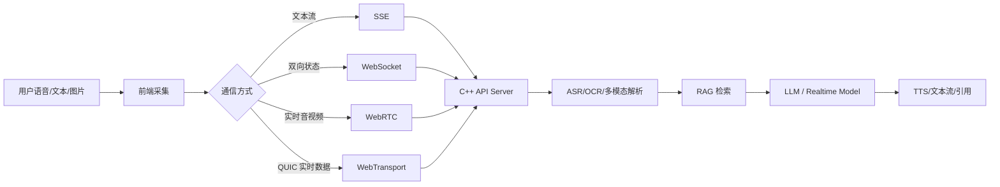

# G10 实时多模态与端侧 AI：WebRTC、Realtime API、WebGPU、Edge AI

这一篇解决的问题是：

```text
AI 应用不再只是“用户打一行字，后端返回一段话”。
```

新的应用形态越来越像一个实时助理：

```text
能听语音
能看截图
能读 PDF
能实时打断
能边说边显示引用
能在端侧做一部分推理
```

所以你要知道从旧技术到新技术的演进：

```text
REST 文本请求 -> SSE 流式文本 -> WebSocket 双向通信
WebSocket -> WebRTC / WebTransport 实时音视频和低延迟数据
服务端推理 -> 端云协同
纯文本 RAG -> 多模态 RAG
```

---

## 1. 总览表

| 技术 | 旧方案痛点 | 新方案改进 | 优点 | 代价 | 项目里怎么用 |
|---|---|---|---|---|---|
| SSE | 普通 HTTP 等完整回答才返回 | 服务端单向流式推送 | 简单，适合文本流式回答 | 只能服务端到客户端 | `/chat/stream` 第一版 |
| WebSocket | HTTP 请求响应不适合双向实时 | 一条长连接双向收发 | 实时协作、状态推送 | 连接管理复杂 | Agent 状态、协作编辑 |
| WebRTC | WebSocket 不擅长音视频低延迟 | 面向实时音视频和数据通道 | 低延迟、音视频成熟 | NAT、信令、调试复杂 | 语音助手、实时面试陪练 |
| WebTransport | WebSocket 只有可靠流 | QUIC 上的 stream + datagram | 低延迟，适合可丢数据 | 生态较新 | 多模态实时状态同步 |
| Realtime API | 传统文本 API 不适合语音交互 | 音频、文本、工具调用实时会话 | 更自然的实时交互 | 状态管理和成本更复杂 | 语音版 Copilot |
| Streaming ASR/TTS | 上传完整音频再处理太慢 | 边听边转写、边生成边播报 | 交互自然 | 延迟链路长 | 语音问答 |
| Multimodal RAG | OCR 后纯文本可能丢版式 | 图片、表格、文本共同检索 | 能处理扫描件、图表、截图 | 数据处理复杂 | 发票、合同、流程图问答 |
| WebGPU / WebNN | 浏览器只能调后端模型 | 浏览器侧 GPU/NPU 推理接口 | 低延迟、隐私更好 | 浏览器和硬件支持差异 | 端侧 embedding、轻量分类 |
| ONNX Runtime GenAI | 模型部署依赖重 | 跨平台本地推理运行时 | 适合端侧和私有化 | 模型适配和性能调优 | 本地小模型 fallback |
| llama.cpp / GGUF | 大模型必须 GPU 服务器 | 量化模型可在 CPU/边缘运行 | 成本低、离线可用 | 速度和效果有限 | 演示、本地助手、边缘场景 |

---

## 2. SSE：文本流式回答的第一把小刀

### 是什么

SSE 是 Server-Sent Events。

它让服务器可以不断往浏览器推事件：

```text
data: 第一个 token
data: 第二个 token
data: 第三个 token
```

### 旧方案痛点

普通 HTTP 是：

```text
用户提问
  -> 后端等模型完整生成
  -> 一次性返回
```

用户会觉得卡住了。

### 新方案怎么改进

SSE 让用户看到模型逐步输出：

```text
首 token 出来就推给前端
后续 token 边生成边推
```

### 优点

- 简单。
- 适合文本聊天。
- 浏览器支持好。

### 缺点

- 单向：只能服务端推客户端。
- 不适合音视频。
- 长连接要处理断线和重连。

### 项目里怎么用

C++ AI Copilot 第一版就应该先做：

```text
POST /api/v1/chat/stream
```

模型 token 流通过 SSE 返回。

---

## 3. WebSocket：双向实时通道

### 是什么

WebSocket 是浏览器和服务器之间的一条双向长连接。

### 什么时候用

```text
需要客户端频繁发消息
需要服务器频繁推状态
需要多人协作
需要 Agent 任务进度实时更新
```

### 和 SSE 的区别

```text
SSE：服务端 -> 客户端，简单，适合模型文本流
WebSocket：客户端 <-> 服务端，复杂，适合实时双向互动
```

### 面试说法

```text
普通大模型文本流式回答我会优先用 SSE，因为简单稳定；如果后续需要语音实时打断、多人协作或双向状态同步，再引入 WebSocket 或 WebRTC。
```

---

## 4. WebRTC：实时语音视频的主角

### 是什么

WebRTC 是浏览器实时音视频通信技术。

它不只是“视频通话”，还包括：

```text
音频流
视频流
DataChannel
NAT 穿透
拥塞控制
```

### 旧方案痛点

如果用普通 HTTP 上传一段完整录音：

```text
录完
上传
ASR
LLM
TTS
播放
```

整个交互像发语音留言，不像对话。

### 新方案怎么改进

WebRTC 支持低延迟音频流：

```text
用户边说
  -> 音频边传
  -> 后端边识别
  -> 模型边生成
  -> TTS 边播
```

### 优点

- 音视频实时性好。
- 浏览器生态成熟。
- 支持 DataChannel。

### 缺点

- 信令、NAT、ICE/STUN/TURN 复杂。
- 线上排查难。
- 后端架构比文本聊天复杂很多。

### 项目定位

秋招项目第一阶段不用硬做 WebRTC。

你可以这样规划：

```text
文本版 Copilot：SSE
实时语音版 Copilot：WebRTC
弱网多模态状态同步：WebTransport 备选
```

---

## 5. WebTransport：QUIC 上更灵活的实时数据通道

### 是什么

WebTransport 建在 HTTP/3/QUIC 之上，支持：

```text
可靠 stream
不可靠 datagram
```

### 和 WebSocket 的区别

WebSocket 更像一条可靠管道。

WebTransport 更像一组不同类型的运输通道：

```text
重要文本：可靠 stream
临时状态：datagram，丢一帧也没关系
```

### 适合场景

```text
实时字幕
语音状态
多人协作光标
实时多模态传感数据
```

### 代价

- 生态较新。
- 需要 HTTP/3/QUIC 基础设施。
- 服务端和网关支持要评估。

---

## 6. Realtime API：从“发请求”变成“开会话”

### 是什么

Realtime API 类能力的核心变化是：

```text
不是一次请求一次回答
而是维护一个实时会话
```

会话里可能有：

```text
音频输入
文本输入
模型输出音频
模型输出文本
工具调用
中途打断
上下文状态
```

### 旧方案痛点

传统 Chat API 更像：

```text
你发一句
模型回一句
```

做语音助手时会遇到：

```text
不能自然打断
音频延迟高
状态难管理
工具调用和语音流不好协调
```

### 新方案怎么改进

实时会话把语音、文本、工具调用放在同一个状态机里。

### 项目里怎么讲

```text
我的第一版是文本 RAG + SSE。后续如果做实时语音 Copilot，可以把前端输入从文本升级为 WebRTC 音频流，后端接 Realtime API 或自建 ASR/LLM/TTS 流水线，同时复用原有 RAG 和 Tool Calling 能力。
```

---

## 7. Streaming ASR / TTS：让语音助手像真人一点

### ASR 是什么

ASR 是语音转文字。

### TTS 是什么

TTS 是文字转语音。

### 旧方案痛点

离线式处理：

```text
等用户说完
再上传整段音频
再转文字
再让模型回答
再整段合成语音
```

用户会觉得慢。

### 新方案怎么改进

流式链路：

```text
音频 chunk
  -> Streaming ASR
  -> LLM streaming
  -> Streaming TTS
```

### 难点

- 端到端延迟。
- 打断检测。
- 噪声环境。
- 说话人分离。
- 成本控制。

---

## 8. 多模态 RAG：不要把图片当成“打不开的 PDF”

### 是什么

多模态 RAG 是把文本以外的数据也纳入知识库：

```text
图片
扫描 PDF
表格
图表
音频
视频截图
```

### 旧方案痛点

传统 RAG 只处理纯文本。

遇到扫描合同、发票、流程图：

```text
向量库里没有内容
模型自然答不出来
```

### 新方案怎么改进

常见链路：

```text
文件上传
  -> OCR / 表格解析 / 图片描述
  -> 结构化抽取
  -> 文本 chunk + 图片区域 metadata
  -> embedding
  -> 检索
  -> 多模态模型或文本模型回答
```

### 高级做法

```text
图片 embedding
版面 layout 信息
表格结构保留
截图区域引用
多向量表示
```

### 项目里怎么用

企业知识库可以先支持：

```text
PDF 文本解析
扫描件 OCR
表格转 Markdown
图片生成 caption
```

之后再考虑真正的视觉向量检索和多模态模型。

---

## 9. WebGPU / WebNN：端侧 AI 的浏览器入口

### 是什么

WebGPU 让浏览器更现代地使用 GPU。

WebNN 面向浏览器中的神经网络推理 API。

### 旧方案痛点

所有 AI 能力都放在后端：

```text
网络延迟
服务器成本
隐私压力
离线不可用
```

### 新方案怎么改进

部分轻量任务可以端侧做：

```text
简单分类
敏感信息预检测
本地 embedding
小模型推理
图片预处理
```

### 优点

- 降低后端压力。
- 隐私更好。
- 弱网时体验更稳。

### 缺点

- 浏览器和硬件兼容性不一致。
- 模型大小受限。
- 前端工程复杂。

### 面试说法

```text
端侧 AI 不是要把大模型全塞进浏览器，而是把低风险、轻量、隐私敏感或预处理任务前移。比如先在端侧做敏感字段预检测或图片压缩，再把必要信息发给后端 RAG。
```

---

## 10. ONNX Runtime GenAI、llama.cpp、GGUF：本地小模型路线

### 是什么

这些工具代表本地推理和边缘部署方向：

```text
ONNX Runtime GenAI：跨平台生成式 AI 推理运行时
llama.cpp：轻量 C/C++ 推理生态
GGUF：常见量化模型文件格式
```

### 旧方案痛点

只依赖云端模型：

```text
断网不可用
隐私数据要出域
高频小任务成本高
```

### 新方案怎么改进

把部分能力放到本地：

```text
低风险摘要
本地问答草稿
敏感信息检测
离线演示
边缘设备推理
```

### 优点

- 私密。
- 低成本。
- 可离线。

### 缺点

- 模型效果通常弱于云端大模型。
- 端侧资源有限。
- 版本分发和更新麻烦。

---

## 11. 实时多模态的架构图



---

## 12. 在 C++ 企业 AI Copilot 里的推荐路线

```text
阶段 1：文本问答 + SSE
阶段 2：文档图片 OCR + 表格解析
阶段 3：Agent 任务状态 WebSocket 推送
阶段 4：语音输入，先用普通上传 + ASR
阶段 5：实时语音，评估 WebRTC / Realtime API
阶段 6：端侧预处理，评估 WebGPU / WebNN / ONNX Runtime
阶段 7：边缘或离线场景，评估 llama.cpp / GGUF
```

---

## 13. 面试总回答模板

```text
我会把实时多模态按阶段做，而不是一开始就堆复杂协议。文本聊天用 SSE 就够；需要双向状态和任务进度时用 WebSocket；如果要做实时语音助手，再考虑 WebRTC 或 Realtime API；如果未来要在弱网和隐私场景下降低后端压力，可以把图片压缩、敏感信息预检测、轻量分类或 embedding 放到端侧，用 WebGPU、WebNN、ONNX Runtime GenAI 或 llama.cpp 这类方案。但每一步都要评估延迟、兼容性、成本和安全。
```

---

## 14. 官方资料入口

- MDN Server-Sent Events：https://developer.mozilla.org/en-US/docs/Web/API/Server-sent_events
- MDN WebSocket：https://developer.mozilla.org/en-US/docs/Web/API/WebSockets_API
- MDN WebRTC：https://developer.mozilla.org/en-US/docs/Web/API/WebRTC_API
- W3C WebTransport：https://www.w3.org/TR/webtransport/
- OpenAI Realtime API：https://platform.openai.com/docs/guides/realtime
- W3C WebGPU：https://www.w3.org/TR/webgpu/
- W3C WebNN：https://www.w3.org/TR/webnn/
- ONNX Runtime GenAI：https://onnxruntime.ai/docs/genai/
- llama.cpp：https://github.com/ggml-org/llama.cpp
