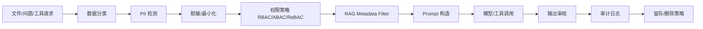

# G11 AI 数据治理与隐私：PII、ABAC、审计、Confidential Computing

这一篇解决的是企业 AI 项目里非常关键的问题：

```text
模型能回答不是最难的，难的是它不能乱看、不能乱说、不能把敏感数据带出去。
```

后端 AI 应用和普通 Web 系统相比，多了一层风险：

```text
模型会读大量上下文
RAG 会检索内部文档
Prompt 会拼接用户数据
日志可能记录完整输入输出
Agent 还可能调用工具
```

所以安全不能只停留在：

```text
登录
鉴权
HTTPS
```

还要升级到：

```text
数据分级
PII 识别与脱敏
租户隔离
ABAC / ReBAC
RAG 权限过滤
审计和追溯
数据留存与删除
机密计算
合规治理
```

---

## 1. 总览表

| 技术 | 旧方案痛点 | 新方案改进 | 优点 | 代价 | 项目里怎么用 |
|---|---|---|---|---|---|
| 数据分级分类 | 所有文档一视同仁 | 按公开/内部/敏感/机密分级 | 权限和脱敏有依据 | 需要治理流程 | 知识库文档入库时打标签 |
| PII 检测 | 日志和 Prompt 可能泄露个人信息 | 识别手机号、身份证、邮箱等 | 降低泄露风险 | 误报和漏报 | 上传、检索、输出前脱敏 |
| 脱敏 / Masking | 明文进入模型和日志 | 替换、哈希、部分隐藏 | 降低暴露面 | 可能影响模型效果 | 日志脱敏、低权限回答脱敏 |
| Tokenization | 直接存敏感明文 | 用 token 代替真实值 | 可逆控制更强 | 需要 token 服务 | 订单号、身份证等敏感字段 |
| ABAC | RBAC 粒度不够 | 基于属性做权限判断 | 适合复杂企业权限 | 规则复杂 | tenant、department、role、doc_level |
| ReBAC | 组织关系复杂 | 基于关系图授权 | 适合文档协作权限 | 建模复杂 | 文档 owner、共享、上下级 |
| Row-level / Metadata Filter | RAG 先召回再鉴权易泄露 | 检索时带权限过滤 | 防止越权 chunk 进入上下文 | filter 影响性能 | 向量库 payload filter |
| 审计日志 | 出事后查不到链路 | 记录谁问了什么、检索了什么、调用了什么 | 可追溯 | 存储和隐私压力 | AI 调用全链路审计 |
| Data Retention / 删除权 | 数据永久留存 | 设置保留期和可删除机制 | 合规更好 | 工程实现复杂 | 文档删除同步删向量和日志策略 |
| Confidential Computing | 云上运行时仍可能暴露 | TEE 保护使用中的数据 | 强合规场景有价值 | 性能和生态成本 | 高敏感私有化场景评估 |
| Policy as Code | 权限规则散落代码 | OPA/Cedar 等集中策略 | 可审计、可测试 | 引入策略系统 | AI 工具调用和文档访问策略 |

---

## 2. 数据分级：先给资料贴“危险等级”

### 是什么

数据分级分类是给数据打安全标签。

例如：

```text
公开：产品介绍
内部：员工制度
敏感：薪资、绩效、客户合同
机密：密钥、财务预测、未发布战略
```

### 旧方案痛点

如果所有文档都只叫“文档”，系统就不知道：

```text
哪些能给所有人看
哪些只能部门内看
哪些不能进大模型
哪些日志必须脱敏
```

### 新方案怎么改进

文档入库时就写 metadata：

```text
tenant_id
department_id
owner_id
doc_level
data_category
retention_policy
allow_llm
allow_export
```

### 面试说法

```text
企业 AI 系统要先做数据分级分类。否则后面的权限过滤、脱敏、审计、留存策略都没有依据。我的项目会在文档入库时把租户、部门、权限级别和数据类型写入 metadata，并在检索和生成阶段使用这些标签。
```

---

## 3. PII：能识别个人身份的信息

### 是什么

PII 是 Personally Identifiable Information。

常见包括：

```text
姓名
手机号
身份证号
邮箱
住址
银行卡号
员工号
客户号
人脸、声纹等生物特征
```

### 旧方案痛点

普通系统可能把完整请求写进日志：

```text
用户问题
RAG chunk
Prompt
模型回答
工具参数
```

在 AI 应用里，这些内容可能包含大量 PII。

### 新方案怎么改进

在关键位置做 PII 检测：

```text
文件入库前
Prompt 拼接前
模型输出前
日志落盘前
数据导出前
```

### 优点

- 降低敏感信息泄露风险。
- 满足企业合规要求。

### 缺点

- 会有误报和漏报。
- 脱敏后可能影响模型理解。
- 中英文、表格、图片 OCR 都要处理。

---

## 4. 脱敏：给敏感信息打马赛克

### 是什么

脱敏是把敏感信息隐藏或替换。

例如：

```text
13812345678 -> 138****5678
身份证号 -> [ID_CARD]
客户姓名 -> 客户A
```

### 常见方式

```text
Masking：部分隐藏
Redaction：整体删除
Hashing：不可逆哈希
Tokenization：用可控 token 替代真实值
```

### 项目里怎么用

```text
日志：尽量不可逆脱敏
低权限用户回答：隐藏敏感字段
内部授权工具调用：使用 tokenization，必要时服务端反查
模型 Prompt：高敏字段尽量不传，必须传时最小化
```

### 面试说法

```text
脱敏不是简单 replace。日志、Prompt、输出、工具参数的脱敏策略不同：日志要尽量不可逆，输出要根据用户权限决定是否展示，工具调用则要在后端做鉴权和最小化传参。
```

---

## 5. RBAC、ABAC、ReBAC：权限从“角色”进化到“上下文”

### RBAC 是什么

RBAC 是基于角色的权限控制：

```text
管理员
HR
财务
普通员工
```

### ABAC 是什么

ABAC 是基于属性的权限控制：

```text
用户部门 = 文档部门
用户职级 >= 文档要求职级
用户地区 = 文档地区
访问时间在工作时间
设备可信
```

### ReBAC 是什么

ReBAC 是基于关系的权限控制：

```text
用户是文档 owner
用户被 owner 分享
用户是项目成员
用户是某人的直属上级
```

### 旧方案痛点

企业文档权限常常不是一个简单角色能表达：

```text
同样是 HR，只能看自己地区员工
项目成员能看项目文档
主管能看下属绩效
外包不能看内部薪资
```

### 新方案怎么改进

用 RBAC 做粗粒度，用 ABAC/ReBAC 做细粒度。

### 项目里怎么用

```text
RBAC：控制是否能访问知识库功能
ABAC：控制部门、租户、文档等级
ReBAC：控制共享文档、项目成员文档
Metadata Filter：把这些权限变成向量检索过滤条件
```

---

## 6. RAG 权限过滤：不能先看见再说“不告诉你”

### 旧错误做法

```text
先从全库召回 TopK
再判断用户有没有权限
```

这有风险。

因为无权限 chunk 已经进入系统上下文，可能被模型间接利用。

### 正确做法

检索时就带权限过滤：

```text
query vector
tenant_id = current_tenant
department_id in allowed_departments
doc_level <= user_clearance
doc_id in shared_docs
```

### 还要二次校验

```text
返回引用前校验
工具调用前校验
导出前校验
日志查看时校验
```

### 面试说法

```text
RAG 权限过滤必须前置到检索阶段，不能先召回全库再过滤。我的做法是在 chunk metadata 里写 tenant、department、doc_level、acl 等字段，向量检索时构造 payload filter，返回引用前再二次校验。
```

---

## 7. 审计日志：AI 系统的行车记录仪

### 是什么

审计日志记录关键行为。

AI 系统至少要记录：

```text
trace_id
user_id
tenant_id
question_hash
retrieved_doc_ids
tool_calls
model_name
prompt_version
policy_version
input_tokens
output_tokens
latency_ms
risk_level
created_at
```

### 注意

审计日志自己也可能含敏感信息。

所以要：

```text
日志脱敏
访问控制
保留期限
不可篡改或防篡改
按 trace_id 追踪
```

---

## 8. 数据留存和删除：删文档时别忘了删向量

### 旧方案痛点

删除文档只删 MySQL 记录。

但 AI 系统里还有：

```text
对象存储原文件
解析后的文本
chunk 表
向量库
缓存
模型调用日志
评测样本
备份
```

### 新方案怎么改进

删除要做成任务链：

```text
删除文档状态
  -> 删除对象存储文件
  -> 删除 chunk
  -> 删除向量
  -> 清理缓存
  -> 标记日志留存策略
  -> 写审计记录
```

### 面试说法

```text
AI 项目里的删除不是删一张表。文档进入 RAG 后会派生出 chunk、embedding、向量索引、缓存和日志，所以删除要做成可追踪的异步任务链，保证派生数据也同步处理。
```

---

## 9. Confidential Computing：保护“正在计算的数据”

### 是什么

Confidential Computing 通常指用可信执行环境保护运行中的数据。

传统加密保护：

```text
传输中：TLS
存储中：磁盘/对象存储加密
```

Confidential Computing 关注：

```text
使用中：程序正在处理数据时也尽量保护
```

### 旧方案痛点

云上机器运行模型时，数据在内存里是明文。

强合规行业可能担心：

```text
云平台管理员
宿主机攻击
运行时数据暴露
```

### 新方案怎么改进

用 TEE 等机制把敏感计算放进受保护环境。

### 优点

- 适合金融、医疗、政企强合规场景。
- 对“数据使用中”多一层保护。

### 缺点

- 性能可能下降。
- 硬件和云平台支持有限。
- 工程复杂，不是普通秋招项目第一阶段必须做。

### 面试定位

```text
我知道常规加密只覆盖传输中和存储中，强合规场景还会关注使用中的数据保护，可以评估 Confidential Computing。但对普通企业知识库，第一优先级仍是权限过滤、脱敏、审计和数据隔离。
```

---

## 10. Policy as Code：把规则从代码里拎出来

### 是什么

Policy as Code 是把权限和治理策略写成可测试、可审计的策略。

常见方向：

```text
OPA / Rego
Cedar
自研策略引擎
```

### 旧方案痛点

权限判断散落在代码里：

```text
controller 里判断一次
service 里判断一次
工具调用前又判断一次
```

时间久了很难确认“到底谁能干什么”。

### 新方案怎么改进

把策略集中：

```text
输入：user attributes + resource attributes + action + context
输出：allow / deny / need_review
```

### AI 场景

```text
是否允许检索某文档
是否允许把 chunk 放入 Prompt
是否允许调用报销工具
是否需要人工确认
是否允许导出答案
```

---

## 11. AI 数据治理架构



---

## 12. 在 C++ 企业 AI Copilot 里的推荐路线

```text
阶段 1：RBAC + tenant_id + kb_id + metadata filter
阶段 2：日志脱敏 + trace_id 审计
阶段 3：PII 检测和输出脱敏
阶段 4：ABAC 文档级权限
阶段 5：删除任务链，保证对象存储、chunk、向量、缓存同步
阶段 6：Policy as Code 管理工具调用和高风险操作
阶段 7：强合规场景评估 Confidential Computing
```

---

## 13. 面试总回答模板

```text
企业 AI 系统的数据安全要比普通 Web 更细，因为 RAG 会把内部文档拼进 Prompt，模型调用和日志也可能带敏感信息。我会先做数据分级分类，文档入库时写 tenant、department、doc_level、acl 等 metadata；检索时用 metadata filter 前置权限过滤，返回引用前二次校验；对 Prompt、输出和日志做 PII 检测与脱敏；所有模型调用、检索文档和工具调用都带 trace_id 审计。对于强合规场景，还可以评估 Policy as Code 和 Confidential Computing，但第一优先级是权限、脱敏、审计和删除链路。
```

---

## 14. 官方资料入口

- OWASP Top 10 for LLM Applications：https://owasp.org/www-project-top-10-for-large-language-model-applications/
- NIST AI Risk Management Framework：https://www.nist.gov/itl/ai-risk-management-framework
- NIST Generative AI Profile：https://www.nist.gov/itl/ai-risk-management-framework/generative-artificial-intelligence
- NIST Privacy Framework：https://www.nist.gov/privacy-framework
- Confidential Computing Consortium：https://confidentialcomputing.io/
- Open Policy Agent：https://www.openpolicyagent.org/
- Cedar Policy Language：https://www.cedarpolicy.com/
