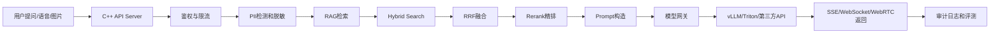

# ！重要！一个例子串起来 G02 前沿 AI 系统上线优化

## 0. 这一篇要串什么

想象你的 C++ 企业 AI Copilot 已经上线了。

第一周大家很开心：

```text
能上传文档
能问制度
能流式回答
还能给引用
```

第二周问题开始冒出来：

```text
知识库变大，检索变慢
有些金额和条款号找不准
模型调用越来越贵
用户觉得语音交互不够实时
安全同学担心模型看到了不该看的文档
日志里可能有手机号和身份证
```

这时你就不能只说：

```text
我用了 RAG
我用了向量数据库
我调用了大模型 API
```

你要升级成：

```text
向量检索优化
LLM 推理服务优化
实时多模态交互
AI 数据治理和隐私保护
```

---

## 1. 整体故事线



---

## 2. 第一类问题：知识库变大，检索变慢

### 2.1 HNSW

**新手理解**：HNSW 像“高速路 + 小路”的地图。先走高速快速接近目标区域，再走小路找到最近的资料。

**在这个例子里**：用户问“试用期员工跨城市培训住宿能不能报销”，系统要从几百万个 chunk 里快速找相关制度。HNSW 避免全库逐个算相似度。

**面试说法**：HNSW 是常见 ANN 索引，适合大规模向量检索。线上要通过 efSearch 在召回率和延迟之间做权衡，并用 Recall@K 和 P95 延迟评估。

### 2.2 efSearch

**新手理解**：efSearch 像“找资料时愿意多问几个人”。问得越多，越可能找到正确答案，但花的时间更长。

**在这个例子里**：如果召回不准，可以适当调大 efSearch；如果 P95 延迟太高，就要压测是否能调小。

**面试说法**：efSearch 控制查询时搜索宽度，值越大召回越高但延迟越高，不能拍脑袋设置，要结合评测集和线上延迟指标。

### 2.3 向量量化

**新手理解**：向量量化像把厚衣服压进行李袋，空间省了，但可能会皱一点。

**在这个例子里**：历史制度文档很多，但访问频率低，可以考虑对冷数据使用 PQ、SQ 或 Binary Quantization，降低内存和磁盘成本。

**面试说法**：量化能降低向量存储和内存成本，但可能损失召回精度，适合冷数据或候选召回阶段，必须通过 Recall@K 和 bad case 评估。

---

## 3. 第二类问题：金额、条款号、专有名词找不准

### 3.1 Dense Vector

**新手理解**：Dense Vector 是语义向量，擅长理解“意思像不像”。

**在这个例子里**：“差旅交通费”和“出差路费”意思接近，dense vector 能把它们找出来。

**面试说法**：Dense embedding 擅长语义召回，但对金额、编号、代码符号等精确词可能不稳定。

### 3.2 Sparse Vector / BM25

**新手理解**：Sparse Vector 或 BM25 像关键词搜索，擅长找“原文里有没有这个词”。

**在这个例子里**：用户问“第 13 条里 5000 元限制是什么”，BM25 更容易抓住“第 13 条”和“5000 元”。

**面试说法**：企业制度、合同、代码文档不能只靠语义检索，要用 sparse/BM25 补足精确词召回。

### 3.3 Hybrid Search

**新手理解**：Hybrid Search 是“语义搜索 + 关键词搜索”两队一起找资料。

**在这个例子里**：系统一边用 dense vector 找语义相关制度，一边用 BM25 找金额、条款号、部门名，然后合并候选。

**面试说法**：Hybrid Search 适合企业 RAG，因为它同时覆盖语义相似和关键词精确匹配，常和 Rerank 一起使用。

### 3.4 RRF

**新手理解**：RRF 像两个榜单合榜。一个资料在语义榜和关键词榜都靠前，它就更值得进入候选。

**在这个例子里**：向量检索分数和 BM25 分数尺度不同，不能直接相加，RRF 用排名融合更稳。

**面试说法**：RRF 用 rank 而不是原始 score 融合不同检索器，适合 dense + sparse 的第一版融合方案。

### 3.5 Rerank

**新手理解**：Rerank 像技术面试官复筛简历。初筛找 50 份，精排挑 5 份最相关的。

**在这个例子里**：Hybrid Search 召回 Top50，Rerank 再选 Top5 放进 Prompt，减少无关 chunk 干扰模型。

**面试说法**：Rerank 能提升最终上下文质量，但会增加延迟和成本，需要控制候选数量并做评测。

### 3.6 Late Interaction / ColBERT

**新手理解**：普通向量像把一段话压成一个点，Late Interaction 会保留更多词级细节。

**在这个例子里**：代码知识库或法律条款问答里，一个 chunk 里每个函数名、参数名、条款词都很重要，可以评估 Late Interaction。

**面试说法**：Late Interaction 通过 token 级向量做细粒度匹配，精度更高，但存储和计算成本更大，适合高价值检索场景。

---

## 4. 第三类问题：模型慢、贵、GPU 利用率低

### 4.1 TTFT

**新手理解**：TTFT 是用户等到第一个字出来的时间。

**在这个例子里**：用户点击发送后，2 秒才看到第一个 token，就会觉得系统卡。TTFT 受 prompt 长度、RAG chunk、模型 prefill、缓存命中影响。

**面试说法**：TTFT 主要衡量首 token 延迟，优化方向包括减少输入长度、控制 TopK、使用 prompt/prefix cache 和优化 prefill。

### 4.2 TPOT / tokens/s

**新手理解**：TPOT 是每生成一个 token 要多久，tokens/s 是每秒能吐多少 token。

**在这个例子里**：首 token 出来很快，但后面一个字一个字蹦得慢，就要看 decode 阶段和 tokens/s。

**面试说法**：生成速度要看 TPOT 和 tokens/s，和模型大小、batching、KV Cache、GPU 利用率有关。

### 4.3 KV Cache

**新手理解**：KV Cache 像模型写答案时的草稿纸，记住前面读过的内容，避免每次重读。

**在这个例子里**：RAG chunk 很长、并发很多时，KV Cache 会占大量显存，管理不好就 OOM。

**面试说法**：KV Cache 是 LLM 推理并发和长上下文的关键资源，需要监控使用率、显存和 OOM。

### 4.4 PagedAttention

**新手理解**：PagedAttention 像操作系统分页，不给每个请求提前分一整块大显存，而是按块管理。

**在这个例子里**：多个用户同时问问题，每个人上下文长度不同，PagedAttention 可以更灵活管理 KV Cache，提升显存利用率。

**面试说法**：PagedAttention 借鉴虚拟内存分页思想管理 KV Cache，是 vLLM 提高吞吐和显存利用率的重要机制。

### 4.5 Continuous Batching

**新手理解**：Continuous Batching 像地铁，有人下车就有人上车，不等一整批人全部结束。

**在这个例子里**：有的用户回答 20 个 token，有的回答 1000 个 token，动态 batch 能让 GPU 不空等。

**面试说法**：Continuous Batching 让请求动态进入和离开 batch，提高 GPU 利用率和吞吐，但调度复杂，可能影响单请求延迟。

### 4.6 vLLM

**新手理解**：vLLM 是一个常用的高吞吐 LLM 推理服务框架，可以把模型包装成类似 OpenAI API 的服务。

**在这个例子里**：C++ 后端不直接操作 GPU，而是通过模型网关调用 vLLM 的 OpenAI-compatible endpoint。

**面试说法**：私有化部署时可以用模型网关对接 vLLM，业务层保持统一接口，底层再根据成本和性能替换推理引擎。

### 4.7 TensorRT-LLM

**新手理解**：TensorRT-LLM 像给 NVIDIA GPU 定制的高性能发动机。

**在这个例子里**：如果调用量非常大，对 GPU 成本敏感，可以评估 TensorRT-LLM 做更深优化。

**面试说法**：TensorRT-LLM 适合 NVIDIA GPU 上的高性能生产推理，但部署和硬件绑定更强，第一版项目不必硬上。

### 4.8 Triton

**新手理解**：Triton 像模型服务的统一车站，Embedding、Rerank、分类模型都可以按统一方式服务化。

**在这个例子里**：Embedding 和 Rerank 模型可以放进 Triton，统一动态批处理、指标和部署。

**面试说法**：Triton 适合统一多模型推理服务，尤其是 Embedding、Rerank、分类等模型，但配置和运维复杂。

---

## 5. 第四类问题：用户想要实时语音和多模态

### 5.1 SSE

**新手理解**：SSE 是服务器单向给浏览器推消息。

**在这个例子里**：普通文本回答用 SSE 就够，模型生成一个 token，后端推一个 token。

**面试说法**：SSE 简单，适合大模型文本流式输出；双向实时交互再考虑 WebSocket 或 WebRTC。

### 5.2 WebSocket

**新手理解**：WebSocket 是浏览器和服务器之间的一条双向长连接。

**在这个例子里**：Agent 正在执行“查制度 -> 查报销单 -> 生成审批意见”，前端想实时看每一步状态，可以用 WebSocket。

**面试说法**：WebSocket 适合双向状态同步和实时协作，但连接管理比 SSE 复杂。

### 5.3 WebRTC

**新手理解**：WebRTC 是浏览器实时音视频通信技术。

**在这个例子里**：如果要做语音 Copilot，用户边说，系统边听边回答，就要考虑 WebRTC 或类似实时音频通道。

**面试说法**：WebRTC 适合低延迟音视频，但信令、NAT、ICE/STUN/TURN 和排查复杂，文本版项目第一阶段不必强上。

### 5.4 Realtime API

**新手理解**：Realtime API 把“发一句回一句”升级成“实时会话”，里面可以有音频、文本、工具调用和打断。

**在这个例子里**：语音版 Copilot 可以复用原有 RAG 和 Tool Calling，但通信和模型调用从普通 Chat API 升级为实时会话。

**面试说法**：Realtime API 适合实时语音和多模态交互，但会带来状态管理、成本控制和安全治理复杂度。

### 5.5 WebGPU / WebNN

**新手理解**：WebGPU/WebNN 是让浏览器本地利用 GPU/NPU 做一部分 AI 计算。

**在这个例子里**：前端可以先做图片压缩、敏感信息预检测、轻量分类，再把必要内容发给后端。

**面试说法**：端侧 AI 不一定是把大模型塞进浏览器，而是把轻量、隐私敏感或预处理任务前移，降低后端压力。

---

## 6. 第五类问题：模型不能看不该看的数据

### 6.1 PII

**新手理解**：PII 是能识别个人身份的信息，比如手机号、身份证号、邮箱、地址。

**在这个例子里**：员工报销单、合同、客户资料里都有 PII，不能完整写入日志，也不能随便送给模型。

**面试说法**：AI 系统要在入库、Prompt、输出和日志环节做 PII 检测与脱敏。

### 6.2 数据分级

**新手理解**：数据分级是给资料贴标签，比如公开、内部、敏感、机密。

**在这个例子里**：普通员工可以查公开制度，但不能查薪资和绩效文档。

**面试说法**：数据分级是权限过滤、脱敏、审计和留存策略的基础。

### 6.3 ABAC

**新手理解**：ABAC 是按属性判断权限，比如部门、地区、职级、文档等级。

**在这个例子里**：华东区 HR 只能看华东区员工相关制度，不能看所有地区资料。

**面试说法**：ABAC 比 RBAC 更适合复杂企业权限，可以结合 tenant、department、doc_level 等 metadata 做细粒度控制。

### 6.4 ReBAC

**新手理解**：ReBAC 是按关系判断权限，比如 owner、共享成员、项目成员、直属上级。

**在这个例子里**：项目文档只给项目成员和被分享的人看。

**面试说法**：ReBAC 适合协作文档和组织关系复杂的权限建模。

### 6.5 RAG Metadata Filter

**新手理解**：Metadata Filter 是检索时带上权限条件，先挡住不该看的资料。

**在这个例子里**：向量库检索时就带 tenant_id、department_id、doc_level、acl，防止无权限 chunk 进入 Prompt。

**面试说法**：RAG 权限过滤必须前置到检索阶段，不能先全库召回再过滤，返回引用前还要二次校验。

### 6.6 审计日志

**新手理解**：审计日志是 AI 系统的行车记录仪。

**在这个例子里**：要记录谁问了什么、检索了哪些文档、调用了哪些工具、使用哪个模型和 Prompt 版本。

**面试说法**：企业 AI 系统必须可追溯，模型调用、检索结果、工具调用和策略版本都要带 trace_id 记录。

### 6.7 Confidential Computing

**新手理解**：普通加密保护传输中和存储中的数据，Confidential Computing 关注“正在计算时”的数据保护。

**在这个例子里**：金融、医疗、政企私有化场景可能会评估可信执行环境来保护敏感推理。

**面试说法**：Confidential Computing 适合强合规场景，但普通企业知识库第一优先级仍是权限过滤、脱敏、审计和数据隔离。

---

## 7. 最终面试总回答

```text
我的项目第一版可以用 C++ API Server + RAG + SSE 跑通企业知识库问答，但上线后要继续从四个方向演进。第一是向量检索，知识库变大后要做 HNSW 参数压测、Hybrid Search、RRF、Rerank，必要时用量化降低成本，用 Late Interaction 提升高价值场景精度。第二是推理服务，如果从第三方 API 转向私有化部署，可以通过模型网关接 vLLM，关注 PagedAttention、Continuous Batching、KV Cache、TTFT、tokens/s 和 GPU 利用率，高性能场景再评估 TensorRT-LLM 或 Triton。第三是实时多模态，文本流用 SSE，任务状态用 WebSocket，实时语音再考虑 WebRTC 或 Realtime API，端侧预处理可以关注 WebGPU/WebNN。第四是数据治理，企业 AI 不能让模型看不该看的数据，所以要做 PII 脱敏、数据分级、ABAC/ReBAC、RAG metadata filter、审计日志和删除链路。
```

---

## 8. 关联文档

- [G08_向量检索前沿_VectorDB_HNSW_Quantization_LateInteraction.md](G08_向量检索前沿_VectorDB_HNSW_Quantization_LateInteraction.md)
- [G09_LLM推理服务_vLLM_TensorRTLLM_Triton_SGLang.md](G09_LLM推理服务_vLLM_TensorRTLLM_Triton_SGLang.md)
- [G10_实时多模态_WebRTC_RealtimeAPI_WebGPU_EdgeAI.md](G10_实时多模态_WebRTC_RealtimeAPI_WebGPU_EdgeAI.md)
- [G11_AI数据治理与隐私_PII_ABAC_ConfidentialComputing.md](G11_AI数据治理与隐私_PII_ABAC_ConfidentialComputing.md)
