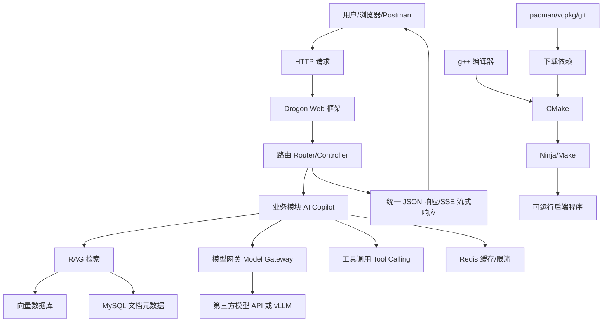

# 03 从教学 HTTP 服务器升级成熟 Web 框架过程记录

记录日期：2026-06-15

这份文档不是最终架构说明，而是“过程性记录”。

目标是让你看到一个后端项目从 toy 骨架往产品化骨架演进时，开发者是怎么判断、怎么查环境、怎么安装依赖、怎么遇到问题再调整路线的。

---

## 0. 初学者先看：我们到底在搭什么

你现在可以把这个项目想象成“开一家 AI 办公助手餐厅”。

```text
用户 = 来点菜的人
HTTP 请求 = 菜单上的订单
Web 框架 = 前厅服务系统，负责接单、分发、返回结果
业务代码 = 后厨，真正做知识库问答、RAG、模型调用
数据库/Redis/向量库 = 仓库、冰箱、资料室
构建工具 = 装修队，把源码盖成能运行的程序
包管理器 = 采购系统，帮你下载工具和依赖
```

我们现在做的不是“研究 socket 玩具”，而是在准备一套真实产品后端的地基。

### 0.1 总框架图



这张图里有两条线：

```text
第一条：用户请求怎么流动
第二条：源码怎么变成可运行程序
```

当前手写 `simple_server.cpp` 只覆盖了很小一块：

```text
HTTP 请求 -> 简单路由 -> 简单响应
```

成熟产品后端需要补上：

```text
成熟 Web 框架
配置管理
日志
统一响应
错误处理
SSE 流式输出
文件上传
数据库
Redis
向量数据库
模型网关
权限和审计
```

---

## 0.2 每个工具/框架到底是干什么的

| 名字                  | 它是什么         | 初学者类比          | 为什么需要它                              | 在项目里填哪个位置              |
| ------------------- | ------------ | -------------- | ----------------------------------- | ---------------------- |
| `g++`               | C++ 编译器      | 把菜谱翻译成厨房能执行的指令 | `.cpp` 不能直接运行，必须编译成 `.exe`          | 把 C++ 源码编译成程序          |
| CMake               | 构建配置工具       | 装修总设计图         | 大项目有很多 `.cpp`、头文件、依赖库，手写编译命令会乱      | 生成 Ninja/Make 能执行的构建规则 |
| Ninja               | 构建执行器        | 施工队            | 按 CMake 生成的规则快速编译                   | 真正调用编译器构建项目            |
| Makefile            | 简单构建脚本       | 简易施工清单         | 当前 toy server 文件少，用 Makefile 够用     | 教学版构建入口                |
| pacman              | MSYS2 包管理器   | 采购系统           | 下载 CMake、Ninja、库依赖                  | 给 UCRT64 C++ 环境安装工具    |
| git                 | 源码下载和版本工具    | 项目档案和搬运工       | 下载 Drogon 源码，管理项目版本                 | 拉取第三方框架源码              |
| Drogon              | C++ Web 框架   | 成熟前厅服务系统       | 处理路由、请求、响应、JSON、文件上传、WebSocket、数据库等 | 产品化 C++ API Server     |
| Trantor             | Drogon 底层网络库 | 前厅系统的通信底座      | Drogon 依赖它做异步网络 IO                  | Drogon 内部依赖            |
| JSON 库              | 处理 JSON 数据   | 订单格式翻译器        | 后端 API 通常用 JSON 交换数据                | 统一响应、请求参数、模型结果         |
| OpenSSL             | 加密/TLS 库     | 安全门锁           | HTTPS、证书、加密连接会用到                    | 后续生产部署和依赖构建            |
| zlib                | 压缩库          | 打包压缩工具         | Web 框架和 HTTP 生态常用压缩能力               | Drogon/依赖可能需要          |
| SQLite/MySQL Client | 数据库访问库       | 仓库管理员          | 保存用户、文档、会话、模型调用日志                   | 产品数据持久化                |
| Redis Client        | Redis 访问库    | 高速缓存柜          | 做缓存、限流、会话、热点数据                      | 高并发和稳定性模块              |

---

## 0.3 为什么不是继续手写 Web 框架

手写版的好处：

```text
能学底层
代码少
容易理解 main -> server -> router -> handler
```

但产品版的问题：

```text
HTTP 协议细节太多
并发模型复杂
文件上传复杂
SSE/WebSocket 要处理很多边界情况
数据库连接池、错误处理、日志、插件都要自己造
```

如果你在面试里展示的是“手写 socket server”，面试官可能会觉得：

```text
这个同学学习能力不错，但项目不太像真实产品。
```

如果你展示的是“Drogon + RAG + 模型网关 + 数据库 + Redis + 向量库”，面试官更容易理解成：

```text
这个同学在做一个完整 C++ AI 后端产品。
```

所以路线是：

```text
手写 server：用来学习原理
Drogon：用来承载产品
```

---

## 0.4 每一步为什么这么做

### 第一步：先判断 toy server 的边界

要做什么：

```text
看当前代码能做什么、不能做什么。
```

为什么：

```text
不能为了“高级”乱装框架，也不能明知 toy 还拿去包装成产品。
```

需要什么：

```text
读 main.cpp、simple_server.cpp、router.cpp、http.cpp
理解当前链路
```

结果：

```text
当前版本适合学习，不适合最终产品展示。
```

### 第二步：选择成熟 Web 框架

要做什么：

```text
在 Drogon、Crow、Boost.Beast、uWebSockets 等方案里选主框架。
```

为什么：

```text
产品后端需要路由、JSON、文件上传、数据库、WebSocket、异步等完整能力。
```

需要什么：

```text
框架文档
C++ 编译器
CMake 构建能力
依赖库
```

当前判断：

```text
Drogon 更适合做完整 C++ Web 产品后端。
```

### 第三步：检查本机工具链

要做什么：

```text
确认有没有 g++、cmake、ninja、vcpkg、pacman、git。
```

为什么：

```text
框架不是复制一个头文件就能用，通常要编译和链接依赖。
```

需要什么：

```text
g++：编译 C++
CMake：生成构建规则
Ninja/Make：执行构建
pacman/vcpkg：安装依赖
git：下载源码
```

已发现：

```text
已有 g++ 和 git
缺 CMake/Ninja/vcpkg
```

### 第四步：安装 CMake 和 Ninja

要做什么：

```text
用 MSYS2 pacman 安装 UCRT64 版本的 CMake 和 Ninja。
```

为什么：

```text
Drogon 这类成熟框架一般用 CMake 构建。
Ninja 是一个快速、稳定的构建执行器。
```

需要什么：

```text
pacman.exe
MSYS2 UCRT64 仓库
网络下载
```

已安装：

```text
mingw-w64-ucrt-x86_64-cmake 4.2.3-1
mingw-w64-ucrt-x86_64-ninja 1.13.2-1
```

### 第五步：尝试获取 Drogon

要做什么：

```text
优先查 pacman 有没有 drogon 包。
没有包，就从 GitHub 下载源码。
```

为什么：

```text
如果包管理器有现成包，安装最省事。
如果没有，就只能源码构建。
```

需要什么：

```text
pacman 查询
git clone
网络稳定
CMake 构建依赖
```

当前结果：

```text
pacman 没查到 drogon/trantor
git clone Drogon 时 GitHub 连接重置
```

下一步：

```text
清理残缺目录
换下载方式
继续获取 Drogon
```

### 第六步：产品化改造代码

要做什么：

```text
保留教学版 simple_server
新增 Drogon 产品版入口
```

为什么：

```text
教学版帮助你理解底层
产品版帮助你展示真实工程能力
两者价值不同，不要互相替代
```

需要填进去的模块：

```text
GET /health
统一 ApiResponse
错误码
/api/v1/chat/stream SSE 骨架
配置加载
日志
请求 trace_id
后续数据库/Redis/向量库/模型网关接口
```

---

## 0.5 产品化后端最终应该长什么样

第一阶段目标不是一下子做完全部 AI Copilot，而是先搭一个像产品的后端壳：

```text
C++ Drogon API Server
  -> /health
  -> /api/v1/chat/stream
  -> /api/v1/documents/upload
  -> /api/v1/documents/{id}/status
  -> /api/v1/knowledge-bases/{id}/search
  -> /api/v1/model-call-logs
```

后面每个接口再接真实模块：

```text
文档上传 -> 对象存储/本地存储
文档状态 -> MySQL
文档解析 -> Worker/MQ
知识检索 -> 向量数据库
聊天生成 -> 模型网关
缓存限流 -> Redis
全链路日志 -> trace_id + logger
```

面试讲法：

```text
我的 C++ 后端不是停留在手写 socket demo。我先用手写版理解 Web 框架原理，然后用 Drogon 承载产品化 API。这样我既能讲清楚底层请求流转，也能展示真实项目需要的路由、JSON、流式响应、数据库、Redis、模型网关和后续 RAG 模块。
```

---

## 1. 为什么要升级

当前 `code/cpp-ai-copilot` 里的 HTTP server 是手写的：

```text
socket
bind
listen
accept
recv
parse_http_request
router.route
send
```

它的价值是教学：

```text
帮你理解 HTTP server 内部大概怎么工作
理解 main、config、logger、router、http、server 怎么分层
理解一个请求从 socket 到 handler 再到 response 的流动
```

但它的问题也很明显：

```text
不是成熟 Web 框架
没有完整 HTTP 协议能力
没有中间件/filter
没有成熟 JSON 处理
没有文件上传
没有数据库/Redis 集成
没有 WebSocket/SSE 的成熟封装
没有生产级错误处理和并发模型
```

所以如果目标是秋招项目展示，就不能停在这里。

面试时要讲的是：

```text
我做了一个 C++ 企业级 AI Copilot 产品后端
```

而不是：

```text
我研究了一下怎么手写 socket server
```

结论：

```text
手写 server 保留为学习材料
产品化主线升级到成熟 C++ Web 框架
```

---

## 2. 选型判断：为什么优先考虑 Drogon

C++ 后端 Web 框架候选：

```text
Drogon
oat++
Crow
Boost.Beast
uWebSockets
Pistache
```

这次优先考虑 Drogon，原因：

```text
1. 它是比较完整的 C++ Web Application Framework
2. 支持路由、filter、controller、JSON、文件上传、WebSocket
3. 支持数据库、Redis、ORM、插件等更接近产品后端的能力
4. 支持异步和协程，适合后续讲 C++ 现代后端
5. 对“企业 AI Copilot 后端”更像真实工程，而不是玩具 demo
```

简单理解：

```text
Crow 更像轻量小框架
Boost.Beast 更偏底层组件
uWebSockets 很适合高性能实时连接
Drogon 更像能承载完整 Web 产品的后端框架
```

---

## 3. 先检查本机工具链

执行目标：

```text
先确认本机有什么，不要盲目装。
```

检查命令：

```powershell
Get-Command cmake,pacman,vcpkg,git,g++ -ErrorAction SilentlyContinue |
  Select-Object Name,Source,Version
```

检查结果：

```text
git.exe -> E:\Git\cmd\git.exe
g++.exe -> E:\Software\MySY2\ucrt64\bin\g++.exe
```

没有发现：

```text
cmake
vcpkg
```

判断：

```text
当前 C++ 编译器来自 MSYS2/UCRT64
最自然的安装路线是先用 MSYS2 pacman 补齐 CMake/Ninja
```

---

## 4. 定位 MSYS2 包管理器

因为 `g++` 在：

```text
E:\Software\MySY2\ucrt64\bin\g++.exe
```

所以继续找 pacman：

```powershell
Get-ChildItem -Path 'E:\Software\MySY2' -Recurse -Filter pacman.exe
```

找到：

```text
E:\Software\MySY2\usr\bin\pacman.exe
```

这说明可以用 MSYS2 的包管理器安装 UCRT64 依赖。

---

## 5. 查询 Drogon 是否能直接用 pacman 安装

查询命令：

```powershell
E:\Software\MySY2\usr\bin\pacman.exe -Ss drogon
```

结果：

```text
没有查到 drogon 包
```

继续查底层依赖：

```powershell
E:\Software\MySY2\usr\bin\pacman.exe -Ss trantor
```

结果：

```text
没有查到 trantor 包
```

判断：

```text
当前 MSYS2 仓库里没有直接可用的 Drogon/Trantor 包
不能简单 pacman -S drogon
```

下一步选择：

```text
走源码构建 Drogon
```

---

## 6. 安装基础构建工具 CMake 和 Ninja

查询 CMake 包：

```powershell
E:\Software\MySY2\usr\bin\pacman.exe -Ss mingw-w64-ucrt-x86_64-cmake
```

查到：

```text
ucrt64/mingw-w64-ucrt-x86_64-cmake 4.2.3-1
```

安装命令：

```powershell
E:\Software\MySY2\usr\bin\pacman.exe -S --needed --noconfirm `
  mingw-w64-ucrt-x86_64-cmake `
  mingw-w64-ucrt-x86_64-ninja
```

安装结果：

```text
安装了 CMake 和 Ninja
同时自动安装了 CMake 需要的依赖包
```

重要依赖包括：

```text
mingw-w64-ucrt-x86_64-cmake 4.2.3-1
mingw-w64-ucrt-x86_64-ninja 1.13.2-1
mingw-w64-ucrt-x86_64-curl
mingw-w64-ucrt-x86_64-jsoncpp
mingw-w64-ucrt-x86_64-libarchive
mingw-w64-ucrt-x86_64-libuv
mingw-w64-ucrt-x86_64-nghttp2
mingw-w64-ucrt-x86_64-nghttp3
mingw-w64-ucrt-x86_64-ngtcp2
```

安装过程中出现一个 warning/error：

```text
/tmp/.../.INSTALL: line 15: mkdir: command not found
/tmp/.../.INSTALL: line 16: cp: command not found
...
error: command failed to execute correctly
```

判断：

```text
这个错误出现在 ca-certificates 的 post-install 脚本阶段
不能直接假设所有东西都完美安装
必须继续验证 cmake 和 ninja 能否运行
```

---

## 7. 验证 CMake 和 Ninja

验证命令：

```powershell
E:\Software\MySY2\ucrt64\bin\cmake.exe --version
```

结果：

```text
cmake version 4.2.3
```

验证命令：

```powershell
E:\Software\MySY2\ucrt64\bin\ninja.exe --version
```

结果：

```text
1.13.2
```

再用 pacman 确认包版本：

```powershell
E:\Software\MySY2\usr\bin\pacman.exe -Q mingw-w64-ucrt-x86_64-cmake mingw-w64-ucrt-x86_64-ninja
```

结果：

```text
mingw-w64-ucrt-x86_64-cmake 4.2.3-1
mingw-w64-ucrt-x86_64-ninja 1.13.2-1
```

结论：

```text
CMake 和 Ninja 当前可用
后续可以用它们构建更成熟的 C++ Web 框架项目
```

---

## 8. 尝试下载 Drogon 源码

计划：

```text
把 Drogon 放到项目 third_party/drogon
后续用 CMake 构建
```

执行命令：

```powershell
git clone --depth 1 https://github.com/drogonframework/drogon.git `
  "6_AI应用开发\20_Cpp企业AI_Copilot项目\code\cpp-ai-copilot\third_party\drogon"
```

结果：

```text
fatal: unable to access 'https://github.com/drogonframework/drogon.git/':
Recv failure: Connection was reset
```

判断：

```text
这是 GitHub 网络连接重置
不是 C++ 代码错误
不是 Drogon 不能用
是下载阶段失败
```

当前状态：

```text
third_party/drogon 目录可能已经被创建
但源码没有完整下载
后续继续前要检查并清理残留
```

---

## 9. 这一步学到的工程经验

真实后端开发不是只写业务代码。

你还会经常做这些事：

```text
检查工具链
选择包管理路线
确认依赖是否有预编译包
没有包就走源码构建
安装 CMake/Ninja 这类基础工具
验证工具是否真的可用
处理网络下载失败
记录每一步安装了什么
```

这和面试也有关。

如果面试官问：

```text
你这个 C++ Web 后端是怎么从零搭起来的？
```

你不能只说：

```text
我写了几个接口。
```

更好的回答是：

```text
我第一版先手写了一个最小 HTTP server，用来理解请求解析、路由分发和响应序列化。之后我意识到它更适合教学，不适合产品展示，所以把主线升级到成熟框架 Drogon。升级前我先检查本机工具链，发现只有 MSYS2/UCRT64 的 g++，没有 CMake/vcpkg，于是用 pacman 安装 CMake 和 Ninja，并验证版本。Drogon 在当前仓库没有直接包，所以准备走源码构建。第一次 GitHub 浅克隆遇到连接重置，这属于依赖下载问题，后续会清理残留后换下载方式继续。
```

这个表达比“我用了某个框架”更像真实工程。

---

## 10. 下一步计划

下一步继续做：

```text
1. 检查 third_party/drogon 是否是残缺目录
2. 如果残缺，清理后重新下载
3. 尝试 git HTTP/1.1、压缩包下载或其他稳定下载方式
4. 构建 Drogon 及其依赖
5. 新建 product 版后端入口，例如 app_drogon.cpp
6. 保留 simple_server 作为教学版
7. 用 Drogon 实现：
   - GET /health
   - 统一 JSON 响应
   - /api/v1/chat/stream 的 SSE 骨架
   - 错误处理
   - 配置加载
   - 日志记录
8. 最后写依赖安装记录和面试表达
```

---

## 11. 已经下载/安装了什么

已经通过 MSYS2 pacman 安装：

```text
mingw-w64-ucrt-x86_64-cmake 4.2.3-1
mingw-w64-ucrt-x86_64-ninja 1.13.2-1
```

随 CMake 自动安装的依赖包括：

```text
brotli
c-ares
ca-certificates
cppdap
curl
gnutls
jsoncpp
libarchive
libidn2
libpsl
libssh2
libtasn1
libunistring
libuv
lz4
nettle
nghttp2
nghttp3
ngtcp2
p11-kit
rhash
```

尝试下载但未成功：

```text
Drogon 官方源码
URL: https://github.com/drogonframework/drogon.git
失败原因: GitHub 连接重置，Recv failure: Connection was reset
```


