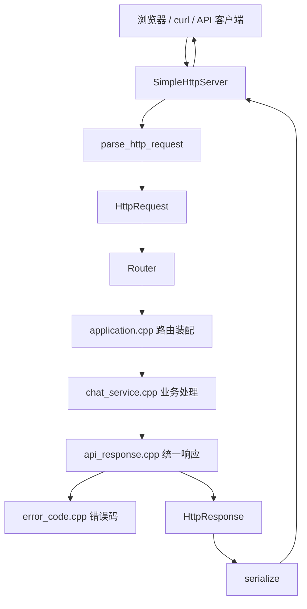

# C++ 企业 AI Copilot 当前后端架构

这份文档解释当前 `cpp-ai-copilot` 后端骨架的架构。它不是最终产品形态，而是一个从 toy HTTP Server 往真实后端产品演进的阶段性架构。

当前项目已经完成：

```text
启动服务
GET /health
GET /api/v1/ping
POST /api/v1/chat
JSON 请求解析
统一成功响应
统一错误响应
chat_service 业务拆分
api_response 响应拆分
error_code 错误码拆分
```

## 1. 当前整体架构



这条链路对应一次请求的完整过程：

```text
客户端发 HTTP 请求
  -> SimpleHttpServer 从 socket 收原始文本
  -> http.cpp 把原始文本解析成 HttpRequest
  -> Router 根据 method + path 找 Handler
  -> application.cpp 注册了这些 Handler
  -> /api/v1/chat 交给 chat_service.cpp
  -> chat_service 解析 body、校验 message、生成 reply
  -> api_response 生成统一 JSON
  -> HttpResponse 包装状态码、header、body
  -> simple_server.cpp 发回客户端
```

## 2. 当前模块职责

| 模块 | 文件 | 当前职责 | 人话解释 |
|---|---|---|---|
| 启动入口 | `src/main.cpp` | 读取配置、创建 Router、启动 Server | 后端程序的开关 |
| 配置模块 | `include/copilot/config.hpp`、`src/config.cpp` | 读取 `APP_HOST`、`APP_PORT`、`LOG_LEVEL` | 把配置文件变成 C++ 对象 |
| 日志模块 | `include/copilot/logger.hpp`、`src/logger.cpp` | 输出 info、warn、error 日志 | 让服务运行过程可观察 |
| HTTP 模块 | `include/copilot/http.hpp`、`src/http.cpp` | 定义 `HttpRequest`、`HttpResponse`，解析和序列化 HTTP | 把字符串和对象互相翻译 |
| 路由模块 | `include/copilot/router.hpp`、`src/router.cpp` | 根据 `method + path` 找处理函数 | 接口分发器 |
| 路由装配层 | `include/copilot/application.hpp`、`src/application.cpp` | 注册 `/health`、`/api/v1/ping`、`/api/v1/chat` | 告诉后端有哪些接口 |
| 聊天业务层 | `include/copilot/chat_service.hpp`、`src/chat_service.cpp` | 处理 chat 请求，解析 `message`，生成 reply | 真正做聊天接口业务 |
| 统一响应层 | `include/copilot/api_response.hpp`、`src/api_response.cpp` | 生成统一 JSON 成功/失败 body | 统一所有接口返回格式 |
| 错误码层 | `include/copilot/error_code.hpp`、`src/error_code.cpp` | 管理 `OK`、`INVALID_REQUEST` 等错误码 | 让错误类型集中管理 |
| 网络服务层 | `include/copilot/simple_server.hpp`、`src/simple_server.cpp` | 监听端口、收请求、发响应 | 当前 toy HTTP Server 的核心 |
| 测试模块 | `tests/test_core.cpp` | 验证核心模块和接口行为 | 防止改代码时把已有功能弄坏 |

## 3. 为什么要分层

最开始可以把所有逻辑都写在 `application.cpp` 里：

```text
注册路由
解析 JSON
校验参数
生成业务回复
拼响应 JSON
返回 HttpResponse
```

但是这样很快会乱。比如以后新增：

```text
文档上传
RAG 问答
用户登录
权限校验
模型调用
数据库访问
Redis 限流
```

如果都堆进 `application.cpp`，这个文件会变得很难读、难测、难改。

所以现在拆成：

```text
application.cpp     只负责路由装配
chat_service.cpp    只负责聊天业务
api_response.cpp    只负责统一响应
error_code.cpp      只负责错误码
```

这就是后端项目里常见的分层思想。

## 4. 当前请求示例

请求：

```http
POST /api/v1/chat HTTP/1.1
Content-Type: application/json

{"message":"你好"}
```

进入项目后：

```text
parse_http_request
  method = POST
  path = /api/v1/chat
  body = {"message":"你好"}

Router
  找到 POST /api/v1/chat 对应 Handler

application.cpp
  Handler 调用 handle_chat_request(request)

chat_service.cpp
  JSON 解析 body
  取出 message = 你好
  构造 reply = 我收到了：你好

api_response.cpp
  生成 {"code":"OK","data":{"reply":"我收到了：你好"}}
```

## 5. 当前架构的边界

当前架构还不是最终产品架构，因为：

```text
网络层还是手写 SimpleHttpServer
没有成熟框架的并发和异步能力
没有数据库连接
没有 Redis
没有文件上传
没有 SSE 流式输出
没有模型网关
没有 RAG
```

但它已经有了一个真实后端的基本骨架：

```text
HTTP 请求对象
HTTP 响应对象
路由分发
业务层
统一响应
错误码
配置
日志
测试
```

## 6. 面试表达

可以这样讲：

```text
我这个项目第一阶段先手写了一个最小 C++ HTTP Server，不是为了替代成熟框架，而是为了理解 Web 后端底层请求链路。

请求进来后，SimpleHttpServer 负责 socket 收发，http 模块负责把原始 HTTP 文本解析成 HttpRequest，Router 根据 method 和 path 找 Handler，application 负责注册路由，具体业务交给 chat_service，响应格式由 api_response 统一生成，错误码由 error_code 集中管理。

这样做的好处是，我后面迁移到 Drogon 时，业务层和响应层可以尽量复用，Web 框架只替换网络层和路由承载层。
```

