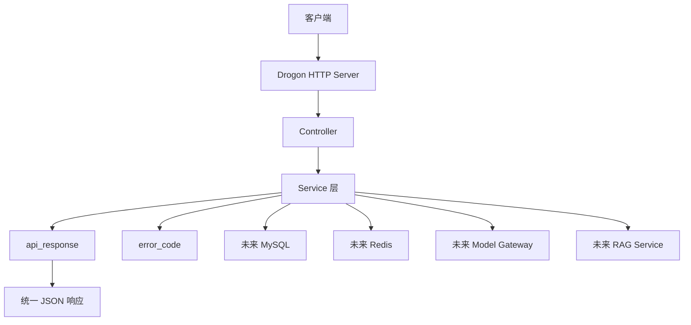

# 从 toy HTTP Server 到 Drogon 产品架构

这份文档解释为什么当前项目要从手写 HTTP Server 迁移到 Drogon，以及迁移时哪些模块保留、哪些模块替换。

## 1. 为什么当前版本叫 toy HTTP Server

当前 `SimpleHttpServer` 能做到：

```text
监听端口
接收 HTTP 请求
解析 method/path/body
路由分发
返回 JSON
输出日志
```

这对学习很有价值，因为它让你看到 Web 框架底层大概做了什么。

但它不适合长期当产品后端，因为真实项目还需要：

```text
高并发连接管理
异步 I/O
成熟路由系统
请求过滤器
统一异常处理
文件上传
SSE / WebSocket
数据库插件
Redis 支持
中间件能力
更完善的日志和配置
```

这些都自己手写，成本很高，也容易写错。

## 2. toy 版和产品版的区别

| 维度 | toy 版 SimpleHttpServer | 产品版 Drogon |
|---|---|---|
| 目标 | 学习 HTTP 底层链路 | 承载真实后端产品 |
| 网络 I/O | 手写 socket 循环 | 框架封装异步 I/O |
| 路由 | 自己写 Router | Drogon Controller / 路由系统 |
| JSON | nlohmann/json | Drogon/JsonCpp 或业务层 JSON |
| 错误处理 | 手写 try/catch | 全局异常和错误处理 |
| 文件上传 | 未实现 | 框架支持 |
| SSE | 未实现 | 更适合在框架层实现 |
| 数据库 | 未实现 | 可接 Drogon DB 或独立客户端 |
| 面试价值 | 能讲清底层原理 | 能展示产品工程能力 |

## 3. 迁移时哪些东西保留

不是把当前代码全部推倒重写。

应该保留：

```text
chat_service
api_response
error_code
测试思路
统一响应格式
参数校验习惯
模块化分层思想
```

应该替换：

```text
SimpleHttpServer
Router
部分 HttpRequest / HttpResponse 适配层
手写 socket 主循环
```

也就是说：

```text
业务层尽量保留
框架承载层逐步替换
```

## 4. 迁移后的目标架构



在 Drogon 版本里，当前模块会这样映射：

| 当前 toy 模块 | Drogon 产品版中的对应关系 |
|---|---|
| `SimpleHttpServer` | Drogon 框架本身 |
| `Router` | Drogon Controller / 路由 |
| `application.cpp` | 产品入口 + Controller 注册 |
| `chat_service.cpp` | 继续作为业务 Service |
| `api_response.cpp` | 继续作为统一响应生成 |
| `error_code.cpp` | 继续作为错误码管理 |
| `config.cpp` | 可以逐步迁移到 Drogon config |
| `logger.cpp` | 可以保留或替换为框架日志 |

## 5. 为什么先保留 toy 版

toy 版不是废代码，它有两个价值：

```text
1. 学习价值：能讲清楚 HTTP 请求底层怎么流转
2. 对照价值：能说明成熟框架帮我们省掉了什么
```

面试时可以说：

```text
我没有一开始就直接套框架，而是先手写了一个最小 HTTP Server，理解请求解析、路由分发和响应序列化。之后我把业务层抽出来，再迁移到 Drogon。这样我既能讲底层原理，也能展示产品工程化能力。
```

## 6. 第五阶段验收标准

Drogon 产品骨架完成时，至少满足：

```text
1. Drogon 依赖获取成功，并记录版本和来源
2. toy 版 mingw32-make test 继续通过
3. toy 版 mingw32-make all 继续通过
4. CMake 能构建 product 版
5. 产品版监听 127.0.0.1:18081
6. GET /health 返回统一 JSON
7. GET /missing 返回统一 404
8. POST /health 返回统一 405
9. 请求日志包含 method、path、status、耗时
10. README 或过程文档记录怎么构建、启动、验证
```

## 7. 后续演进路线

```text
阶段 1：toy HTTP Server 跑通 /health
阶段 2：POST /api/v1/chat 接收 body
阶段 3：接入 JSON 库和统一错误响应
阶段 4：拆分 application / service / response / error_code
阶段 5：迁移 Drogon 产品骨架
阶段 6：接 MySQL / Redis
阶段 7：文档上传和知识库元数据
阶段 8：Embedding / 向量库 / RAG
阶段 9：SSE 流式问答
阶段 10：Tool Calling 和业务流程查询
```

