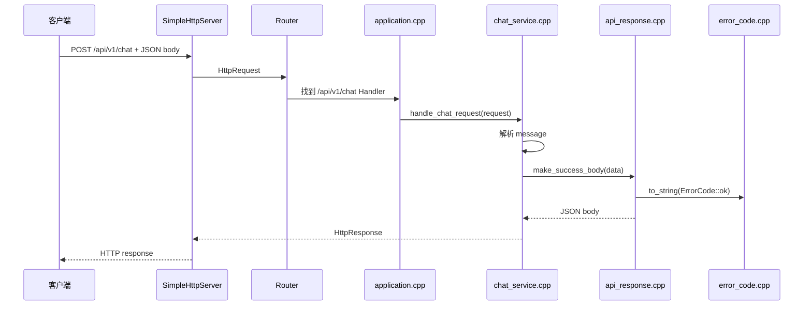

# 后端分层架构：Controller / Service / Response / ErrorCode

这份文档用当前 C++ AI Copilot 项目解释后端为什么要分层。

当前 toy 版还没有正式的 `Controller` 类，但 `application.cpp + Router` 已经承担了 Controller/路由装配的雏形。

## 1. 分层后的职责

```text
Controller / 路由层
  负责接收请求，决定交给哪个业务模块

Service / 业务层
  负责真正的业务处理

Response / 响应层
  负责统一返回格式

ErrorCode / 错误码层
  负责统一错误类型
```

当前代码对应：

| 分层 | 当前文件 | 负责什么 |
|---|---|---|
| 路由装配层 | `application.cpp` | 注册 `/health`、`/api/v1/ping`、`/api/v1/chat` |
| 业务层 | `chat_service.cpp` | 解析 chat 请求、校验 message、生成 reply |
| 响应层 | `api_response.cpp` | 生成 `code/data/message` JSON |
| 错误码层 | `error_code.cpp` | 把 `ErrorCode` 转成字符串 |

## 2. 为什么 application.cpp 不能继续写业务

如果 `application.cpp` 同时做这些事：

```text
注册路由
解析 JSON
校验参数
写业务逻辑
拼响应
处理错误码
```

它会很快变成一个大杂烩。

比如以后你要加：

```text
POST /api/v1/documents/upload
POST /api/v1/chat/stream
GET /api/v1/knowledge-bases
POST /api/v1/tools/expense/query
```

如果每个接口都把业务写在 `application.cpp`，这个文件会变得难读、难测、难维护。

所以更好的写法是：

```cpp
router.post("/api/v1/chat", [](const HttpRequest& request) {
    return handle_chat_request(request);
});
```

`application.cpp` 只说：

```text
这个路径交给谁处理
```

不亲自处理业务。

## 3. Service 层的意义

`chat_service.cpp` 当前做了：

```text
解析 request.body
检查 message 是否存在
检查 message 是否是字符串
检查 message 是否为空
生成 reply
调用 api_response 生成响应 body
```

这就是 Service 层的雏形。

未来可以继续扩展成：

```text
ChatService
  -> 调用 RAG Service
  -> 调用 Model Gateway
  -> 调用 Conversation Repository
  -> 返回 Answer DTO
```

也就是说，Service 层是业务复杂度增长的地方。

## 4. Response 层的意义

如果没有 `api_response.cpp`，每个接口都可能自己返回：

```json
{"reply":"你好"}
```

或者：

```json
{"status":"ok","data":...}
```

或者：

```json
{"code":0,"msg":"ok"}
```

格式会乱。

所以现在统一成：

成功：

```json
{
  "code": "OK",
  "data": {
    "reply": "我收到了：你好"
  }
}
```

失败：

```json
{
  "code": "INVALID_REQUEST",
  "message": "message is required",
  "data": null
}
```

这样前端和测试都能依赖稳定格式。

## 5. ErrorCode 层的意义

如果到处手写：

```cpp
"INVALID_REQUEST"
"ROUTE_NOT_FOUND"
"INTERNAL_ERROR"
```

很容易拼错，或者同一个错误在不同地方叫不同名字。

所以现在先定义：

```cpp
enum class ErrorCode {
    ok,
    invalid_request,
};
```

再用：

```cpp
to_string(ErrorCode::invalid_request)
```

统一转成：

```text
INVALID_REQUEST
```

未来可以继续扩展：

```cpp
route_not_found
method_not_allowed
unauthorized
forbidden
internal_error
model_timeout
rag_no_context
```

## 6. 当前请求在分层中的流转



## 7. 面试表达

可以这样讲：

```text
我没有把所有接口逻辑都堆在路由文件里，而是做了一个最小的后端分层。

application.cpp 只负责路由装配，chat_service.cpp 负责聊天接口业务，api_response.cpp 负责统一响应格式，error_code.cpp 负责错误码管理。

这样拆的好处是，后面我迁移到 Drogon 时，只需要替换 Controller/路由承载层，业务层和响应层可以继续复用。
```

